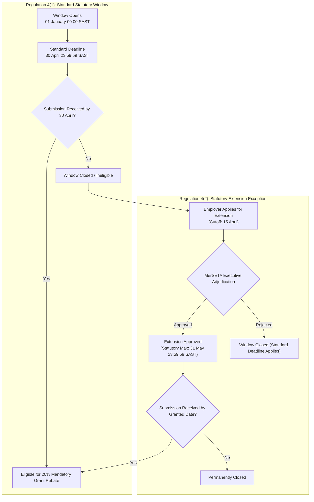
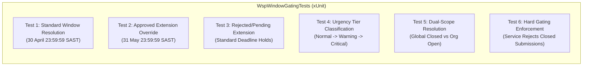

# Implementation Plan: Option B (The Smart Responsive Ticker)
## Mandatory Grant (WSP / ATR) Submission Window Gating & Countdown Alert System

---

## 1. Executive Summary & Strategic Objective

Under the **Skills Development Act, 1998 (Act No. 97 of 1998)** and the **SETA Grant Regulations (Government Gazette No. 35940)**, South African employers in the manufacturing, engineering, and related services sector are entitled to claim a 20% Mandatory Grant levy rebate upon timeous lodgement of their Annual Workplace Skills Plan (WSP) and Annual Training Report (ATR).

Historically, submission windows have been static, leading to:
1. **User Ambiguity**: Employers and Skills Development Facilitators (SDFs) lack real-time visibility into the exact hours, minutes, and seconds remaining before the statutory window closes.
2. **Disputed Submissions**: Confusion surrounding standard statutory deadlines vs. approved extensions under Regulation 4(2).
3. **Invalid Lodgements**: Outdated client sessions submitting data after the statutory window has closed, requiring manual administrative invalidation.

**Option B ("The Smart Responsive Ticker")** establishes an end-to-end statutory gating and countdown alerting system across the MerSETA NSDMS platform. It couples a sub-second client-side countdown ticker with dual-scope statutory resolution (Global Sector vs. Employer-Specific approved extensions) and hard server-side enforcement.

This plan details the full architecture, domain models, backend services, reusable UI components, page integrations, and verification suite.

---

## 2. Statutory Governance & Regulatory Foundation



### 2.1 Regulation 4(1) Standard Deadline
- **Statutory Provision**: Regulation 4(1) of the SETA Grant Regulations dictates that an employer seeking a mandatory grant must submit an approved WSP and ATR by **30 April** of each financial year.
- **System Configuration Key**: `Governance:WspAnnualSubmissionDeadline` (Default: `04-30 23:59:59` SAST / `21:59:59` UTC).
- **Opening Date Key**: `Governance:WspWindowOpenDate` (Default: `01-01 00:00:00` SAST).

### 2.2 Regulation 4(2) Approved Extensions
- **Statutory Provision**: Regulation 4(2) allows the SETA to grant an extension of time to submit the WSP/ATR to an employer who has submitted a written application with valid motivation (e.g., business rescue, strike/industrial action, system outage, natural disaster) prior to the cutoff date (`Governance:WspExtensionRequestDeadline`, typically 15 April).
- **Statutory Ceiling**: Extensions may not exceed **31 May** of the financial scheme year.
- **Approval Entity**: Modeled in `WspExtensionRequest` where `ApprovalStatusCode == "Approved"` and `GrantedExtensionDate` is recorded.

### 2.3 Dual-Scope Deadline Resolution Architecture
The system must resolve the submission window across two distinct operational scopes:

| Resolution Scope | Context / Consumer | Logic & Precedence |
| :--- | :--- | :--- |
| **Global Scope** (`OrganisationId == null`) | Anonymous views, public portal announcements, executive dashboards, and general administrative queues (`WspList.razor`). | Resolves against gazetted sector dates (`Governance:WspWindowOpenDate` to `Governance:WspAnnualSubmissionDeadline`). No organisation-specific extensions are applied. |
| **Employer-Specific Scope** (`OrganisationId != null`) | Authenticated employer workspaces, SDF filing portal, WSP submission wizard (`/wsp/create`), and employer 360 profile (`EmployerWspLeviesTab.razor`). | Evaluates standard window first. If an approved `WspExtensionRequest` exists for the given `OrganisationId` and `SchemeYear` with `GrantedExtensionDate > StandardDeadline`, the effective deadline is dynamically overridden by the granted extension date. |

### 2.4 Timezone Canonicalization
- All database timestamps and EF Core queries use **UTC**.
- All South African statutory deadlines are configured as **South African Standard Time (SAST, UTC+2)** with end-of-day precision (`23:59:59.999`).
- The backend canonicalizes and standardizes all window boundaries to UTC ISO-8601 strings to prevent edge-case rollover disputes.

---

## 3. UI Terminology & Statutory Domain Mapping

To maintain clean architecture and domain-driven design standards, all user interface elements and internal pattern names are strictly mapped to formal business and regulatory terminology:

| UI / Pattern Jargon | Statutory Business Term | Domain Definition |
| :--- | :--- | :--- |
| *Ticker / Timer* | **Mandatory Grant Window Countdown** | High-precision reactive visual indicator showing the remaining statutory lodgement period. |
| *Gating* | **Statutory Lodgement Window Enforcement** | Pre-condition validation blocking WSP/ATR creation or submission outside gazetted or granted dates. |
| *Button Morphing* | **Context-Adaptive Action Control** | Action zone button dynamically transitioning from "New WSP Submission" to "Request Deadline Extension" or "New WSP Submission (Extension Active)". |
| *Urgency Tier* | **Statutory Alert Severity** | Tiered alert status based on time proximity to statutory deadline (Normal, Warning, Critical, Extension Active, Closed). |
| *Hard Lock* | **Final Gating Rejection** | Complete disabling of wizard progression and server-side rejection of API submissions post-deadline. |

---

## 4. Architecture & File Touches

```
dotnet/
├── Nsdms.Application/
│   ├── Common/Models/
│   │   └── WspWindowStatusDto.cs                  [NEW]  DTO & WspUrgencyTier enum
│   └── Services/
│       ├── IWspService.cs                         [MOD]  Expose GetWindowStatusAsync
│       └── WspService.cs                          [MOD]  Implement dual-scope window resolution & urgency logic
├── Nsdms.Web/
│   └── Components/
│       ├── Shared/Wsp/
│       │   └── WspWindowCountdownBadge.razor      [NEW]  Responsive reactive countdown ticker component
│       └── Pages/
│           ├── Wsp/
│           │   ├── WspList.razor                  [MOD]  Action zone button morphing & badge placement
│           │   └── WspAtrSubmissionWizard.razor   [MOD]  Header ticker placement & wizard step hard gating
│           └── Employers/
│               ├── Tabs/EmployerWspLeviesTab.razor[MOD]  Employer-aware button gating & ticker badge
│               └── EmployerDetail.razor           [MOD]  Services menu gating & extension redirection
└── Nsdms.Tests/
    └── WspWindowGatingTests.cs                    [NEW]  xUnit test suite for statutory dates & gating
```

---

## 5. Detailed Component & Service Specifications

### 5.1 Backend Domain Models & Contracts

#### 5.1.1 `WspWindowStatusDto.cs`
**File Location**: `dotnet/Nsdms.Application/Common/Models/WspWindowStatusDto.cs`

```csharp
namespace Nsdms.Application.Common.Models;

/// <summary>
/// Visual and governance alert severity for Mandatory Grant submission deadlines.
/// </summary>
public enum WspUrgencyTier
{
    /// <summary>Window is open with more than 14 days remaining.</summary>
    Normal = 0,

    /// <summary>Window is open with 14 days or fewer remaining (Warning threshold).</summary>
    Warning = 1,

    /// <summary>Window is open with 72 hours or fewer remaining (Critical threshold).</summary>
    Critical = 2,

    /// <summary>Standard window has passed, but an approved Regulation 4(2) extension is active.</summary>
    ExtensionActive = 3,

    /// <summary>Window is closed. Statutory deadline has expired without an active extension.</summary>
    Closed = 4,

    /// <summary>Window has not yet opened for the target scheme year.</summary>
    Upcoming = 5
}

/// <summary>
/// Authoritative statutory window status evaluated across global or employer-specific scopes.
/// </summary>
public class WspWindowStatusDto
{
    public int SchemeYear { get; set; }
    public int? OrganisationId { get; set; }
    public string? OrganisationName { get; set; }
    
    public DateTime OpeningDateUtc { get; set; }
    public DateTime StandardClosingDateUtc { get; set; }
    public DateTime EffectiveDeadlineUtc { get; set; }
    
    public bool HasApprovedExtension { get; set; }
    public DateTime? GrantedExtensionDateUtc { get; set; }
    public string? ExtensionApplicationReference { get; set; }
    
    public bool IsOpen { get; set; }
    public bool IsUpcoming { get; set; }
    public bool IsClosed { get; set; }
    
    public TimeSpan TimeRemaining { get; set; }
    public WspUrgencyTier UrgencyTier { get; set; }
    
    public string DisplayTitle { get; set; } = string.Empty;
    public string DisplayMessage { get; set; } = string.Empty;
    public string FormattedTimeRemaining { get; set; } = string.Empty;
}
```

#### 5.1.2 Service Interface & Implementation Updates
**File Locations**: 
- `dotnet/Nsdms.Application/Services/IWspService.cs`
- `dotnet/Nsdms.Application/Services/WspService.cs`

Add the following signature to `IWspService`:
```csharp
Task<WspWindowStatusDto> GetWindowStatusAsync(int? organisationId = null, int? schemeYear = null);
```

**Implementation in `WspService.cs`**:
1. **Scheme Year Resolution**: If `schemeYear` is null or 0, query `ISystemConfigurationService.GetValueAsync("Governance:CurrentSchemeYear")`, defaulting to current UTC year.
2. **Base Window Dates**:
   - `OpeningDate`: Parsed from `Governance:WspWindowOpenDate` (default: `{schemeYear}-01-01 00:00:00 SAST`).
   - `StandardClosingDate`: Parsed from `Governance:WspAnnualSubmissionDeadline` (default: `{schemeYear}-04-30 23:59:59 SAST`).
3. **Extension Resolution (Employer Scope)**:
   - If `organisationId.HasValue && organisationId.Value > 0`:
     - Query `db.WspExtensionRequests` for `OrganisationId == organisationId.Value`, `SchemeYear == schemeYear`, and `ApprovalStatusCode == "Approved"`.
     - If found and `GrantedExtensionDate.HasValue` and `GrantedExtensionDate.Value > StandardClosingDate`:
       - `EffectiveDeadline = GrantedExtensionDate.Value`.
       - `HasApprovedExtension = true`.
       - `GrantedExtensionDateUtc = GrantedExtensionDate.Value`.
       - `ExtensionApplicationReference = ext.ApplicationReference`.
4. **Window State & Urgency Tier Calculation**:
   - Let `now = DateTime.UtcNow`.
   - If `now < OpeningDate`: `IsUpcoming = true`, `UrgencyTier = WspUrgencyTier.Upcoming`.
   - If `now > EffectiveDeadline`: `IsClosed = true`, `UrgencyTier = WspUrgencyTier.Closed`.
   - If `now >= OpeningDate && now <= EffectiveDeadline`:
     - `IsOpen = true`.
     - `TimeRemaining = EffectiveDeadline - now`.
     - If `HasApprovedExtension && now > StandardClosingDate`: `UrgencyTier = WspUrgencyTier.ExtensionActive`.
     - Else if `TimeRemaining.TotalHours <= 72`: `UrgencyTier = WspUrgencyTier.Critical`.
     - Else if `TimeRemaining.TotalDays <= 14`: `UrgencyTier = WspUrgencyTier.Warning`.
     - Else: `UrgencyTier = WspUrgencyTier.Normal`.
5. **Formatted Time Remaining**: Formats `TimeRemaining` cleanly:
   - Example (> 1 day): `"{days}d {hours:D2}h {minutes:D2}m {seconds:D2}s"`
   - Example (<= 24 hours): `"{hours:D2}h {minutes:D2}m {seconds:D2}s"`
6. **Hard Enforcement**: Update `CreateAsync` and `SubmitAsync` in `WspService` to verify `var status = await GetWindowStatusAsync(submission.OrganisationId, submission.FinYear);` and reject with `InvalidOperationException("The Mandatory Grant submission window for Scheme Year {year} closed on {deadline}. Submissions can no longer be accepted.")` if `!status.IsOpen`.

---

## 6. Comprehensive Test Suite & Verification Strategy

**New Test Suite File**: `dotnet/Nsdms.Tests/WspWindowGatingTests.cs`



### Test Scenarios to Implement:
1. **`GetWindowStatus_StandardDeadline_ResolvesApril30`**:
   - Verifies that with no organisation ID specified, the closing deadline resolves to 30 April of the current scheme year at 23:59:59 SAST (converted to UTC).
2. **`GetWindowStatus_ApprovedExtension_OverridesStandardDeadline`**:
   - Seeds an approved `WspExtensionRequest` for Organisation X with `GrantedExtensionDate = 2026-05-31`.
   - Verifies that `GetWindowStatusAsync(orgId, 2026)` reports `EffectiveDeadlineUtc` matching 31 May, `HasApprovedExtension = true`, and `IsOpen = true` even when tested on 15 May.
3. **`GetWindowStatus_PendingOrRejectedExtension_DoesNotOverrideDeadline`**:
   - Seeds an extension request with `ApprovalStatusCode = "PendingReview"` or `"Rejected"`.
   - Asserts that the effective deadline remains 30 April.
4. **`GetWindowStatus_UrgencyTiers_CorrectlyClassified`**:
   - Tests boundary conditions:
     - 20 days prior to deadline -> `WspUrgencyTier.Normal`
     - 14 days prior to deadline -> `WspUrgencyTier.Warning`
     - 71 hours prior to deadline -> `WspUrgencyTier.Critical`
     - Past deadline without extension -> `WspUrgencyTier.Closed`
     - Past standard deadline with approved extension -> `WspUrgencyTier.ExtensionActive`
5. **`GetWindowStatus_DualScope_DifferentiatesGlobalVsEmployer`**:
   - On 10 May 2026:
     - `GetWindowStatusAsync(null, 2026)` returns `IsClosed = true`, `UrgencyTier = Closed`.
     - `GetWindowStatusAsync(orgWithExtensionId, 2026)` returns `IsOpen = true`, `UrgencyTier = ExtensionActive`.
6. **`CreateAsync_WhenWindowClosed_ThrowsInvalidOperationException`**:
   - Verifies that `WspService.CreateAsync` strictly prevents creating a new WSP record if the submission window is closed for that organisation.

---

## 7. Deliverable Checklist & Implementation Roadmap

| Step | Scope | Task Description | Target File | Status |
| :---: | :---: | :--- | :--- | :--- |
| **1** | Domain & DTO | Create `WspUrgencyTier` enum and `WspWindowStatusDto` class. | `dotnet/Nsdms.Application/Common/Models/WspWindowStatusDto.cs` | Pending |
| **2** | Application Service | Add `GetWindowStatusAsync` to `IWspService` and implement dual-scope resolution logic in `WspService`. | `dotnet/Nsdms.Application/Services/IWspService.cs`<br/>`dotnet/Nsdms.Application/Services/WspService.cs` | Pending |
| **3** | Service Gating | Enforce window status in `WspService.CreateAsync` and `WspService.SubmitAsync`. | `dotnet/Nsdms.Application/Services/WspService.cs` | Pending |
| **4** | UI Component | Build `WspWindowCountdownBadge.razor` with 1-second ticker, 3-tier visual styles, and CSS pulse. | `dotnet/Nsdms.Web/Components/Shared/Wsp/WspWindowCountdownBadge.razor` | Pending |
| **5** | UI Integration | Integrate countdown badge and morph "New WSP Submission" button to "Request Deadline Extension" when closed. | `dotnet/Nsdms.Web/Components/Pages/Wsp/WspList.razor` | Pending |
| **6** | Wizard Integration | Place countdown ticker in `WizardShell.HeaderActions` and hard-lock wizard progression if window closed. | `dotnet/Nsdms.Web/Components/Pages/Wsp/WspAtrSubmissionWizard.razor` | Pending |
| **7** | Employer 360 Tab | Integrate countdown ticker and employer-aware button morphing in Employer WSP tab. | `dotnet/Nsdms.Web/Components/Pages/Employers/Tabs/EmployerWspLeviesTab.razor` | Pending |
| **8** | Employer Detail | Add window awareness to the "Services" menu in Employer detail view. | `dotnet/Nsdms.Web/Components/Pages/Employers/EmployerDetail.razor` | Pending |
| **9** | Unit Tests | Create comprehensive xUnit test suite for window status, extension overrides, urgency tiers, and service gating. | `dotnet/Nsdms.Tests/WspWindowGatingTests.cs` | Pending |
| **10** | Build & Verification | Execute `dotnet build` and `dotnet test` to verify full compilation and test green pass. | Repository Root | Pending |
