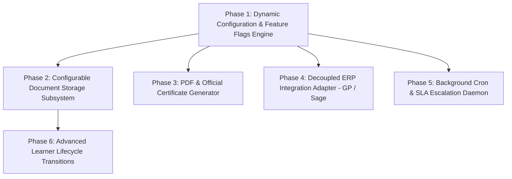

# PLAN: Configurable System Architecture & Next Priorities

> **Governance Directive:** Zero hardcoding. Every integration, scheduler, and storage provider must be runtime-configurable and feature-flagged. All external integrations (e.g. Microsoft Dynamics GP, live SFTP, SMS OTP) **MUST be disabled (`false`) by default** with graceful mock/fallback providers.

---

## 🎯 Architecture Principles & Invariants

1. **Zero Hardcoding Invariant**:
   - Connection strings, API endpoints, storage paths, statutory split percentages, cron expressions, and feature toggles must be injected via `IOptions<T>` / `ISystemConfigurationService` and backed by database overrides in `SystemConfig` / `SystemFeatureFlag`.
2. **Off-By-Default Integration Strategy**:
   - External third-party integrations (`Dynamics GP`, `Sage ERP`, `Live DHET SFTP`, `Live SARS FTP`, `Live SMS Gateway`) must default to `false`.
   - When a feature is disabled, the system resolves a no-op / local mock service (`MockErpIntegrationService`, `LocalFileStorageService`) that logs informational audit entries without failing transactions.
3. **Dynamic Admin Control**:
   - Administrative users can toggle features and update endpoints at runtime from an interactive `/admin/settings` management console without application redeployment.
4. **Clean Architecture Isolation**:
   - All modules continue adhering to `INsdmsDbContextFactory`, atomic double-write `AuditLog` snapshots, and singular PascalCase tables.

---

## 🏗️ Phase Breakdown

---

### Phase 1: Dynamic Configuration & Feature Flag Engine (P0 Foundation)
- **Objective:** Establish the runtime configuration repository, feature toggle provider, and Admin UI.
- **Database Model:**
  - Table: `SystemConfig` (`Id`, `ConfigKey`, `ConfigValue`, `Category`, `Description`, `DataType`, `IsEncrypted`, Audit Columns)
  - Table: `SystemFeatureFlag` (`Id`, `FeatureKey`, `FeatureName`, `Description`, `IsEnabled`, `Category`, Audit Columns)
- **Core Interfaces & Services:**
  - `ISystemConfigurationService`: Strongly typed lookup for settings (`GetBoolAsync`, `GetStringAsync`, `GetDecimalAsync`).
  - `IFeatureFlagService`: `Task<bool> IsFeatureEnabledAsync(string featureKey)`.
- **Default System Feature Flags (All external disabled by default):**
  - `Integrations.DynamicsGp` = `false`
  - `Integrations.LiveDhetSftp` = `false`
  - `Integrations.LiveSarsFtp` = `false`
  - `Integrations.SmsOtp` = `false`
  - `Storage.Provider` = `"Local"` (options: `"Local"`, `"AzureBlob"`, `"Database"`)
  - `Scheduler.Enabled` = `false`
  - `Pdfs.Enabled` = `true`
- **UI:** Add `/admin/system-settings` and `/admin/feature-flags` with MudBlazor switches, configuration tables, and instant refresh.

---

### Phase 2: Configurable Document & Attachment Storage Subsystem
- **Objective:** Provide robust, polymorphic document attachments for all entities with configurable storage targets.
- **Database Model:**
  - Table: `DocumentAttachment` (`Id`, `TargetEntityName`, `TargetEntityId`, `FileName`, `ContentType`, `FileSizeBytes`, `StoragePath`, `FileHashSha256`, `CategoryCode`, `IsArchived`, Audit Columns)
- **Service Layer:**
  - Interface `IFileStorageService`: `SaveFileAsync`, `GetFileAsync`, `DeleteFileAsync`.
  - Providers:
    - `LocalFileStorageService` (default): Stores under configured directory (`UploadsPath` in `SystemConfig`).
    - `AzureBlobStorageService`: Stores in Azure Storage container (enabled when configured).
    - `DatabaseBlobStorageService`: Stores in database (legacy compatibility).
- **UI Components:**
  - `MudDocumentUploadWidget`: Multi-file drag-and-drop uploader with file size limits and MIME-type validation.
  - `MudDocumentViewerDialog`: Inline PDF / image preview and secure download.

---

### Phase 3: Templated PDF & Certificate Generation Engine
- **Objective:** Generate official downloadable documents with branding, serial numbers, watermarks, and QR codes.
- **Service Layer:**
  - Interface `IPdfDocumentService`: `GenerateTradeTestCertificateAsync`, `GenerateGrantMoaDocumentAsync`, `GenerateAccreditationLetterAsync`, `GenerateWspApprovalLetterAsync`.
  - Implementation using **QuestPDF** (clean, fluid C# document DSL).
- **Generated Document Templates:**
  1. **Official Trade Test Certificate:** Full legal styling, learner details, serial number (`CERT-YYYY-XXXXX`), issue date, competency badge, QR validation link.
  2. **Grant MOA Agreement Contract:** Legal multi-page contract, 4-tranche payment milestone tables, terms & conditions, signature blocks.
  3. **SDP Accreditation Letter:** Formal merSETA accreditation award with scope unit standards table.
  4. **WSP Approval Letter:** Statutory acknowledgement with levy grant calculation breakdown.

---

### Phase 4: Decoupled ERP Integration Adapter (Microsoft Dynamics GP / Sage)
- **Objective:** Integrate financial disbursements with ERP ledgers, disabled by default.
- **Service Layer:**
  - Interface `IErpIntegrationService`: `PostTranchePaymentBatchAsync`, `SyncVendorDetailsAsync`, `VerifyBankingDetailsAsync`.
  - `MockErpIntegrationService` (Default active provider): Logs audit trail simulation, marks records as `Simulated_ERP_Success`, and prevents external network calls.
  - `DynamicsGpIntegrationService`: Real SOAP/REST adapter active only when `Integrations.DynamicsGp == true`.
- **UI / Workflow:**
  - When posting payments in `/finance/moas` or `/finance/rebates`, the UI displays the active ERP Mode (`ERP Integration: Disabled (Simulated Mode)` vs `Dynamics GP Live`).

---

### Phase 5: Background Scheduler Daemon (Quartz.NET / `IHostedService`)
- **Objective:** Execute automated background tasks with runtime cron management and master switches.
- **Service Layer:**
  - `BackgroundWorkerHostedService`: Evaluates `IFeatureFlagService.IsFeatureEnabledAsync("Scheduler.Enabled")`.
  - Configurable Scheduled Jobs:
    1. `SlaTaskEscalationJob`: Auto-escalates pending tasks older than configured SLA threshold (e.g. 14 days).
    2. `LevyAutoReconciliationJob`: Reconciles unreconciled levy lines against newly activated employers.
    3. `SetmisBatchVerificationJob`: Pre-validates quarterly compliance records.

---

### Phase 6: Advanced Learner Lifecycle Transitions
- **Objective:** Complete the remaining specialized learner lifecycle workflows.
- **Database Model:**
  - Table: `CompanyLearnerTransfer` (`Id`, `CompanyLearnerId`, `FromOrganisationId`, `ToOrganisationId`, `TransferReasonCode`, `TransferDate`, `StatusCode`, Audit Columns)
  - Table: `CompanyLearnerLostTime` (`Id`, `CompanyLearnerId`, `LostTimeReasonCode`, `StartDate`, `EndDate`, `DaysLost`, `RevisedContractEndDate`, `StatusCode`, Audit Columns)
  - Table: `CompanyLearnerTermination` (`Id`, `CompanyLearnerId`, `TerminationReasonCode`, `EffectiveDate`, `DisputeLogged`, `SettlementNotes`, `StatusCode`, Audit Columns)
- **Service & UI:**
  - `ILearnerLifecycleService`: `TransferLearnerAsync`, `RecordLostTimeAsync`, `TerminateContractAsync`.
  - UI Tabs in `LearnerDetail.razor`: Transfers, Lost Time, Terminations with full workflow approval actions.

---

## 📋 Task Matrix & Verification Plan

| Phase | Deliverables | Verification Strategy |
| :--- | :--- | :--- |
| **Phase 1** | `SystemConfig`, `SystemFeatureFlag`, `ISystemConfigurationService`, `IFeatureFlagService`, `/admin/settings` page | Unit tests verifying default `false` flags, fallback resolution, and DB override mechanics. |
| **Phase 2** | `DocumentAttachment`, `IFileStorageService` (Local + Mock + Azure), `MudDocumentUploadWidget` | Test uploading, retrieving, deleting files and verifying entity link constraints. |
| **Phase 3** | `IPdfDocumentService` (QuestPDF), Certificate & MOA templates | Unit tests generating PDF byte arrays and verifying non-empty output and serial numbers. |
| **Phase 4** | `IErpIntegrationService` (Mock + GP), ERP configuration in settings | Unit tests confirming payment posting succeeds cleanly under Mock mode without network calls. |
| **Phase 5** | Background scheduler worker, `SlaTaskEscalationJob`, `LevyAutoReconciliationJob` | Unit tests running scheduled job methods directly and asserting state updates. |
| **Phase 6** | `CompanyLearnerTransfer`, `LostTime`, `Termination` entities, services, and UI tabs | Full integration tests verifying state transitions, contract recalculations, and audit logging. |

---

## 🚦 Next Step

Once approved, we will proceed to execute the implementation phases starting with **Phase 1: Dynamic Configuration & Feature Flag Engine**.
