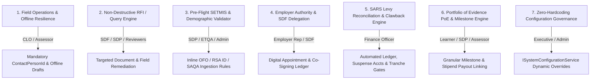

# 📋 Strategic Remediation Plan: merSETA NSDMS Persona Concerns & Architecture Gaps
**Document ID:** `PLAN-fix-system-concerns.md`  
**Target Solution:** merSETA NSDMS Enterprise Platform (.NET 10 Blazor Server / Clean Architecture / SQL Server Express)  
**Status:** Under Review / Awaiting User Approval  

---

## 🎯 Executive Summary & Objectives
This plan outlines the systematic technical and functional remediation to address the core operational concerns and architectural gaps identified across the 10 NSDMS personas. The primary objective is to harden data governance, streamline multi-stakeholder approval workflows, eliminate regulatory compliance drift (SETMIS/SARS), and guarantee audit defensibility.

---

## 👥 Persona Impact & Key Remediation Pillars

---

## 📐 Detailed Work Breakdown by Phase

### Phase 1: Field Operations & Workplace Monitoring Hardening (CLO & Assessor)
* **Objective:** Ensure all field visits are strictly bonded to authorized employer contact persons with zero data loss in disconnected environments.
* **Tasks:**
  1. **Relational Gatekeeping:** Enforce strict foreign key requirement for `ContactPersonId` across `WorkplaceApproval`, `EmployerMonitoringVisit`, and `SiteInspectionReport` domain entities.
  2. **Field Draft Resilience:** Implement client-side draft auto-saving in Blazor Server / Local Storage to prevent session timeouts while inspecting workshops.
  3. **Multi-Media Evidence Upload:** Streamlined attachment of GPS-tagged workshop photos and signed physical inspection rosters via `IStorageService`.
* **Assigned Agent:** `backend-specialist` + `frontend-specialist`

---

### Phase 2: Non-Destructive RFI (Request for Information) & Query State Machine (SDF, SDP, QA)
* **Objective:** Replace destructive "Reject" loops with granular "Query" sub-states allowing targeted document resubmission without resetting review cycles.
* **Tasks:**
  1. **Workflow State Extensions:** Add `Queried`, `ReworkPending`, and `Remediated` enum states to WSP submissions, Grant Applications, and Accreditation requests.
  2. **Field-Level Query Annotations:** Allow internal reviewers to attach contextual feedback to specific tabs, fields, or attachments.
  3. **SLA Deadlines & Alerts:** Implement automated countdown timers (e.g., 14 business days) with automated SMS/Email reminders via `IRealtimeNotificationService`.
* **Assigned Agent:** `backend-specialist`

---

### Phase 3: Ingestion-Layer SETMIS & Demographic Pre-Flight Validator (SDP & ETQA)
* **Objective:** Prevent quarterly DHET SETMIS extraction rejections by validating data at the moment of entry.
* **Tasks:**
  1. **RSA ID & Demographics Helper:** Bind `RsaIdValidator.Parse` across all learner registration forms to auto-populate and enforce valid Date of Birth, Gender, and Citizenship.
  2. **OFO & SAQA Code Verification:** Real-time lookup validation against active `LookupOfoCode` and `LookupQualification` datasets during bulk Excel ingestion.
  3. **SETMIS Rule Pre-Check Engine:** Pre-flight compliance validator running SETMIS LLP error rules (File 500/501/502/503/504) before approving batch submissions.
* **Assigned Agent:** `database-architect` + `backend-specialist`

---

### Phase 4: Employer Governance & Digital SDF Appointment Delegation (Employer & SDF)
* **Objective:** Secure authorization boundaries between employers and external consulting SDFs.
* **Tasks:**
  1. **Dual-Authorization Workflow:** Require digital co-signature from registered Employer CEO/Authorized Signatory before WSP/ATR final submission.
  2. **Delegation & Access Revocation Ledger:** Comprehensive audit log tracking SDF appointment dates, authorization scope, and historical deactivation timestamps.
  3. **CASL Multi-Tenant Access Filtering:** Enforce CASL ability rules ensuring SDFs only see organizations where active delegation agreements exist.
* **Assigned Agent:** `security-auditor` + `backend-specialist`

---

### Phase 5: SARS Levy Batch Reconciliation & Financial Gatekeeping (Finance)
* **Objective:** Eliminate overpayment risks and reconcile actual SARS 1% skills levy income against Mandatory Grant allocations.
* **Tasks:**
  1. **Automated SARS Ingestion Ledger:** Reconcile monthly SARS CSV/FTP files against registered employer SDL numbers with suspense account assignment for unallocated levies.
  2. **Payment Tranche Release Preconditions:** Enforce immutable validation checks in `GrantService`:
     - Mandatory Grant: Approved WSP + Verified Banking Details + Confirmed SARS Levy receipt.
     - Discretionary Grant: Signed MOA + Verified Contact Person + Completed Milestone Verification Report.
  3. **Clawback & Financial Adjustment Engine:** Automated calculation of grant adjustments for retrospective levy revisions or terminated learner contracts.
* **Assigned Agent:** `backend-specialist` + `security-auditor`

---

### Phase 6: Granular Learner Milestone & Portfolio of Evidence (PoE) Engine (Learner & SDP)
* **Objective:** Give learners real-time progress visibility and tie provider stipend payouts directly to verifiable learning milestones.
* **Tasks:**
  1. **Learner Self-Service Progress Timeline:** Visual stepper tracking registration $\rightarrow$ theory modules $\rightarrow$ workplace practical $\rightarrow$ trade test readiness.
  2. **Digital PoE Verification:** Modular upload capability for SDPs and Assessors to submit unit standard credits with instant moderation stamp logging.
  3. **SMS/Push Alerts:** Automated notifications triggered on trade test booking confirmations and certificate issuance.
* **Assigned Agent:** `frontend-specialist`

---

### Phase 7: Dynamic System Configuration Governance (Executive & Admin)
* **Objective:** Guarantee zero hardcoded business thresholds, deadlines, or integration endpoints.
* **Tasks:**
  1. **Centralized Configuration Service:** Full coverage under `ISystemConfigurationService` for grant submission windows, stipend rates, and compliance parameters with cascading database overrides.
  2. **Audit Double-Write Guarantee:** All configuration changes and feature flag toggles perform immediate double-writes into `audit_logs` capturing actor and before/after JSON diffs.
* **Assigned Agent:** `backend-specialist` + `test-engineer`

---

## 🧪 Verification & Quality Gate Strategy

| Gate | Test Focus | Method & Tooling | Success Metric |
|---|---|---|---|
| **V1: Relational Integrity** | Employer visit relational constraints | Unit & Integration tests in `Nsdms.Tests` | 100% rejection of visits without `ContactPersonId` |
| **V2: Validation Accuracy** | RSA ID parsing & SETMIS error rules | Ingestion test suite with malformed test datasets | 0 unhandled validation exceptions |
| **V3: Financial Gatekeeping** | Tranche disbursement preconditions | Mocked workflow tests in `FinanceServiceTests` | 0 disbursements allowed without approved MoA/Site Visit |
| **V4: UI/UX Standards** | WCAG 2.2 AA compliance, MudBlazor sticky bars | Automated Playwright E2E (`test_all_pages_playwright.py`) | All routes render without overflow/appbar overlaps |
| **V5: Audit Immutability** | Double-write snapshots across mutations | SQL Server Temporal & `audit_logs` assertions | 100% mutation coverage with `beforeJson` & `afterJson` |

---

## 🚦 Recommended Next Steps
1. **User Review:** Review and approve this remediation plan.
2. **Execute via Orchestration:** Run implementation commands (e.g. `/orchestrate` or individual phase rollouts) to apply the domain, application, and UI enhancements.
