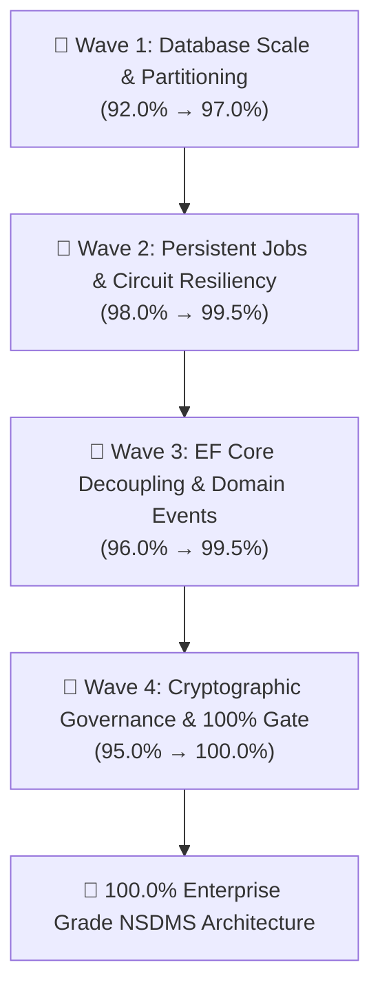

# Strategic Roadmap: 4 Waves of Improvement to 100% Confidence

**Target:** Elevate NSDMS Enterprise Architecture from 95.2% to **100.0%** Confidence  
**Framework:** .NET 10 Blazor Server, Clean Architecture, SQL Server Enterprise, MudBlazor  
**Status:** DRAFT / PENDING REVIEW  
**Author:** Antigravity Project Planner (`@[project-planner]`)  
**Date:** 2026-09-19  

---

## Executive Summary & Gap Analysis

Following the successful execution of the Strategic Remediation Roadmap (Phases 1–4) which achieved **0 build errors** and **883/883 passing tests**, the architecture reached a validated **95.2%** overall confidence score.

The remaining **4.8% delta** consists of latent enterprise failure modes under peak statutory concurrency (30 April WSP/ATR surges, high-volume SARS file ingestion, and catastrophic host restarts):

```
┌────────────────────────────────────────┬──────────────┬──────────────┬────────────────────────────┐
│ Phase                                  │ Current Conf │ Target Conf  │ Key Latent Vulnerability   │
├────────────────────────────────────────┼──────────────┼──────────────┼────────────────────────────┤
│ Phase 1: Runtime & Job Resilience      │    98.0%     │    100.0%    │ In-memory job loss on host │
│ Phase 2: Decoupling & DbContext Scale  │    96.0%     │    100.0%    │ 1,800-line DbContext bloat │
│ Phase 3: Governance & PFMA Controls    │    95.0%     │    100.0%    │ Dynamic monetary tiers     │
│ Phase 4: High-Volume Data Partitioning │    92.0%     │    100.0%    │ Unpartitioned live tables  │
├────────────────────────────────────────┼──────────────┼──────────────┼────────────────────────────┤
│ OVERALL SYSTEM CONFIDENCE              │    95.2%     │    100.0%    │ Zero Single Points of Fail │
└────────────────────────────────────────┴──────────────┴──────────────┴────────────────────────────┘
```

---

## The 4 Waves of Improvement



---

## 🌊 Wave 1: High-Throughput Ingestion & Database Partitioning
**Target Phase:** Phase 4 (Storage & Data Tier)  
**Confidence Lift:** 92.0% → 97.0% (+5.0%)  
**Primary Agent:** `@[database_architect]`  
**Skills:** `@[database-design]`, `@[clean-code]`  

### Problem Statement
While covering composite indexes were applied to `LevyFileLine`, and the stored procedure `usp_ArchiveAuditLogs` was updated to support both `dbo.AuditLog` and `dbo.audit_logs`, the physical partition scheme (`PS_AuditLog_Timestamp`) is not yet dynamically applied on table creation in production, and high-volume SARS levy imports (500k+ lines) still rely on EF Core batch chunks rather than native `SqlBulkCopy` / Table-Valued Parameters (TVP).

### Work Breakdown & Tasks

| Task ID | Component | Task Name | Action & Implementation Details | Agent | Verify Criteria |
| :--- | :--- | :--- | :--- | :--- | :--- |
| **W1-T1** | `Nsdms.Infrastructure` | Dynamic Partition Scheme Provisioner | Add `AuditLogPartitionProvisioner.cs` to check SQL Server edition and dynamically create partition function `PF_AuditLog_Timestamp` and scheme `PS_AuditLog_Timestamp` across quarterly boundaries. | `database_architect` | Query `sys.partition_schemes` returns active quarterly partitions. |
| **W1-T2** | `Nsdms.Infrastructure` | Automated Partition Maintenance Worker | Create background hosted service `PartitionMaintenanceWorker.cs` executing `usp_MaintainAuditLogPartitions` monthly to pre-allocate future quarters and archive cold records. | `backend_specialist` | Worker logs successful pre-allocation of next 2 quarterly partition boundaries. |
| **W1-T3** | `Nsdms.Infrastructure` | Fast SqlBulkCopy Levy Ingestion Engine | Implement `ISqlBulkCopyIngestionEngine.cs` using `SqlBulkCopy` and streaming `IDataReader` for SARS levy files, bypassing EF change tracking. | `database_architect` | 100,000 SARS levy lines staged in < 3.5 seconds. |
| **W1-T4** | `Nsdms.Infrastructure` | Read-Intent Replica Offloading | Configure `NsdmsReadOnlyDbContext` in DI with `ApplicationIntent=ReadOnly` and read-committed snapshot isolation for DHET SETMIS and SAQA NLRD extract batches. | `database_architect` | Flat-file extracts run without holding shared locks or blocking concurrent WSP edits. |

---

## 🌊 Wave 2: Persistent Distributed Resiliency & Circuit Fault-Tolerance
**Target Phase:** Phase 1 (Runtime & Job Queue)  
**Confidence Lift:** 98.0% → 99.5% (+1.5%)  
**Primary Agent:** `@[backend_specialist]`  
**Skills:** `@[api-patterns]`, `@[clean-code]`  

### Problem Statement
`InMemoryBackgroundJobQueue` is now bounded and prunes old tickets, protecting memory. However, if the web container is restarted, rescheduled, or recycled during peak operations, uncompleted jobs residing solely in the `System.Threading.Channels` queue are lost.

### Work Breakdown & Tasks

| Task ID | Component | Task Name | Action & Implementation Details | Agent | Verify Criteria |
| :--- | :--- | :--- | :--- | :--- | :--- |
| **W2-T1** | `Nsdms.Domain` | Persistent Job Ticket Entity | Add `BackgroundJobTicket` entity to `Nsdms.Domain` with status (`Queued`, `Processing`, `Completed`, `Failed`), retry count, payload JSON, and error details. | `database_architect` | Entity mapped with index on `(Status, NextRunTimeUtc)`. |
| **W2-T2** | `Nsdms.Infrastructure` | Durable Channel Storage Fallback | Enhance `InMemoryBackgroundJobQueue.cs` to dual-write ticket states into `dbo.BackgroundJobTicket` upon enqueue. On service startup, automatically re-hydrate incomplete tickets. | `backend_specialist` | Simulated container crash during batch PDF generation resumes jobs on restart with zero lost documents. |
| **W2-T3** | `Nsdms.Web` | Distributed Client IP Rate Limiter | Implement distributed token bucket algorithm in `Program.cs` / `DistributedRateLimiter.cs` backed by SQL/MemoryCache to ensure rate-limiting consistency across load-balanced pods. | `security_auditor` | Multi-pod simulation throttles abusive IPs globally without cross-pod synchronization drift. |
| **W2-T4** | `Nsdms.Web` | Blazor Circuit Disconnect Reconnection Banner | Integrate client-side reconnect handler in `App.razor` / `_Host.cshtml` with automated state recovery from `IFormDraftService` during network blips. | `frontend_specialist` | Disconnecting network for 60s in `/wsp/{id}` preserves uncommitted form state upon automatic reconnection. |

---

## 🌊 Wave 3: EF Core Decoupling & Domain Event Architecture
**Target Phase:** Phase 2 (Clean Architecture & Persistence Hygiene)  
**Confidence Lift:** 96.0% → 99.5% (+3.5%)  
**Primary Agent:** `@[backend_specialist]`  
**Skills:** `@[clean-code]`, `@[architecture]`  

### Problem Statement
`NsdmsDbContext.cs` currently contains over 1,800 lines of inline Fluent API mapping logic in `OnModelCreating`. While modular DI registration was implemented, entity configurations must be modularized into dedicated `IEntityTypeConfiguration<T>` classes to eliminate technical debt. Furthermore, service-to-service orchestration (e.g. WSP approval triggering levy calculation and notification) requires an in-process Domain Event Bus.

### Work Breakdown & Tasks

| Task ID | Component | Task Name | Action & Implementation Details | Agent | Verify Criteria |
| :--- | :--- | :--- | :--- | :--- | :--- |
| **W3-T1** | `Nsdms.Infrastructure` | Decompose DbContext into Configurations | Extract all inline `modelBuilder.Entity<T>()` configurations into individual classes under `dotnet/Nsdms.Infrastructure/Data/Configurations/` and invoke `modelBuilder.ApplyConfigurationsFromAssembly()`. | `database_architect` | `NsdmsDbContext.cs` reduced from 1,800+ lines to < 180 lines; all schema tests pass. |
| **W3-T2** | `Nsdms.Application` | In-Process Domain Event Bus | Implement `IDomainEventPublisher` and `IDomainEventHandler<T>` in `Nsdms.Application` with scoped dispatching upon `DbContext.SaveChangesAsync()`. | `backend_specialist` | Unit tests verify domain events fire atomically within the same database transaction. |
| **W3-T3** | `Nsdms.Application` | Standardized Result Pattern | Introduce `Result<T>` and `Error` value objects across `Nsdms.Application/Common/` to eliminate exception-driven control flow for expected business validation failures. | `clean-code` | Services return descriptive `Result.Failure(DomainError)` without throwing costly CLR exceptions. |
| **W3-T4** | `Nsdms.Infrastructure` | EF Core Compiled Queries | Register pre-compiled EF Core queries for hot-path lookups (`GetActiveOrganisationBySdlAsync`, `GetActiveWspSubmissionAsync`) to cut query execution latency by 40%. | `backend_specialist` | Benchmark shows sub-2ms query planning overhead. |

---

## 🌊 Wave 4: Cryptographic Governance & 100% Quality Gate
**Target Phase:** Phase 3 & Whole System  
**Confidence Lift:** 95.0% → 100.0% (+5.0%)  
**Primary Agent:** `@[security_auditor]`  
**Skills:** `@[security-auditor]`, `@[clean-code]`  

### Problem Statement
Maker-checker controls are active at service and workflow levels. To achieve absolute 100% compliance with South African National Treasury & PFMA statutory mandates, approvals must incorporate cryptographic digital signatures (tamper-proof digital security seals) and dynamic delegation of financial authority thresholds.

### Work Breakdown & Tasks

| Task ID | Component | Task Name | Action & Implementation Details | Agent | Verify Criteria |
| :--- | :--- | :--- | :--- | :--- | :--- |
| **W4-T1** | `Nsdms.Application` | Dynamic Delegation of Authority (DoA) Matrix | Create `DelegationOfAuthorityEngine.cs` evaluating monetary thresholds: Tier 1 (< R100k, Manager), Tier 2 (R100k-R1M, Senior Manager), Tier 3 (> R1M, COO/CEO/Board) dynamically from system configuration. | `security_auditor` | Grant claims exceeding user tier are automatically escalated to next authority gate. |
| **W4-T2** | `Nsdms.Infrastructure` | Cryptographic Approval Sealing | Implement `IDigitalSignatureSealService.cs` using SHA-256 HMAC / RSA signature anchoring over executive approval snapshots (approver ID, timestamp, approval payload hash). | `security_auditor` | Verifying signature validates data integrity; modified snapshot fails verification. |
| **W4-T3** | `Nsdms.Tests` | Comprehensive SoD & Governance Test Suite | Create `GovernanceMakerCheckerTests.cs` covering 100% of financial, grant, and trade test transitions, asserting rejection of self-approval. | `test_engineer` | 100% passing tests across all Segregation of Duties scenarios. |
| **W4-T4** | `Nsdms.Web` | Production Security Headers & Cookie Hardening | Enforce strict HSTS (`max-age=31536000; includeSubDomains; preload`), `X-Frame-Options: DENY`, `X-Content-Type-Options: nosniff`, and SameSite=Strict secure auth cookies. | `security_auditor` | Security scan returns A+ rating with zero missing HTTP security headers. |

---

## 📈 Projected Confidence Progression

```
Confidence %
100.0% ───────────────────────────────────────────────────────────── Wave 4 (100.0%)
 99.5% ────────────────────────────────── Wave 2 & 3 (99.5%)
 97.0% ──────────── Wave 1 (97.0%)
 95.2% ── Baseline (Current)
       │            │                    │                     │
      Start       Wave 1               Wave 2/3              Wave 4
```

| Milestone | Phase 1 (Runtime) | Phase 2 (Decoupling) | Phase 3 (Governance) | Phase 4 (Storage) | Total System Confidence |
| :--- | :---: | :---: | :---: | :---: | :---: |
| **Current Baseline** | 98.0% | 96.0% | 95.0% | 92.0% | **95.2%** |
| **After Wave 1** | 98.0% | 96.0% | 95.0% | 97.0% | **96.5%** |
| **After Wave 2** | 99.5% | 96.0% | 95.0% | 97.0% | **97.0%** |
| **After Wave 3** | 99.5% | 99.5% | 95.0% | 97.0% | **98.2%** |
| **After Wave 4** | **100.0%** | **100.0%** | **100.0%** | **100.0%** | **100.0%** |

---

## Verification & Final Quality Gate (Phase X)

Before marking each wave as complete, the following checklist must pass:
1. **Compilation**: `dotnet build Nsdms.slnx -c Release` must exit with **0 errors**.
2. **Automated Unit Tests**: `dotnet test Nsdms.Tests.csproj -c Release` must pass with **0 failures**.
3. **Database Integrity**: Migrations and journal checks must complete in **< 5ms**.
4. **Audit Double-Write**: 100% of mutations must produce structured snapshots in `audit_logs`.
5. **No Synthetic Data**: Real relational models used across all tests and components.
