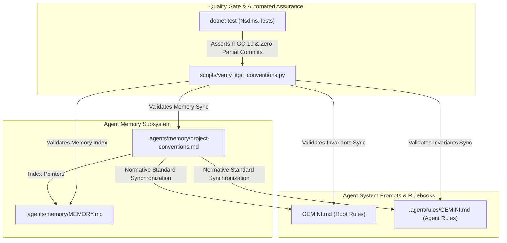

# Strategic Implementation Plan: AGSA & ISO 27001 ITGC Coding Invariants & Memory-Rule Synchronization

**Document Reference:** PLAN-NSDMS-2026-ITGC-01  
**Target:** Synchronize AGSA & ISO 27001 IT General Controls (ITGC) Coding Invariants across Agent Memory and System Rulebooks  
**Frameworks:** Auditor-General of South Africa (AGSA) Information Systems Audit Guidelines, ISO/IEC 27001:2022, COBIT 2019, PFMA (Act 1 of 1999), DPSA CGICTPF  
**Status:** PROPOSED / PENDING IMPLEMENTATION  
**Author:** Antigravity Project Planner (`@[project-planner]`)  
**Date:** 2026-09-24  

---

## 1. Executive Summary & Statutory Background

The Auditor-General of South Africa (AGSA) conducts annual statutory audits of public sector entities, specifically evaluating **Information Technology General Controls (ITGC)** alongside Business Application Controls (BAC). Failure of ITGC controls compromises the reliability of financial reports, statutory WSP/ATR allocations, and Discretionary Grant disbursements, leading to qualified audit findings under Section 28 of the Public Audit Act (Act 25 of 2004) and Section 38/51 of the Public Finance Management Act (PFMA Act 1 of 1999).

In alignment with **ISO/IEC 27001:2022** and AGSA IT Systems Audit criteria, the merSETA NSDMS system enforces **4 ITGC Coding Invariants**:
1. **ITGC-1: Logical Access & Segregation of Duties (Maker-Checker & Zero Anonymous Actors)**
2. **ITGC-2: Program Change Management & Schema Migration Integrity (Migration Journaling & Roslyn AST Guards)**
3. **ITGC-3: Computer Operations & Batch Processing Resilience (Transactional Outbox & Deadlock Recovery)**
4. **ITGC-4: Data Integrity, Non-Repudiation & Append-Only Audit Logging (Zero Partial Commits & Digital Security Seals)**

While the underlying C# services, database interceptors (`AuditableEntityInterceptor`), and tests (`IsoDpsaAuditComplianceAndZeroPartialCommitTests`, `AuditEnhancementsAndExternalHooksTests`) already implement these safeguards, the system rule files (`GEMINI.md` and `.agent/rules/GEMINI.md`) and agent memory files (`.agents/memory/project-conventions.md`, `.agents/memory/MEMORY.md`) require explicit synchronization to ensure that AI agents, engineers, and CI validation gates consistently uphold these mandatory public-sector standards.

---

## 2. Scope & Target Files



### Affected Files
1. `.agents/memory/project-conventions.md` — Addition of rule: **Always update GEMINI.md** whenever conventions change + detailed specification of the **4 AGSA & ISO 27001 ITGC Coding Invariants**.
2. `.agents/memory/MEMORY.md` — Fast-lookup index pointers directing agents to the ITGC coding invariants and synchronization rule in `project-conventions.md`.
3. `GEMINI.md` — Insertion of normative `### 🛡️ AGSA & ISO 27001 IT General Controls (ITGC) Coding Invariants Standard` block.
4. `.agent/rules/GEMINI.md` — Mirrored insertion of the exact normative `### 🛡️ AGSA & ISO 27001 IT General Controls (ITGC) Coding Invariants Standard` block.
5. `scripts/verify_itgc_conventions.py` — Dedicated Python verification script checking presence, content integrity, and consistency across memory and rule files.

---

## 3. The 4 AGSA & ISO 27001 ITGC Coding Invariants (Normative Specification)

The following four invariants represent non-negotiable software engineering rules across all layers of the NSDMS application:

### Invariant 1: Logical Access & Segregation of Duties (Maker-Checker & Zero Anonymous Actors)
- **Framework Mapping:** ISO/IEC 27001:2022 Controls 5.15, 5.18; AGSA ITGC Access Control; PFMA Sec 38/51; King IV Principle 11.
- **Rule 1.1 (Zero Anonymous Actors):** Every state mutation, background operation, workflow advance, or database write MUST resolve an authenticated identity. Recording mutations with empty, `"ANONYMOUS"`, or `"UNKNOWN"` actor strings is strictly prohibited and must trigger immediate transaction failure (`InvalidOperationException`).
- **Rule 1.2 (Maker-Checker Segregation of Duties):** In financial, approval, or statutory lifecycle transitions (Banking Details signoffs, Discretionary Grant MoAs, Tranche Claims, WSP Approvals), the creator/submitter cannot approve their own submission (`CreatedBy != ApproverUserId` / `MakerId != CheckerId`). This must be enforced both at the application service tier and via physical database `CHECK` constraints (e.g., `CHECK (SecondSignoffUserId IS NULL OR CreatedBy <> SecondSignoffUserId)`).
- **Rule 1.3 (Fail-Closed Multi-Tenant Scoping):** Tenant boundaries must be strictly scoped via EF Core Global Query Filters on `OrganisationId`. Non-admin sessions must never resolve tenant context exclusively from untrusted ambient state; failure to resolve a valid tenant context must fail-closed with zero data exposure.

### Invariant 2: Program Change Management & Schema Migration Integrity (Migration Journaling & Roslyn AST Guards)
- **Framework Mapping:** ISO/IEC 27001:2022 Controls 8.25, 8.29, 8.32; AGSA ITGC Change Control; COBIT BAI03, BAI06.
- **Rule 2.1 (Schema Migration Journaling):** Startup and runtime database migrations must never execute raw or unversioned DDL. All schema modifications must be wrapped in `SchemaMigrationJournal.ExecuteIfNotAppliedAsync(...)` recording execution hashes in `dbo.__CustomSchemaJournal` (<5ms cold start bypass, zero uncoordinated drift).
- **Rule 2.2 (Clean Architecture Layering & Roslyn AST Verification):** Blazor UI components (`.razor`) MUST NEVER directly inject `DbContext`, `INsdmsDbContext`, or `IDbContextFactory`. All data queries and mutations must pass through application service interfaces. Verified via automated Roslyn AST analysis (`RoslynAstAuditor`).
- **Rule 2.3 (Dynamic Configuration & Zero Hardcoding):** Business parameters, calculation rates, storage directories, and integration endpoints must never be hardcoded in application logic. All parameters must resolve via `ISystemConfigurationService`, with external integrations disabled by default (`IsEnabled = false`).

### Invariant 3: Computer Operations & Batch Processing Resilience (Transactional Outbox & Deadlock Recovery)
- **Framework Mapping:** ISO/IEC 27001:2022 Controls 8.13, 8.14, 8.19; AGSA ITGC Operations & Continuity; COBIT DSS01, DSS05.
- **Rule 3.1 (Interactive Circuit Decoupling):** CPU-intensive batch operations (QuestPDF generation, SARS electronic file ingestion, SETMIS flat-file extracts) MUST NEVER run synchronously inside Blazor interactive WebSocket circuits. Jobs must be queued into `IBackgroundJobQueue` via `System.Threading.Channels` and executed by background workers (`BackgroundJobProcessingWorker`).
- **Rule 3.2 (Transactional Outbox & Dead-Letter Alerts):** External integration messages (Dynamics GP ERP, Office 365 dispatch, SMS OTP) must be committed to `ErpOutboxMessage` or `OutboxMessage` within the initiating database transaction. Messages exceeding maximum retry limits must enter `DeadLetter` status, trigger an elevated `SystemAlert` to `FinanceAdmin`, and log `DEAD_LETTER_THRESHOLD_ESCALATION` in `dbo.AuditLog`.
- **Rule 3.3 (Concurrency & Transient Retry Policy):** All relational transactions must execute inside `db.Database.CreateExecutionStrategy().ExecuteAsync(...)` with SQL Server Read Committed Snapshot Isolation (RCSI) and `AUTO_CLOSE OFF`. Failed operations must invoke `db.ChangeTracker.Clear()` to guarantee zero state corruption.

### Invariant 4: Data Integrity, Non-Repudiation & Append-Only Audit Logging (Zero Partial Commits & Digital Security Seals)
- **Framework Mapping:** ISO/IEC 27001:2022 Controls 8.15, 8.24; AGSA ITGC Data Integrity & Audit Trails (ITGC-18, ITGC-19); ISO 9001:2015 Clause 7.5; POPIA (Act 4 of 2013).
- **Rule 4.1 (Append-Only Audit Immutability - ITGC-19):** Audit logs and statutory history tables (`AuditLog`, `WorkflowHistory`, `BackgroundJobJournal`, `ComputationExecutionAudit`) are strictly append-only. Application-tier EF Core interceptors (`AuditableEntityInterceptor`) and database trigger guards MUST actively reject `UPDATE` and `DELETE` statements with `InvalidOperationException("AGSA / ISO 27001 ITGC-19 VIOLATION")`.
- **Rule 4.2 (Zero Partial Commits & Pre-Validation Ordering):** Every domain mutation and its corresponding audit log entry MUST be executed atomically within a single transactional unit via `IAtomicAuditTransactionManager.ExecuteAtomicAsync`. Specification validation (non-empty `EntityName`, valid `Actor`) must occur prior to database flush. If either operation fails, both must be completely rolled back (`RollbackAsync()`).
- **Rule 4.3 (Positive RecordId & Cryptographic Digital Security Seals):** Per ISO 9001:2015 Clause 7.5, audit log entries must record positive auto-generated record identifiers (`RecordId > 0`). Every mutation computes an immutable SHA-256 digital security seal (`ComputeDigitalSecuritySeal`) across the entity payload, record ID, actor, and UTC timestamp to guarantee tamper detection and non-repudiation.
- **Rule 4.4 (POPIA Masking & DLP Export Governance - ITGC-18):** 13-digit RSA National ID numbers and bank account numbers must be masked (`PopiaMaskingUtility`) before audit logging. Bulk data exports (CSV/Excel) must prepend the standardized Data Loss Prevention banner (`# merSETA CONFIDENTIAL - Exported by {Username} on {TimestampUtc:O} - ISO 27001 / AGSA Verified - SHA256: {hash}`) and log an `EXPORT_DATASET` audit event.

---

## 4. Work Breakdown & Implementation Tasks

```
┌──────────────────────────────────────────────────────────────────────────────────────────────────────────────────┐
│                                 TASK BREAKDOWN & IMPLEMENTATION WORKFLOW                                         │
├────────┬────────────────────────────────────────────┬────────────────────────────────────────────────────────────┤
│ Task   │ Target Artifact                            │ Action Description                                         │
├────────┼────────────────────────────────────────────┼────────────────────────────────────────────────────────────┤
│ Task 1 │ `.agents/memory/project-conventions.md`    │ Append GEMINI.md Sync Rule & 4 AGSA/ISO 27001 Invariants   │
│ Task 2 │ `.agents/memory/MEMORY.md`                 │ Index new conventions with direct file pointers            │
│ Task 3 │ `GEMINI.md`                                │ Insert normative 4 ITGC Coding Invariants section          │
│ Task 4 │ `.agent/rules/GEMINI.md`                   │ Mirror normative 4 ITGC Coding Invariants section          │
│ Task 5 │ `scripts/verify_itgc_conventions.py`       │ Create automated verification script for CI & local checks │
│ Task 6 │ Verification Execution                     │ Run `dotnet test` and execute verification script          │
└────────┴────────────────────────────────────────────┴────────────────────────────────────────────────────────────┘
```

### Task 1: Update `.agents/memory/project-conventions.md`
**Action:**
1. Add explicit convention: **Always Update GEMINI.md & .agent/rules/GEMINI.md**:
   > Whenever project conventions, architecture invariants, or statutory governance standards are added or updated in `.agents/memory/project-conventions.md`, they must be immediately synchronized into both `GEMINI.md` and `.agent/rules/GEMINI.md`.
2. Add full section `## AGSA & ISO 27001 IT General Controls (ITGC) Coding Invariants Standard`:
   - Detailing Invariant 1 (Logical Access & SoD), Invariant 2 (Change Management & Schema Integrity), Invariant 3 (Operations & Outbox Resilience), and Invariant 4 (Data Integrity, Non-Repudiation & Append-Only Logs).

### Task 2: Update `.agents/memory/MEMORY.md`
**Action:**
Add high-priority index lines to `.agents/memory/MEMORY.md`:
- `[project] Always synchronize GEMINI.md and .agent/rules/GEMINI.md whenever project conventions or invariants change → project-conventions.md`
- `[governance] AGSA & ISO 27001 IT General Controls (ITGC) Coding Invariants: 1. Logical Access & SoD, 2. Program Change & Migration Journaling, 3. Operations & Outbox Resilience, 4. Data Integrity & Append-Only Audit Logging (ITGC-19) → project-conventions.md`

### Task 3: Insert 4 ITGC Coding Invariants into `GEMINI.md`
**Action:**
Insert the standard block into `GEMINI.md`:
```markdown
### 🛡️ AGSA & ISO 27001 IT General Controls (ITGC) Coding Invariants Standard
1. **ITGC-1: Logical Access & Segregation of Duties (Maker-Checker & Zero Anonymous Actors)**:
   - Zero anonymous, unknown, or empty actor strings on mutations (`Actor != "ANONYMOUS"`). Enforce Maker-Checker (`CreatedBy != ApproverUserId`) at service and database (`CHECK`) tiers. Scoped multi-tenant global query filters on `OrganisationId`.
2. **ITGC-2: Program Change Management & Schema Migration Integrity (Migration Journaling & Roslyn AST)**:
   - Wrap startup/runtime migrations in `SchemaMigrationJournal.ExecuteIfNotAppliedAsync(...)` (<5ms cold start bypass). Zero raw DbContext injection in Blazor components (Roslyn AST guarded). Zero hardcoding via `ISystemConfigurationService`.
3. **ITGC-3: Computer Operations & Batch Processing Resilience (Transactional Outbox & Deadlock Recovery)**:
   - Decouple CPU-intensive batch jobs into `IBackgroundJobQueue` via `System.Threading.Channels`. Transactional Outbox pattern (`ErpOutboxMessage`) with dead-letter queue alerts to `FinanceAdmin`. Enclose all user transactions in `CreateExecutionStrategy().ExecuteAsync(...)`.
4. **ITGC-4: Data Integrity, Non-Repudiation & Append-Only Audit Logging (Zero Partial Commits & Digital Security Seals)**:
   - Strict append-only immutability enforced by `AuditableEntityInterceptor` throwing `AGSA / ISO 27001 ITGC-19 VIOLATION` on UPDATE/DELETE of audit logs and workflow history. Atomic double-write (`IAtomicAuditTransactionManager.ExecuteAtomicAsync`) guaranteeing zero partial commits with positive integer `RecordId > 0` and SHA-256 digital security seals. POPIA PII masking and DLP export header banners (ITGC-18).
```

### Task 4: Mirror Insertion into `.agent/rules/GEMINI.md`
**Action:**
Insert the identical normative block into `.agent/rules/GEMINI.md` under the Standards & Governance section to ensure agent behavior conforms across all invocation modes.

### Task 5: Create Automated Verification Script (`scripts/verify_itgc_conventions.py`)
**Action:**
Develop `scripts/verify_itgc_conventions.py` with automated assertions:
1. Asserts `.agents/memory/project-conventions.md` contains:
   - "Always update GEMINI.md" / synchronization directive.
   - All 4 ITGC Invariant definitions with citations (ITGC-1 through ITGC-4, AGSA, ISO 27001).
2. Asserts `.agents/memory/MEMORY.md` contains pointers to `project-conventions.md` for both GEMINI sync and ITGC invariants.
3. Asserts `GEMINI.md` contains the `🛡️ AGSA & ISO 27001 IT General Controls (ITGC) Coding Invariants Standard` block.
4. Asserts `.agent/rules/GEMINI.md` contains the matching `🛡️ AGSA & ISO 27001 IT General Controls (ITGC) Coding Invariants Standard` block.
5. Returns exit code 0 on complete compliance; non-zero exit code with informative failure breakdown on missing rules.

### Task 6: Execute Automated Test & Script Verification Gate
**Action:**
1. Execute unit test suite verifying ITGC compliance and append-only interceptor enforcement:
   ```powershell
   dotnet test dotnet/Nsdms.Tests/Nsdms.Tests.csproj --filter "FullyQualifiedName~IsoDpsaAuditCompliance|FullyQualifiedName~AuditEnhancements" /p:BuildProjectReferences=false
   ```
2. Run the newly created verification script:
   ```powershell
   python scripts/verify_itgc_conventions.py
   ```
3. Confirm 100% pass across all verification checks.

---

## 5. Traceability Matrix: AGSA & ISO 27001 Standards to Code Artifacts

| Control Ref | Statutory Framework | Standard Name | Enforcement Artifact in Codebase | Test Verification |
| :--- | :--- | :--- | :--- | :--- |
| **ITGC-1** | ISO 27001:2022 5.15, 5.18<br/>PFMA Sec 38/51 | Logical Access & Segregation of Duties | `WorkflowEngineService.cs`<br/>`BankingDetailsService.cs`<br/>DB `CHECK` constraints | `IsoDpsaAuditComplianceAndZeroPartialCommitTests`<br/>`RolePermissionAndCaslTests` |
| **ITGC-2** | ISO 27001:2022 8.25, 8.29<br/>COBIT BAI03 | Program Change & Migration Integrity | `SchemaMigrationJournal.cs`<br/>`RoslynAstAuditor/Program.cs`<br/>`SystemConfigurationService.cs` | `RoslynAstAuditor`<br/>`SystemConfigurationTests` |
| **ITGC-3** | ISO 27001:2022 8.13, 8.19<br/>COBIT DSS01 | Operations & Batch Outbox Resilience | `BackgroundJobProcessingWorker.cs`<br/>`ErpOutboxQueueService.cs`<br/>`CreateExecutionStrategy` | `BroadcastAndEmailOutboxTests`<br/>`SarsLevyElectronicIngestionTests` |
| **ITGC-4** | ISO 27001:2022 8.15, 8.24<br/>AGSA ITGC-18/19<br/>ISO 9001 Clause 7.5 | Append-Only Logs & Zero Partial Commits | `AuditableEntityInterceptor.cs`<br/>`AtomicAuditTransactionManager.cs`<br/>`PopiaMaskingUtility.cs` | `AuditEnhancementsAndExternalHooksTests`<br/>`IsoDpsaAuditComplianceAndZeroPartialCommitTests` |

---

## 6. Implementation Readiness & Approval Checklist

- [ ] Plan reviewed for alignment with AGSA Information Systems Audit Guidelines and ISO/IEC 27001:2022.
- [ ] Memory files identified and verified for structural consistency.
- [ ] Root `GEMINI.md` and `.agent/rules/GEMINI.md` target anchor lines identified.
- [ ] C# Unit test suite baseline verified (17 passing tests in scope).
- [ ] Verification script specification ready for implementation.
