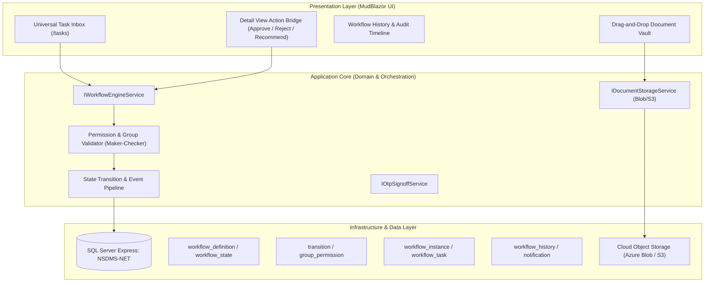

# Project Plan: NSDMS Workflow Engine, Task Matrix & Document Management

**Document:** `docs/PLAN-next-steps.md`  
**Status:** Ready for Review  
**Target Architecture:** .NET 10 Blazor Server / EF Core 10 / SQL Server Express / Clean Architecture  
**Author:** `project-planner` (Senior Enterprise Architect)

---

## 🎯 Executive Objective
Transform the stabilized NSDMS Core CRUD entities (Phases 1–3) into an interactive, enterprise-grade workflow orchestration platform. Implement the **Universal Workflow State Machine (Spec 10)**, **Universal Task Inbox**, **Document Management & Cloud Blob Storage (Spec 15)**, and **Multi-Party OTP Signoffs**, enabling automated Maker-Checker approvals across all 25+ SETA business processes.

---

## 🏗️ Architectural Blueprint

---

## 📋 Task Breakdown by Phase

### Phase 1: Workflow Engine Schema & Domain Foundation (`database-architect`)
- [ ] **1.1 Workflow Domain Entities** (`Nsdms.Domain/Entities/Workflow/`):
  - `WorkflowDefinition`: Business process metadata (`Code`, `Name`, `TargetEntityName`, `KeyFieldName`).
  - `WorkflowState`: Routing stages (`StateName`, `IsTerminal`, `StepOrder`).
  - `WorkflowTransition`: Permitted transitions (`FromStateId`, `ToStateId`, `ActionName`, `RequiredPermissionCode`).
  - `WorkflowInstance`: Active process instance (`WorkflowDefinitionId`, `EntityId`, `CurrentWorkflowStateId`, `InitiatorUserId`).
  - `WorkflowTask`: Inbox work item (`WorkflowInstanceId`, `AssignedGroupId`, `AssignedUserId`, `TaskStatus`, `DueDateTime`).
  - `WorkflowHistory`: Immutable transition audit log (`WorkflowInstanceId`, `FromStateId`, `ToStateId`, `ActorUserId`, `ActionDate`, `Comments`).
  - `WorkflowNotification`: In-app actionable notifications with deep-link URIs.
- [ ] **1.2 Database Schema Migrations** (`Phase3WorkflowSchemaMigrator.cs`):
  - Idempotent table creation on SQL Server Express with singular naming (`workflow_definition`, `workflow_state`, `workflow_transition`, `workflow_instance`, `workflow_task`, `workflow_history`, `workflow_notification`).
  - Strict foreign key indices and constraints.
- [ ] **1.3 Workflow Process Seed Data** (`WorkflowDefinitionSeeder.cs`):
  - Seed state machine graphs for core processes:
    1. `PROVIDER`: Training Provider Accreditation (Draft $\rightarrow$ Desktop Review $\rightarrow$ Site Inspection $\rightarrow$ Committee Approval $\rightarrow$ Accredited).
    2. `WSP`: Workplace Skills Plan (Draft $\rightarrow$ SDF Signed $\rightarrow$ Labour Signed $\rightarrow$ CLO Review $\rightarrow$ Manager Approval $\rightarrow$ Approved).
    3. `DG`: Discretionary Grant Application (Applied $\rightarrow$ Technical Evaluation $\rightarrow$ Review Committee $\rightarrow$ Board Adjudication $\rightarrow$ Awarded).
    4. `WPAPP`: Workplace Approval (Draft $\rightarrow$ Site Audit Scheduled $\rightarrow$ Tool Verified $\rightarrow$ Mentor Certified $\rightarrow$ Approved).
    5. `LRN`: Learner Agreement Registration (Draft $\rightarrow$ Quality Checked $\rightarrow$ Contract Registered $\rightarrow$ Certified).
    6. `TRADETEST`: Trade Test Scheduling (Applied $\rightarrow$ Center Assigned $\rightarrow$ Assessed $\rightarrow$ Competency Moderated $\rightarrow$ Serial Certificate Issued).

---

### Phase 2: Application Services & Maker-Checker Engine (`backend-specialist`)
- [ ] **2.1 `IWorkflowEngineService` Implementation**:
  - `StartWorkflowAsync(string processCode, int entityId, string initiatorUserId)`
  - `GetAvailableActionsAsync(int workflowInstanceId, ClaimsPrincipal user)`
  - `AdvanceWorkflowAsync(int workflowInstanceId, string actionName, ClaimsPrincipal user, string comments)`
  - `ClaimTaskAsync(int workflowTaskId, string userId)`
  - `GetPendingTasksAsync(ClaimsPrincipal user)`
  - `GetWorkflowHistoryAsync(int workflowInstanceId)`
- [ ] **2.2 Maker-Checker Guard Validation**:
  - Prevent entity creator from self-approving (Maker $\neq$ Checker rule).
  - Enforce group and role claims (`CLO`, `RegionManager`, `ReviewCommittee`, `QualityAssuranceManager`, `CEO`).
- [ ] **2.3 Dual-Write & Aggregate Synchronization**:
  - Automatically update the parent entity's `StatusCode` on every transition within an atomic EF Core transaction.
  - Intercept transitions to write double-write entries to `AuditLog`.

---

### Phase 3: Document Management & Object Storage Integration (`backend-specialist` + `database-architect`)
- [ ] **3.1 Document Metadata Domain Model**:
  - `DocumentMetadata`: `Id`, `EntityName`, `EntityId`, `DocumentTypeCode`, `FileName`, `StorageUri`, `FileSizeBytes`, `ContentType`, `Sha256Hash`, `UploadDate`.
  - `DocumentRequirementRule`: Process-specific mandatory document gating (e.g. RSA ID document required before Learner Registration advances).
- [ ] **3.2 `IStorageService` (Cloud / Local Object Storage)**:
  - Streaming file storage provider (Local filesystem during development / Azure Blob Storage in production).
  - Pre-signed secure download URL generator with MIME type sniffing and antivirus header validation.
- [ ] **3.3 Document Gating Interceptor**:
  - Validate all required documents exist before allowing a workflow transition (e.g., cannot approve Workplace Approval without Tool Checklist Evidence PDF).

---

### Phase 4: MudBlazor Presentation & Universal Task Inbox (`frontend-specialist`)
- [ ] **4.1 Universal Task Inbox (`/tasks`)**:
  - Interactive TanStack/MudBlazor DataGrid displaying pending tasks assigned to the user's group or direct claims.
  - Priority badges (Overdue, High, Normal), SLA deadline countdown timers, and one-click deep link to the target entity detail view.
- [ ] **4.2 Action Bridge Component (`WorkflowActionBridge.razor`)**:
  - Context-aware sticky top bar actions dynamically rendered based on user permissions (`Approve`, `Reject`, `Recommend`, `Request Clarification`).
  - Action confirmation modal capturing mandatory feedback/rejection comments.
- [ ] **4.3 Workflow History & Audit Timeline Widget (`WorkflowTimeline.razor`)**:
  - Chronological timeline component showing all past states, actors, transition timestamps, and approval comments.
- [ ] **4.4 Drag-and-Drop Document Vault Widget (`DocumentVault.razor`)**:
  - Multi-file drag-and-drop upload zone with upload progress indicators, file size formatters, and secure preview/download links.

---

### Phase 5: Automated Verification & Playwright E2E Testing (`test-engineer`)
- [ ] **5.1 Unit & Integration Test Suite** (`Nsdms.Tests/WorkflowTests/`):
  - State machine transition tests (valid paths, invalid jump rejection, terminal state lockout).
  - Maker-Checker permission isolation tests (CLO vs Manager vs Admin).
  - Document requirement gating tests (blocked transitions when required file missing).
  - Target: **$\ge 25$ new automated unit/integration tests**.
- [ ] **5.2 Playwright E2E Interactive Flow Tests** (`test_workflow_playwright.py`):
  - End-to-end task submission, inbox assignment, manager approval, and status change verification.
  - Target: **100% pass rate across all workflow interactions**.

---

## 👥 Specialist Agent Assignments

| Milestone Area | Primary Agent | Supporting Agent | Key Deliverable |
| :--- | :--- | :--- | :--- |
| **Workflow Domain & DB Migrations** | `database-architect` | `project-planner` | Workflow entity classes, EF mappings & SQL Server seeders |
| **Workflow Engine & Services** | `backend-specialist` | `security-auditor` | `IWorkflowEngineService`, Maker-Checker validator & event pipeline |
| **Blob Document Storage (ECM)** | `backend-specialist` | `database-architect` | `IStorageService`, DocumentMetadata & gating rule validator |
| **Task Inbox & UI Action Bridges** | `frontend-specialist` | `accessibility-specialist`| `/tasks` page, `WorkflowActionBridge`, `WorkflowTimeline` |
| **Testing & Playwright Suite** | `test-engineer` | `security-auditor` | 25+ Unit tests & Playwright workflow verification |

---

## 🏁 Verification & Acceptance Criteria

1. **Relational Invariant:** All workflow tables follow `snake_case` naming, integer primary keys, and index coverage.
2. **Deterministic State Transitions:** Invalid jumps (e.g. Draft $\rightarrow$ Approved without Review) throw domain exceptions.
3. **Audit Integrity:** Every workflow state change produces an immutable `WorkflowHistory` record and a corresponding `AuditLog` entry.
4. **Zero BLOBs in Database:** All uploaded files are stored in object storage with only metadata preserved in SQL Server.
5. **Universal Task Inbox:** Users can view, claim, and advance all pending tasks across the 6 core business modules from `/tasks`.
6. **Zero Regressions:** Existing 123 xUnit tests and 29-page Playwright test suite maintain 100% pass rate.
