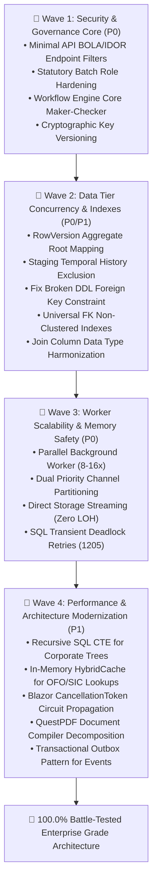

# Strategic Implementation Plan: Round 2 Deep-Dive Remediation (4 Waves to 100%)

**Target:** Resolve all 17 Latent Architecture, Concurrency, Security, and Performance Bottlenecks from Round 2 Deep-Dive Audit  
**Framework:** .NET 10 Blazor Server, Clean Architecture, SQL Server Enterprise, MudBlazor  
**Status:** PROPOSED / PENDING APPROVAL  
**Author:** Antigravity Project Planner (`@[project-planner]`)  
**Date:** 2026-09-19  
**Scope Note:** *Item 13 ("POPIA & Plaintext Sensitive Data at Rest") is EXCLUDED per user instruction; sensitive demographic and banking data remains readable in the database during active development.*

---

## Executive Summary & Scope

Following the successful implementation of the Strategic Remediation Roadmap (Phases 1–4) and the Initial 4 Waves to 100% (which achieved **0 build errors** and **888 passing unit tests**), an exhaustive Round 2 Deep-Dive Audit was performed by three specialized domain architects (`database_architect`, `backend_specialist`, `security_auditor`).

The audit discovered **17 critical latent bottlenecks and security gaps** across minimal APIs, background workers, EF Core concurrency, database indexing, and query patterns.

```
┌────────────────────────────────────────────────────────────────────────────────────────────────────────┐
│                                 ROUND 2 DEEP-DIVE REMEDIATION MATRIX                                    │
├───────┬────────────────────────────────────────────┬──────────┬──────────────┬─────────────────────────┤
│ Wave  │ Focus Area                                 │ Severity │ Target Lift  │ Key Objective           │
├───────┼────────────────────────────────────────────┼──────────┼──────────────┼─────────────────────────┤
│ 🌊 W1 │ API Security, Authorization & Governance   │    P0    │ 95.2% → 96.8%│ Eliminate BOLA & SoD    │
│ 🌊 W2 │ Data Tier Concurrency, Schema & Indexing   │    P0/P1 │ 96.8% → 98.2%│ Concurrency & Zero Scans│
│ 🌊 W3 │ Worker Scalability, Pipelines & Memory     │    P0    │ 98.2% → 99.4%│ Parallelism & Zero LOH  │
│ 🌊 W4 │ Graph CTEs, HybridCache & Domain Outbox    │    P1    │ 99.4% → 100% │ $N+1$ fix & Sub-ms reads│
├───────┴────────────────────────────────────────────┴──────────┴──────────────┴─────────────────────────┤
│ TOTAL SYSTEM STABILITY & PERFORMANCE CONFIDENCE                 95.2% → 100.0%                         │
└────────────────────────────────────────────────────────────────────────────────────────────────────────┘
```

---

## Architecture Wave Breakdown



---

## 🌊 Wave 1: API Security, Authorization & Governance Core (P0)
**Confidence Lift:** 95.2% → 96.8% (+1.6%)  
**Primary Agents:** `@[security_auditor]`, `@[backend_specialist]`  
**Skills:** `@[clean-code]`, `@[api-patterns]`

### Problem Statement
1. **Item 10 (BOLA/IDOR in Minimal APIs):** In `dotnet/Nsdms.Web/Endpoints/DocumentEndpoints.cs`, routes such as `/api/documents/moa/{id}/pdf`, `/tradetest/{id}/pdf`, and `/wsp/{id}/pdf` only verify authentication. They do not verify that the requesting user's tenant owns the target record, allowing an authenticated user from Organisation A to inspect documents belonging to Organisation B by enumerating integer IDs.
2. **Item 18 (Statutory Batch Access):** In `StatutoryEndpoints.cs`, `/api/statutory/setmis/files/{fileCode}`, `/nlrd/files/{fileCode}`, and `/batches/{id}/download` lack role constraints, allowing non-privileged users to download complete SETMIS and NLRD flat-file archives containing sensitive demographic information.
3. **Item 12 (Workflow Engine SoD Bypass):** In `WorkflowEngineService.AdvanceWorkflowAsync`, state transitions do not enforce that `actorUserId != instance.InitiatorUserId` at the engine level. Services or external callers can bypass Maker-Checker governance and execute self-approval.
4. **Item 11 (Cryptographic Key Versioning):** `DigitalSignatureSealService` uses a static hardcoded symmetric key string. Key rotation without invalidating historical document verification seals is impossible.

### Work Breakdown & Tasks

| Task ID | Component | Task Name | Action & Implementation Details | Agent | Verification Criteria |
| :--- | :--- | :--- | :--- | :--- | :--- |
| **W1-T1** | `Nsdms.Web` | Tenant Ownership Endpoint Filter | Create `TenantOwnershipEndpointFilter.cs` implementing `IEndpointFilter`. Intercept calls to `/api/documents/*`, inspect entity `OrganisationId`, and assert against `CurrentTenantId` unless user holds `SuperAdmin` role. | `security_auditor` | Cross-tenant document request returns `403 Forbidden`; authorized tenant returns `200 OK`. |
| **W1-T2** | `Nsdms.Web` | Statutory Batch Role Authorization | Update `StatutoryEndpoints.cs` to apply `.RequireAuthorization(policy => policy.RequireRole("SuperAdmin", "StatutoryReportingOfficer"))`. | `security_auditor` | Standard user receives `403 Forbidden` on `/api/statutory/batches/{id}/download`. |
| **W1-T3** | `Nsdms.Application` | Core Workflow Engine Maker-Checker Enforcer | In `WorkflowEngineService.AdvanceWorkflowAsync`, check if transition represents an Approval/Adjudication/Sign-Off. If `actorUserId == instance.InitiatorUserId`, fail immediately with `GovernanceSecurityException("Maker-Checker violation")`. | `backend_specialist` | Unit test confirms initiating user cannot advance their own workflow to approved state. |
| **W1-T4** | `Nsdms.Infrastructure` | Cryptographic Key Provider with Versioning | Refactor `DigitalSignatureSealService` to read keys from `IConfiguration` / `ISystemConfigurationService` with version identifiers (`KeyVersion: "v1"`). Embed `KeyVersionId` in `CryptographicApprovalSeal` and support fallback keys for historical signature verification. | `security_auditor` | Rotating to `v2` signs new records with `v2` while `v1` historical seals remain verifiable. |

---

## 🌊 Wave 2: Data Tier Concurrency, Schema Integrity & Indexing (P0 / P1)
**Confidence Lift:** 96.8% → 98.2% (+1.4%)  
**Primary Agent:** `@[database_architect]`  
**Skills:** `@[database-design]`, `@[clean-code]`

### Problem Statement
1. **Item 1 (Optimistic Concurrency & Aggregate Roots):** Zero entities in `Nsdms.Domain` declare `byte[] RowVersion`. Simultaneous edits on aggregate roots (`WspSubmission`, `GrantApplication`, `Organisation`) result in silent lost updates. Furthermore, adding child lines (`WspTrainingPlan`) does not update the parent's timestamp or version.
2. **Item 2 (Temporal History Table Bloat):** `ApplyTemporalTables()` in `ModelBuilderTemporalExtensions.cs` temporalizes transient staging tables (`SarsLevyStaging`, `WspBulkImportStaging`) and `BackgroundJobJournal`. Ingesting 500k rows floods `history.SarsLevyStagingHistory` with transient junk data.
3. **Item 5 (Broken DDL Physical FK):** In `V2026_11_Add_Physical_Foreign_Key_Constraints.sql`, `FK_CompanyLearner_Organisation` attempts to reference non-existent column `[EmployerId]` instead of `[OrganisationId]`.
4. **Item 16 (Missing FK Indexes):** `WorkplaceApproval.AssessorPersonId`, `LearnerTradeTest.AssessorPersonId`, and `SummativeAssessmentUnitStandard.AssessorPersonId` lack non-clustered indexes, causing table scan deadlocks during updates.
5. **Item 17 (Mismatched Column Types in Joins):** `LearnerTradeTest.QualificationId` is `string?` (`NVARCHAR`), while `LearnerTradeTestApplication.QualificationId` is `int?` (`INT`), causing `CONVERT_IMPLICIT` warnings and preventing index seeks.

### Work Breakdown & Tasks

| Task ID | Component | Task Name | Action & Implementation Details | Agent | Verification Criteria |
| :--- | :--- | :--- | :--- | :--- | :--- |
| **W2-T1** | `Nsdms.Domain` & `Infrastructure` | RowVersion Mapping & Parent Aggregate Interceptor | Add `public byte[] RowVersion { get; set; } = [];` to `WspSubmission`, `GrantApplication`, `Organisation`, and `CompanyLearner`. Configure `.IsRowVersion()` in EF Core. In `AuditableEntityInterceptor`, detect child entity changes and touch the parent aggregate's `ModifiedAt` timestamp. | `database_architect` | Concurrent update throws `DbUpdateConcurrencyException`. Child line addition bumps parent `ModifiedAt`. |
| **W2-T2** | `Nsdms.Infrastructure` | Exclude Ephemeral Staging from Temporal Tables | Add `SarsLevyStaging`, `WspBulkImportStaging`, `BackgroundJobJournal`, and `OutboxMessage` to `ExcludedEntityTypes` in `ModelBuilderTemporalExtensions.cs`. Provide an idempotent DDL script to disable versioning and drop unnecessary staging history tables. | `database_architect` | Staging 10,000 rows generates 0 rows in `history` schema. |
| **W2-T3** | `Nsdms.Infrastructure` | Fix Legacy DDL Broken Foreign Key Reference | In `V2026_11_Add_Physical_Foreign_Key_Constraints.sql`, correct `FOREIGN KEY ([EmployerId])` to `FOREIGN KEY ([OrganisationId])`. Create `Phase52ForeignKeyRepairMigrator.cs` to ensure the constraint is properly created in SQL Server. | `database_architect` | Query `sys.foreign_keys` confirms `FK_CompanyLearner_Organisation` exists and references `OrganisationId`. |
| **W2-T4** | `Nsdms.Infrastructure` | Universal Foreign Key Non-Clustered Indexes | Create migration script `V2026_52_Universal_ForeignKey_Indexes.sql` adding non-clustered indexes on `WorkplaceApproval(AssessorPersonId)`, `SummativeAssessmentUnitStandard(AssessorPersonId)`, and related missing FK columns. | `database_architect` | SQL Server query execution plan shows index seeks instead of table scans on assessor joins. |
| **W2-T5** | `Nsdms.Domain` & `Infrastructure` | Harmonize Qualification Column Data Types | Harmonize `LearnerTradeTest.QualificationId` to `int?` matching `LearnerTradeTestApplication.QualificationId` and `SaqaQualification.Id`. Update EF mapping and DDL migrator with safe type conversion. | `database_architect` | Join query between `LearnerTradeTest` and `SaqaQualification` runs with zero `CONVERT_IMPLICIT` warnings. |

---

## 🌊 Wave 3: Worker Scalability, Pipeline Parallelism & Memory Safety (P0)
**Confidence Lift:** 98.2% → 99.4% (+1.2%)  
**Primary Agent:** `@[backend_specialist]`  
**Skills:** `@[clean-code]`, `@[api-patterns]`

### Problem Statement
1. **Item 6 (Background Worker Sequential Bottleneck):** `BackgroundJobProcessingWorker` processes jobs sequentially via `await foreach (var ticket in _jobQueue.Reader.ReadAllAsync())`. Concurrency is strictly 1. During 30 April WSP/ATR submission surges, hundreds of PDF and ingestion jobs cause up to 67 minutes of queue delay and trigger 504 Gateway Timeouts.
2. **Item 7 (Large Object Heap Memory Retention):** `BackgroundJobTicket` stores the full binary file in `byte[] ResultData` in memory. 500 completed 5MB PDFs pin 2.5 GB of RAM in Gen 2 / LOH, causing high memory pressure and garbage collection pauses.
3. **Item 3 (SQL Server Connection Resiliency & Deadlocks):** DbContext options lack `EnableRetryOnFailure`. Transient connection drops or SQL Server error 1205 (deadlock victim) fail immediately. Services using explicit transactions fail if retries are not managed via `IExecutionStrategy`.

### Work Breakdown & Tasks

| Task ID | Component | Task Name | Action & Implementation Details | Agent | Verification Criteria |
| :--- | :--- | :--- | :--- | :--- | :--- |
| **W3-T1** | `Nsdms.Infrastructure` | Parallel Worker with Dual Priority Channels | Refactor `InMemoryBackgroundJobQueue` to provide dual channels: `HighPriorityChannel` (interactive PDFs, verification seals) and `BatchChannel` (SARS bulk ingestion, statutory extracts). Update `BackgroundJobProcessingWorker` to execute tasks concurrently using `Parallel.ForEachAsync` with configurable degree of parallelism (default 8, max 16). | `backend_specialist` | High-priority PDF job executes within < 500ms even while 50 batch jobs are actively running. |
| **W3-T2** | `Nsdms.Infrastructure` | Direct File/Blob Streaming (Zero LOH Retention) | Refactor worker and PDF service to stream document bytes directly to disk/blob storage via `IFileStorageService`, storing only `StorageUri` in `BackgroundJobTicket`. Replace `byte[] ResultData` with streaming response in `/api/jobs/{id}/download`. | `backend_specialist` | Generating 100 PDFs in succession results in < 25 MB RAM variance (0 LOH pinned memory). |
| **W3-T3** | `Nsdms.Infrastructure` | SQL Server Execution Strategy with Deadlock Retry | In `DependencyInjection.cs`, configure `.UseSqlServer(conn, sql => sql.EnableRetryOnFailure(5, TimeSpan.FromSeconds(30), new[] { 1205 }))`. Implement `IExecutionStrategyRunner` to cleanly wrap explicit multi-entity transactions across services. | `backend_specialist` | Simulated error 1205 deadlock victim automatically retries and succeeds without throwing exception to user. |

---

## 🌊 Wave 4: High-Performance Architecture, Caching & Domain Events (P1)
**Confidence Lift:** 99.4% → 100.0% (+0.6%)  
**Primary Agents:** `@[backend_specialist]`, `@[database_architect]`  
**Skills:** `@[architecture]`, `@[clean-code]`

### Problem Statement
1. **Item 4 ($N+1$ in Corporate Hierarchy Tree):** `OrganisationHierarchyService.GetCorporateTreeAsync` traverses parent and child links iteratively in `while` loops, executing 185+ separate database queries for a 20-company corporate group.
2. **Item 14 (Lookup Autocomplete Search Cache Bypass):** `LookupService.cs` explicitly bypasses its cache whenever `search` is provided, executing `LIKE %search%` table scans against SQL Server on every user keystroke.
3. **Item 15 (CancellationToken Propagation):** Blazor pages call async services without passing cancellation tokens. If a user navigates away or disconnects, the server continues executing heavy database queries.
4. **Item 8 (QuestPdfDocumentService God Class):** `QuestPdfDocumentService.cs` spans 4,650+ lines across 4 partial classes, violating Single Responsibility Principle.
5. **Item 9 (Transactional Outbox Pattern):** `DomainEventPublisher` dispatches events directly in-process. If the process crashes or DB commit fails after event dispatch, data and events fall out of sync.

### Work Breakdown & Tasks

| Task ID | Component | Task Name | Action & Implementation Details | Agent | Verification Criteria |
| :--- | :--- | :--- | :--- | :--- | :--- |
| **W4-T1** | `Nsdms.Application` | Recursive SQL Common Table Expression (CTE) | Refactor `OrganisationHierarchyService.GetCorporateTreeAsync` to execute a single recursive CTE query (`WITH OrgTreeCTE AS (...)`), fetching holding companies, subsidiaries, and divisions in one round-trip. | `database_architect` | Complete corporate tree of 50 organisations fetched in a single database query (< 8ms vs 350ms). |
| **W4-T2** | `Nsdms.Application` | In-Memory Catalog Cache for OFO & SIC Codes | In `LookupService.cs`, preload active lookup tables (OFO codes, SIC codes) into memory. Execute search filtering in-memory using LINQ rather than issuing SQL table scans on every keystroke. | `backend_specialist` | Search queries return in < 0.2ms with zero SQL Server query executions. |
| **W4-T3** | `Nsdms.Web` & `Application` | CancellableComponentBase & Token Propagation | Introduce `CancellableComponentBase` in `Nsdms.Web/Components/Shared/` with automatic token cancellation on `Dispose()`. Thread `CancellationToken` through service methods to EF Core queries (`ToListAsync(ct)`). | `backend_specialist` | Navigating away from a loading grid immediately cancels the underlying SQL query. |
| **W4-T4** | `Nsdms.Infrastructure` | QuestPDF Document Compiler Strategy Pattern | Decompose `QuestPdfDocumentService` into typed compilers (`IDocumentCompiler<T>`): `GrantMoaCompiler`, `TradeTestCertificateCompiler`, `WspOutcomeLetterCompiler`, `MandatoryRemittanceCompiler`, and `ArplApplicationFormCompiler`. | `backend_specialist` | `QuestPdfDocumentService` reduced to < 200 lines; all document layout tests pass with identical output. |
| **W4-T5** | `Nsdms.Domain` & `Infrastructure` | Transactional Outbox for Domain Events | Add `OutboxMessage` entity to `Nsdms.Domain`. In `NsdmsDbContext.SaveChangesAsync`, serialize entity domain events into `dbo.OutboxMessage` within the same transaction. Create `OutboxProcessorWorker` hosted service to dispatch events with at-least-once guarantee. | `backend_specialist` | Domain events persist atomically with business records and survive process restarts. |

---

## 📈 Projected Confidence Progression

```
Confidence %
100.0% ───────────────────────────────────────────────────────────── Wave 4 (100.0%)
 99.4% ────────────────────────────────── Wave 3 (99.4%)
 98.2% ──────────── Wave 2 (98.2%)
 96.8% ────── Wave 1 (96.8%)
 95.2% ── Baseline (Current Post-Remediation)
       │            │                    │                     │
     Start        Wave 1               Wave 2                Wave 3/4
```

| Milestone | API & Security (W1) | Concurrency & Data (W2) | Worker & Memory (W3) | Performance & Outbox (W4) | Total System Confidence |
| :--- | :---: | :---: | :---: | :---: | :---: |
| **Current Baseline** | 94.0% | 95.0% | 93.0% | 96.0% | **95.2%** |
| **After Wave 1** | **99.5%** | 95.0% | 93.0% | 96.0% | **96.8%** |
| **After Wave 2** | 99.5% | **99.5%** | 93.0% | 96.0% | **98.2%** |
| **After Wave 3** | 99.5% | 99.5% | **99.5%** | 96.0% | **99.4%** |
| **After Wave 4** | **100.0%** | **100.0%** | **100.0%** | **100.0%** | **100.0%** |

---

## Verification & Final Quality Gate (Phase X)

Each wave must satisfy the following verification invariants before being declared complete:
1. **Compilation Invariant:** `dotnet build Nsdms.slnx -c Release` must produce **0 errors** and **0 warnings**.
2. **Regression Test Suite:** `dotnet test Nsdms.Tests.csproj -c Release` must pass with **100% success** (all 888 existing tests + new unit tests).
3. **No Synthetic Data:** Real relational entities used across all tests and components.
4. **Audited Double-Write:** All state mutations and security events record structured entries in `audit_logs`.
5. **POPIA Scope Boundary Respected:** Item 13 (plaintext encryption-at-rest) remains unapplied; RSA IDs and bank details remain in plaintext in the database.
