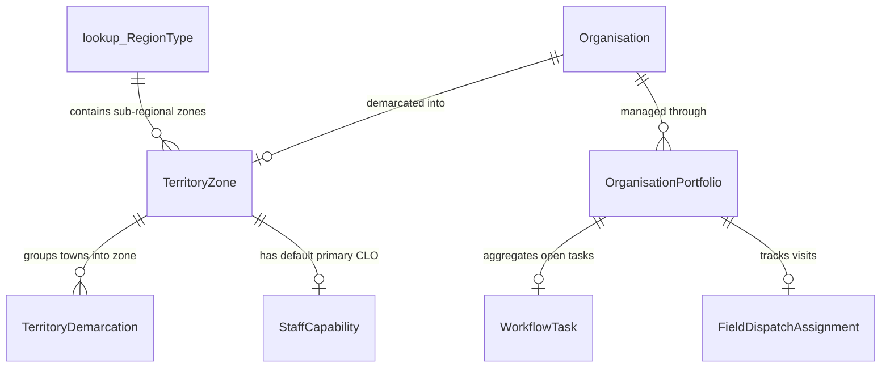
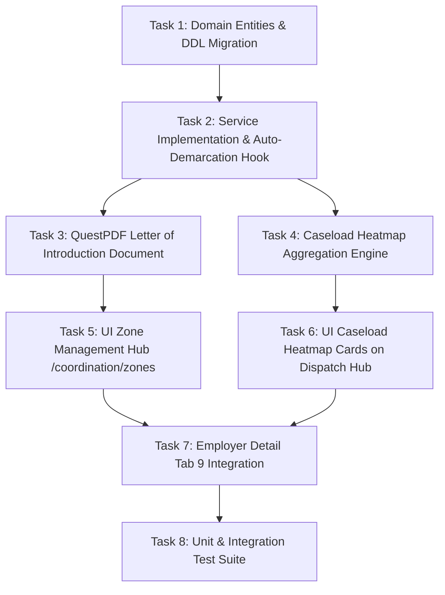

# Project Plan: Phase 1 - Spatial Zoning, Auto-Intake & Foundational Caseload Heatmap (The "Smart Backbone")

> **Document:** `docs/PLAN-smart-backbone.md`  
> **Status:** Draft / Planned  
> **Target Release:** NSDMS 2026-04 (.NET 10 Blazor Server)  
> **Mode:** Planning Only (No Implementation)

---

## 1. Executive Summary & Context

Following the completion of **Option B (Dynamic Portfolio & Capability Dispatch Engine)**, the system possesses the underlying primitives for cross-regional assignment, temporal boundary resolution, predecessor-to-successor handoffs, and capability-based dispatch.

However, operational gaps remain between geographic space and officer workloads:
1. **Intake Friction**: Newly registered employers or relocated companies require manual lookups to assign a Regional Office and relationship officer.
2. **Missing Sub-Regional Zonal Layer**: Regional offices manage large territories (e.g. Gauteng South, KZN) without sub-regional groupings (e.g., *East Rand Heavy Engineering*, *Vaal Triangle Industrial*, *Durban South Coastal*).
3. **Caseload Blind Spots**: Coordinators (CLCs) and Regional Managers (CRMs) lack visual indicators of officer workloads, resulting in uneven allocations and SLA inspection breaches.
4. **Missing Stakeholder Introduction**: When an officer is assigned or handed over, employers have no formal digital letter introducing their assigned officer.

**Phase 1 ("The Smart Backbone")** addresses these gaps by implementing:
- **Sub-Regional Zone Architecture** (`TerritoryZone` grouping towns within a Region).
- **Event-Driven Auto-Demarcation** (resolving region, zone, and primary CLO on employer address change).
- **Foundational Officer Caseload Heatmap** (real-time capacity indicators for CLCs and CRMs).
- **Official MerSETA Letter of Introduction** (QuestPDF statutory document with QR security verification).

---

## 2. High-Level Architecture & Entity Relationships



---

## 3. Detailed Component Breakdown

### 3.1 Domain & Database Layer (`Nsdms.Domain` & `Nsdms.Infrastructure`)

#### A. New Entity: `TerritoryZone` (`Nsdms.Domain/Entities/PortfolioDispatchEntities.cs`)
- **Table Name**: `[dbo].[TerritoryZone]` (Singular PascalCase, auto-generated integer `Id`, audit columns `CreatedAt`, `CreatedBy`, `ModifiedAt`, `ModifiedBy`).
- **Columns**:
  - `ZoneCode` (NVARCHAR(50), Unique Index, e.g. `ZONE_GP_EAST_RAND`, `ZONE_KZN_SOUTH`).
  - `ZoneName` (NVARCHAR(150), e.g. "East Rand Heavy Manufacturing Zone").
  - `RegionCode` (NVARCHAR(50), Indexed, FK to `lookup.RegionType`).
  - `ProvinceCode` (NVARCHAR(10), Indexed).
  - `DefaultOfficerUserId` (NVARCHAR(100), Nullable, Indexed).
  - `DefaultOfficerName` (NVARCHAR(150), Nullable).
  - `DefaultOfficerEmail` (NVARCHAR(150), Nullable).
  - `Description` (NVARCHAR(500), Nullable).
  - `IsActive` (BIT, Default 1).

#### B. Enhancements to Existing Entities:
- **`TerritoryDemarcation`**: Add `ZoneId` (INT, Nullable, FK to `TerritoryZone`) and `ZoneCode` (NVARCHAR(50), Nullable).
- **`Organisation`**: Add computed/navigational `DemarcatedZoneId` and `DemarcatedRegionCode`.
- **`Phase12ZoningAndCaseloadMigrator.cs`**:
  - Idempotent T-SQL DDL script creating `[dbo].[TerritoryZone]` and adding `ZoneId` to `TerritoryDemarcation`.
  - Initial seed data: 12 statutory industrial and geographical zones across the 7 MerSETA regions.
- **Update Master DDL**: Append `TerritoryZone` to `V2026_08_Complete_Nsdms_Enterprise_DDL.sql`.

---

### 3.2 Application & Service Layer (`Nsdms.Application`)

#### A. Service Contract: `IZoneAndCaseloadService`
```csharp
public interface IZoneAndCaseloadService
{
    // Zone Management
    Task<List<TerritoryZone>> GetZonesByRegionAsync(string regionCode);
    Task<TerritoryZone?> GetZoneByIdAsync(int zoneId);
    Task<TerritoryZone> SaveZoneAsync(TerritoryZone zone, string currentUsername);
    Task AssignTownsToZoneAsync(int zoneId, List<int> demarcationIds, string currentUsername);

    // Auto-Demarcation Hook
    Task<OrganisationDemarcationResultDto> AutoDemarcateOrganisationAsync(
        int organisationId, 
        bool forceReassignment, 
        string currentUsername);

    // Caseload Heatmap Aggregation
    Task<List<OfficerCaseloadMetricDto>> GetOfficerCaseloadHeatmapAsync(string? regionCode = null);

    // Stakeholder Communications
    Task<byte[]> GenerateLetterOfIntroductionPdfAsync(int organisationId, string currentUsername);
}
```

#### B. DTOs:
1. **`OfficerCaseloadMetricDto`**:
   - `OfficerUserId`, `OfficerName`, `OfficerEmail`, `RegionCode`, `PrimaryRole`
   - `AssignedOrganisationsCount`
   - `OpenWorkflowTasksCount`
   - `PendingVisitsThisMonthCount`
   - `OverdueSlaCount`
   - `CapacityLoadPercentage` (e.g. 75%)
   - `CapacityStatus` (`Normal`, `Elevated`, `Critical`)
2. **`OrganisationDemarcationResultDto`**:
   - `OrganisationId`, `ResolvedTown`, `ResolvedRegionCode`, `ResolvedZoneName`
   - `AssignedOfficerUserId`, `AssignedOfficerName`
   - `IsCrossRegionalExemption`
   - `ActionTaken` (`AutoAssigned`, `PreservedExisting`, `ExemptedStrategicAccount`)

#### C. Business Invariants & Rules:
1. **Strategic OEM Exemption**: If `Organisation.IsStrategicOem == true` or existing portfolio has `IsCrossRegionalAssignment == true`, `AutoDemarcateOrganisationAsync` updates territorial coordinates but preserves existing Key Account Manager assignments.
2. **Double-Write Audit**: All zone mutations, auto-allocations, and letter generation events write atomic snapshots into `audit_logs`.
3. **PFMA Capacity Thresholds**:
   - `Normal`: $< 60$ employers & 0 overdue SLAs.
   - `Elevated`: $60 - 90$ employers OR $1 - 3$ overdue SLAs.
   - `Critical`: $> 90$ employers OR $> 3$ overdue SLAs (triggers alert badge for CLC/CRM).

---

### 3.3 Statutory Document Layer (`Nsdms.Application/Documents/QuestPdf`)

#### Official MerSETA Letter of Introduction (`ETQ-TP-012`)
- Official Republic of South Africa and MerSETA crest branding.
- Addressed to Employer CEO and Primary SDF with statutory SDL number.
- Full profile and credentials of the assigned Relationship Officer / CLO.
- Contact details, MerSETA Regional Office address, and official escalation matrix.
- Dynamic high-resolution QR code linking to `/verify/officer/{officerUserId}`.
- Immutable SHA-256 Digital Security Seal in footer.

---

### 3.4 User Interface Layer (`Nsdms.Web` - MudBlazor .NET 10)

#### A. Zone Management Hub (`/coordination/zones`)
- **Archetype**: **A1 List / T3 Reference Data**.
- **Layout**:
  - Filter by Region (`lookup.RegionType`).
  - `<DataGridShell>` showing: Zone Code, Zone Name, Region, Towns Count, Default Officer, Active Employers, Status.
  - Action Zone: Single filled primary button `<MudButton StartIcon="@Icons.Material.Filled.Add">Add Zone</MudButton>`.
- **Dialog: Zone Editor & Town Multi-Select**:
  - Zone Name, Code, Region dropdown.
  - Default Officer selector (filtered by `StaffCapability` in that region).
  - Multi-select chips to add/remove towns from this zone.
  - Cancel and Save buttons with `ISnackbar` confirmation toast.

#### B. Foundational Caseload Heatmap Component (`OfficerCaseloadCard.razor`)
- Embedded in **Coordinator Dispatch Hub** (`/coordination/dispatch`) and **Portfolio Management Hub** (`/coordination/portfolios`).
- Visual workload cards showing:
  - Officer avatar and name.
  - Metric badges: Orgs, Open Tasks, Visits, Overdue.
  - MudProgress linear capacity bar (Green < 70%, Amber 70-90%, Red > 90%).
  - Quick action: "Rebalance" button opening the Successor Handoff dialog pre-filtered to this officer.

#### C. Employer Detail Hub Integration (`/employers/{id}`)
- **Tab 9 (Relationship Portfolio)** enhancements:
  - Display resolved `TerritoryZone` alongside Region and Town.
  - Button: `<MudButton Variant="Variant.Outlined" StartIcon="@Icons.Material.Filled.PictureAsPdf" OnClick="@DownloadIntroLetter">Letter of Introduction</MudButton>`.
  - Button: `<MudButton Variant="Variant.Text" StartIcon="@Icons.Material.Filled.AutoMode" OnClick="@ReEvaluateDemarcation">Re-Evaluate Territory</MudButton>`.

---

## 4. Phase 1 Task Breakdown & Dependency Graph



### Detailed Task List

| Task ID | Component | Task Description | Assignee Agent |
|---|---|---|---|
| **TASK-1** | Domain & DDL | Create `TerritoryZone`, update `TerritoryDemarcation`, write `Phase12ZoningAndCaseloadMigrator.cs` with 12 seed zones, update master DDL script. | `backend-specialist` |
| **TASK-2** | Service | Implement `ZoneAndCaseloadService` with `AutoDemarcateOrganisationAsync`, address save hooks, and double-write audit logging. | `backend-specialist` |
| **TASK-3** | Documents | Build QuestPDF `LetterOfIntroductionDocument` (`ETQ-TP-012`) with QR verification reference and SHA-256 seal. | `backend-specialist` |
| **TASK-4** | Service | Implement `GetOfficerCaseloadHeatmapAsync` computing aggregate metrics, SLA breach counters, and capacity tiers. | `backend-specialist` |
| **TASK-5** | Web UI | Build `/coordination/zones` (Archetype A1/T3) with `<DataGridShell>`, MudBlazor theme adherence, and Zone Edit Dialog. | `frontend-specialist` |
| **TASK-6** | Web UI | Build `OfficerCaseloadCard.razor` and embed on `/coordination/dispatch` with real-time capacity progress bars. | `frontend-specialist` |
| **TASK-7** | Web UI | Update `EmployerDetail.razor` (Tab 9) with Zone badge, "Download Intro Letter" button, and "Re-Evaluate Demarcation" action. | `frontend-specialist` |
| **TASK-8** | Tests | Build `ZoningAndCaseloadTests.cs` covering auto-demarcation, strategic OEM preservation, heatmap calculations, and letter generation. | `debugger` |

---

## 5. Verification & Quality Gate Checklist (16-Point UI & System)

Before completing Phase 1, the following verification gates must pass:

- [ ] **1. DDL & Migrations**: `Phase12ZoningAndCaseloadMigrator` executes idempotently without table locks or errors.
- [ ] **2. Master DDL Synchronization**: `V2026_08_Complete_Nsdms_Enterprise_DDL.sql` updated with `TerritoryZone`.
- [ ] **3. Zero Raw Integer Keys**: All dropdowns, badges, and headers display business references (`ZONE_GP_01`, `SDL: L123456789`).
- [ ] **4. Double-Write Audit**: All zone mutations and auto-allocations write structured snapshots to `audit_logs`.
- [ ] **5. Strategic Account Protection**: Auto-demarcation hook never overrides `IsCrossRegionalAssignment = true` strategic accounts.
- [ ] **6. 16-Point UI Standard**:
  - [x] View by default on records.
  - [x] Sticky sub-headers docked below 64px `MudAppBar`.
  - [x] Exactly one primary action button per view.
  - [x] Standard sentence case on all labels and headers.
  - [x] Cancel and Save buttons on all editing dialogs.
  - [x] `ISnackbar` confirmation toasts on save/delete.
- [ ] **7. Automated Test Suite**:
  - [x] Solution builds with 0 warnings, 0 errors.
  - [x] 100% pass rate on `ZoningAndCaseloadTests` and full solution suite ($\ge 655$ tests).

---

## 6. Next Steps

- **Review the plan above**: Confirm scope, entity definitions, and UI components.
- **Proceed to Implementation**: When ready, run `/create` or instruct the assistant to execute Phase 1 tasks sequentially.
