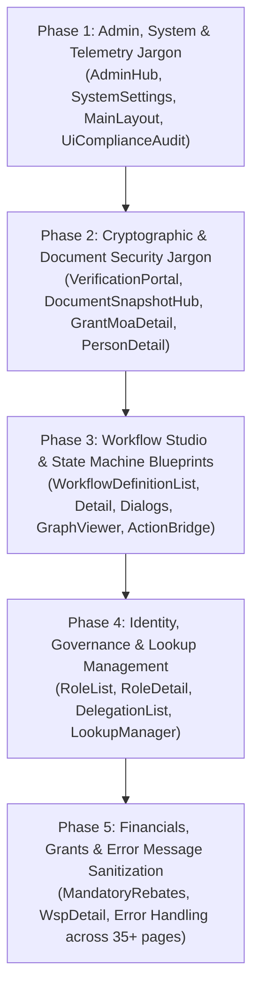

# PLAN-ui-jargon-cleanup.md: merSETA NSDMS UI Plain-Language & Technical Jargon Harmonization Plan

## 1. Executive Summary & Problem Statement

### 1.1 Objective
Eliminate all instances of software engineering jargon, database schema terminology, cryptography terms, and raw internal identifiers currently exposed to business end-users across the .NET 10 Blazor application (`dotnet/Nsdms.Web/Components/`). Harmonize all user-facing copy, headers, action buttons, table columns, chips, dialogs, and toast notifications with statutory South African Skills Development and merSETA operational terminology.

### 1.2 Target Scope
Across **30+ UI components** in `dotnet/Nsdms.Web/Components/Pages/`, `Components/Layout/`, and `Components/Shared/`, we will remediate:
1. **Audit & JSON Metadata**: Remove "double-write", "MetadataJson", "before/after JSON snapshots".
2. **Cryptographic & Verification Jargon**: Replace "SHA-256 Hash / Fingerprint", "Cryptographically Frozen", "Luhn Checksum" with "Digital Security Seal", "Legally Executed & Locked", "Valid RSA ID".
3. **Workflow State Machine Jargon**: Replace "Workflow Blueprint", "Finite State Machine (FSM)", "Terminal State", "Transition Rules" with "Standard Process Guide", "Approval Stages", "Workflow Concluded", "Workflow Actions".
4. **Identity & Governance Jargon**: Disambiguate "Claims" (security vs grant claims), replace "CASL permission scopes", "Maker-Checker SoD".
5. **Database Schema & Entity Introspection Leaks**: Replace "Temporal Tables", "Primary Key / PK", raw C# entity class names in dropdowns.
6. **Telemetry & Framework Jargon**: Remove "SignalR", "Playwright Circuit", "HUD", "Heuristics".
7. **Raw Integer Primary Key Leakage**: Mask raw database integer IDs in tables/headers with formal statutory business references (`WSP-2026-0042`, `DEL-00123`, `TH-0042`, `CLM-00091`, SDL numbers).
8. **Statutory Nomenclature**: Ensure explicit "Discretionary Grant (DG)" vs "Mandatory Grant (MG)" distinctions throughout; replace "Migration" with "Sector / Chamber Transfer".
9. **Safe Error Feedback**: Sanitize generic `catch (Exception ex)` blocks to prevent raw stack/SQL error leakage to end-users while preserving internal logging.

---

## 2. Phased Implementation Roadmap



---

## 3. Detailed Component Modification Inventory

### Phase 1: Admin, System Configuration & Telemetry Cleanup
| Target File | Line / Location | Current Technical Term | Proposed Plain-Language / merSETA Replacement |
| :--- | :--- | :--- | :--- |
| `dotnet/Nsdms.Web/Components/Pages/Admin/AdminHub.razor` | Line 591 (Snackbar) | `"...saved with double-write audit logging."` | `"...saved successfully."` |
| `dotnet/Nsdms.Web/Components/Pages/Admin/AdminHub.razor` | Line 422 (Select Item) | `<MudSelectItem Value="@("Json")">JSON Object</MudSelectItem>` | `Structured Configuration / Key-Value` |
| `dotnet/Nsdms.Web/Components/Pages/Admin/AdminHub.razor` | Line 118 (Chip) | `<MudChip>Temporal Versioning</MudChip>` | `<MudChip>Version History Active</MudChip>` |
| `dotnet/Nsdms.Web/Components/Pages/Admin/AdminHub.razor` | Line 78 (Subtitle) | `"SETMIS & OFO standard enums"` | `"Standard reference lists & codes"` |
| `dotnet/Nsdms.Web/Components/Pages/Admin/SystemSettings.razor` | Line 21 (Header) | `"Cascading enterprise configuration engine with dynamic database overrides and double-write audit logging."` | `"Enterprise system configuration and operational parameter management."` |
| `dotnet/Nsdms.Web/Components/Pages/Admin/SystemSettings.razor` | Line 224 (Select Item) | `<MudSelectItem Value="@("Json")">Json</MudSelectItem>` | `Structured Configuration` |
| `dotnet/Nsdms.Web/Components/Pages/Admin/AuditLogs.razor` | Line 20 (Header Subtitle) | `"Immutable enterprise audit records tracking entity mutations, actor activity, timestamps, and before/after JSON snapshots."` | `"Official activity logs tracking system changes, user actions, and change history."` |
| `dotnet/Nsdms.Web/Components/Pages/Admin/AuditLogs.razor` | Line 81 (Column Header) | `<MudTh>Metadata Snapshot</MudTh>` | `<MudTh>Change Details</MudTh>` |
| `dotnet/Nsdms.Web/Components/Layout/MainLayout.razor` | Line 61 (Subtitle) | `"Real-Time SignalR & In-App Alerts"` | `"Live Notifications"` |
| `dotnet/Nsdms.Web/Components/Layout/MainLayout.razor` | Line 292, 301 (Toasts) | `"⚡ Live SignalR Event: Task '...' assigned"`, `"⚡ Workflow Transition: ..."` | `"🔔 New Task Assigned: '...' to ..."`, `"📋 Status Update: ... is now '...'"` |
| `dotnet/Nsdms.Web/Components/Pages/Admin/UiComplianceAudit.razor` | Lines 23, 283 | `"UI/UX Enterprise Standards & Compliance Audit HUD"` | `"UI/UX Standards & Accessibility Compliance Dashboard"` |
| `dotnet/Nsdms.Web/Components/Pages/Developer/SimulationRecordingViewer.razor` | Line 34 (Chip) | `<MudChip>Verified Playwright Circuit</MudChip>` | `<MudChip>Verified Automated Test</MudChip>` |

---

### Phase 2: Cryptographic & Document Security Modernization
| Target File | Line / Location | Current Technical Term | Proposed Plain-Language / merSETA Replacement |
| :--- | :--- | :--- | :--- |
| `dotnet/Nsdms.Web/Components/Pages/Verification/DocumentVerificationPortal.razor` | Line 20 (Subtitle) | `"Instant cryptographic point-in-time provenance verification..."` | `"Instant online verification of official merSETA trade certificates, outcome letters, and contracts."` |
| `dotnet/Nsdms.Web/Components/Pages/Verification/DocumentVerificationPortal.razor` | Line 25 (Chip) | `SHA-256 Hash Anchored` | `Digitally Secured & Verified` |
| `dotnet/Nsdms.Web/Components/Pages/Verification/DocumentVerificationPortal.razor` | Line 33 (Placeholder) | `"Enter document SHA-256 hash or tracking number (e.g. DOC-2026-TT-00123)..."` | `"Enter document reference number or verification code (e.g. DOC-2026-TT-00123)..."` |
| `dotnet/Nsdms.Web/Components/Pages/Verification/DocumentVerificationPortal.razor` | Line 137 (Table Cell) | `SHA-256 Fingerprint` | `Digital Verification Code` |
| `dotnet/Nsdms.Web/Components/Pages/Verification/DocumentVerificationPortal.razor` | Line 242 (Toast) | `"Cryptographic document verification complete."` | `"Document verification complete."` |
| `dotnet/Nsdms.Web/Components/Pages/Admin/DocumentSnapshotHub.razor` | Line 17 (Chip) | `Non-Repudiation Engine` | `Official Document Registry` |
| `dotnet/Nsdms.Web/Components/Pages/Admin/DocumentSnapshotHub.razor` | Line 21 (Subtitle) | `"Audit trail of all cryptographically frozen statutory certificates... with SHA-256 fingerprinting."` | `"Official register of issued statutory certificates, outcome letters, and agreements with digital security verification."` |
| `dotnet/Nsdms.Web/Components/Pages/Admin/DocumentSnapshotHub.razor` | Line 86, 111 (Column/Cell) | `<MudTh>SHA-256 Fingerprint</MudTh>`, `DataLabel="SHA-256"` | `<MudTh>Digital Security Code</MudTh>`, `DataLabel="Security Code"` |
| `dotnet/Nsdms.Web/Components/Pages/Finance/GrantMoaDetail.razor` | Line 517 (Header) | `"Cryptographic Non-Repudiation"` | `"Document Security & Verification"` |
| `dotnet/Nsdms.Web/Components/Pages/Finance/GrantMoaDetail.razor` | Line 527 (Display) | `SHA-256: <code>...</code>` | `Security Verification Code: <code>...</code>` |
| `dotnet/Nsdms.Web/Components/Pages/Finance/GrantMoaDetail.razor` | Line 531 (Button) | `"Verify Cryptographic Hash Integrity"` | `"Verify Document Authenticity"` |
| `dotnet/Nsdms.Web/Components/Pages/Finance/GrantMoaDetail.razor` | Line 856 (Toast) | `"MoA snapshot frozen successfully. SHA-256: ..."` | `"MoA agreement executed and locked successfully."` |
| `dotnet/Nsdms.Web/Components/Pages/People/PersonDetail.razor` | Line 142 (Chip) | `<MudChip>Luhn Checksum Valid</MudChip>` | `<MudChip Color="Color.Success">Valid RSA National ID</MudChip>` |
| `dotnet/Nsdms.Web/Components/Pages/Assessments/SummativeAssessmentDetail.razor` | Lines 192, 209 | `"generate the formal cryptographic SOR document."`, `"SHA-256 Hash: ..."` | `"generate the official Statement of Results."`, `"Verification Code: ..."` |

---

### Phase 3: Workflow State Machine & Blueprint Harmonization
| Target File | Line / Location | Current Technical Term | Proposed Plain-Language / merSETA Replacement |
| :--- | :--- | :--- | :--- |
| `dotnet/Nsdms.Web/Components/Pages/Admin/WorkflowDefinitionList.razor` | Lines 12, 19 | `"Workflow Studio & State Machine Blueprints"` | `"Workflow & Approval Process Management"` |
| `dotnet/Nsdms.Web/Components/Pages/Admin/WorkflowDefinitionList.razor` | Line 20 (Subtitle) | `"Enterprise state machine orchestration, lifecycle stages, gate transition matrices, and SLA policies"` | `"Configure approval stages, review steps, requirements, and escalation timelines."` |
| `dotnet/Nsdms.Web/Components/Pages/Admin/WorkflowDefinitionList.razor` | Lines 36, 219 (Buttons) | `"New Blueprint"`, `"Create Blueprint"` | `"New Workflow"`, `"Create Workflow Process"` |
| `dotnet/Nsdms.Web/Components/Pages/Admin/WorkflowDefinitionList.razor` | Line 58, 70 (Stat Labels) | `"Active Engines"`, `"Configured States"` | `"Active Workflows"`, `"Workflow Stages"` |
| `dotnet/Nsdms.Web/Components/Pages/Admin/WorkflowDefinitionList.razor` | Line 234 (Column Header) | `<MudTh>Blueprint Title & Process</MudTh>` | `<MudTh>Workflow Name & Process</MudTh>` |
| `dotnet/Nsdms.Web/Components/Pages/Admin/WorkflowDefinitionList.razor` | Lines 123–129 (Filter) | Raw class names: `Organisation`, `WspSubmission`, `GrantApplication` | Friendly names: `Employers & Organisations`, `Workplace Skills Plans (WSP)`, `Discretionary Grant Applications` |
| `dotnet/Nsdms.Web/Components/Pages/Admin/WorkflowDefinitionDetail.razor` | Lines 12, 89, 104, 110 | `"Workflow Blueprint Studio"`, `"Save Blueprint"`, `"Blueprint Metadata"`, `"Process Blueprint Code"` | `"Workflow Process Editor"`, `"Save Workflow"`, `"Process Details"`, `"Process Code"` |
| `dotnet/Nsdms.Web/Components/Pages/Admin/WorkflowDefinitionDetail.razor` | Lines 758, 777 | `"Add State Transition Rule"`, `"Edit State Transition Rule"` | `"Add Workflow Action / Step"`, `"Edit Workflow Action"` |
| `dotnet/Nsdms.Web/Components/Pages/Admin/WorkflowCloneDialog.razor` | Lines 11, 26, 34, 56 | `"Clone Workflow Blueprint"`, `"New Blueprint Code"`, `"New Blueprint Name"`, `"Clone Blueprint"` | `"Duplicate Workflow Process"`, `"New Process Code"`, `"New Process Name"`, `"Duplicate Workflow"` |
| `dotnet/Nsdms.Web/Components/Pages/Admin/WorkflowCreateDialog.razor` | Lines 11, 19, 57, 64 | `"Create Workflow Blueprint"`, `"Process Blueprint Code"`, `"Primary Key Field Name"`, `"Activate Blueprint Immediately"` | `"Create Workflow Process"`, `"Process Code"`, `"Record Identifier Field"`, `"Activate Workflow Immediately"` |
| `dotnet/Nsdms.Web/Components/Shared/WorkflowActionBridge.razor` | Line 83 (Chip) | `<MudChip>Terminal State Reached</MudChip>` | `<MudChip Color="Color.Success">Workflow Completed / Finalized</MudChip>` |
| `dotnet/Nsdms.Web/Components/Shared/WorkflowGraphViewer.razor` | Lines 9, 35, 39, 43 | `"State Machine Topology & Gate Flow"`, `"Initial State"`, `"Intermediate Gate"`, `"Terminal State"` | `"Workflow Process Diagram"`, `"Start Stage"`, `"Review Stage"`, `"Completed Stage"` |

---

### Phase 4: Identity, Permissions & Reference Data Management
| Target File | Line / Location | Current Technical Term | Proposed Plain-Language / merSETA Replacement |
| :--- | :--- | :--- | :--- |
| `dotnet/Nsdms.Web/Components/Pages/Admin/RoleList.razor` | Line 19 (Subtitle) | `"Configure Claims-Based RBAC roles and module-level action permissions"` | `"Configure user roles, functional access, and system permissions"` |
| `dotnet/Nsdms.Web/Components/Pages/Admin/RoleList.razor` | Lines 77, 86 (Column/Cell) | `<MudTh>ID</MudTh>`, `#@context.Id` | `<MudTh>Role Code</MudTh>`, `@context.Name` |
| `dotnet/Nsdms.Web/Components/Pages/Admin/RoleDetail.razor` | Line 87 (HelperText) | `HelperText="...CASL access scopes."` | `HelperText="...operational boundaries and access levels."` |
| `dotnet/Nsdms.Web/Components/Pages/Admin/RoleDetail.razor` | Line 122 (Header) | `Active Claims: @_selectedClaims.Count of @_allPermissions.Count Selected` | `Active Permissions: @_selectedClaims.Count of @_allPermissions.Count Selected` |
| `dotnet/Nsdms.Web/Components/Pages/Admin/WorkflowTransitionDialog.razor` | Line 92 (Label) | `Label="Required CASL Permission / Role Gate"` | `Label="Required User Role / Permission"` |
| `dotnet/Nsdms.Web/Components/Pages/Governance/DelegationList.razor` | Line 48 (Chip) | `Maker-Checker Enforced` | `Independent Dual-Approval Enforced` |
| `dotnet/Nsdms.Web/Components/Pages/Governance/DelegationList.razor` | Lines 78, 89 (Column/Cell) | `<MudTh>ID</MudTh>`, `#@context.Id` | `<MudTh>Delegation Ref</MudTh>`, `DEL-@context.Id.ToString("D5")` |
| `dotnet/Nsdms.Web/Components/Pages/Governance/ThresholdList.razor` | Lines 61, 73 (Column/Cell) | `<MudTh>ID</MudTh>`, `#@context.Id` | `<MudTh>Threshold Ref</MudTh>`, `TH-@context.Id.ToString("D4")` |
| `dotnet/Nsdms.Web/Components/Pages/Admin/LookupManager.razor` | Line 20 (Header Title) | `<EntityHeader Title="@($"lookup.{TableName}")">` | Display Name (e.g. `Title Reference List`) |
| `dotnet/Nsdms.Web/Components/Pages/Admin/LookupManager.razor` | Line 53 (HelperText) | `HelperText="Unique uppercase primary key (varchar 50)"` | `HelperText="Unique uppercase reference code"` |
| `dotnet/Nsdms.Web/Components/Pages/Admin/LookupManager.razor` | Line 132 (Column Header) | `<MudTh>Code (PK)</MudTh>` | `<MudTh>Reference Code</MudTh>` |
| `dotnet/Nsdms.Web/Components/Pages/Employers/EmployerDetail.razor` | Lines 436, 1039 | `Person ID: @context.PersonId` | Contact Person Full Name & Job Title |
| `dotnet/Nsdms.Web/Components/Pages/Etqa/EtqaDetail.razor` | Line 375 | `Person ID: @context.PersonId` | Assessor / Moderator Full Name |

---

### Phase 5: Financials, Grants & Error Feedback Sanitization
| Target File | Line / Location | Current Technical Term | Proposed Plain-Language / merSETA Replacement |
| :--- | :--- | :--- | :--- |
| `dotnet/Nsdms.Web/Components/Pages/Finance/MandatoryRebateDisbursements.razor` | Line 221 (Toast) | `"Mandatory rebate disbursement marked as PAID via EFT release."` | `"Mandatory grant rebate marked as Disbursed. Remittance advice generated."` |
| `dotnet/Nsdms.Web/Components/Pages/Finance/GrantMoaDetail.razor` | Line 211 (Column/Cell) | `<MudTd DataLabel="Claim Ref"><strong>#@context.Id</strong></MudTd>` | `<MudTd DataLabel="Claim Ref"><strong>CLM-@context.Id.ToString("D5")</strong></MudTd>` |
| `dotnet/Nsdms.Web/Components/Pages/InterSeta/InterSetaTransferList.razor` | Line 205 (Field Label) | `"Reason for Chamber / SIC Code Migration"` | `"Reason for Sector / Chamber Transfer"` |
| `dotnet/Nsdms.Web/Components/Pages/WorkplaceApprovals/TradeMentorRatioList.razor` | Line 50 (Chip) | `<MudChip>Global Bypass / Migration Mode</MudChip>` | `<MudChip>Transitional Policy Exemption Active</MudChip>` |
| Across 35+ `.razor` pages | Catch blocks | `Snackbar.Add($"Error loading ...: {ex.Message}", Severity.Error);` | `Snackbar.Add("Unable to complete action. Please check required inputs and try again.", Severity.Error);` (with internal logger recording `ex`) |

---

## 4. Socratic Gate (Design Decisions & Clarifications)

Before executing implementation, the following architectural and design invariants are locked in:

1. **Trade-off on Developer Tools Accessibility**:
   - `DatabaseDictionary.razor` and `UiComplianceAudit.razor` are designated as internal system diagnostics. They will display an explicit top badge `[Internal Developer Diagnostics]` rather than polluting the business navigation menu.
2. **Backward Compatibility with Existing Data**:
   - Replacing UI text strings, chips, table headers, and toasts does **not** alter the underlying database schema, EF Core migrations, or service contracts. Existing database columns (`MetadataJson`, `Sha256Hash`, `RenderedContentHash`) remain intact at the storage layer while being rendered cleanly on the UI.
3. **Audit Double-Write Integrity**:
   - All workflow actions, grant approvals, and delegation mutations continue to write to `audit_logs` via `INsdmsDbContextFactory`. Only the toast confirmation text is updated to remove the phrase "double-write".

---

## 5. Verification & Testing Plan

### 5.1 Automated Test Execution
1. **Compilation Check**:
   ```powershell
   dotnet build dotnet/Nsdms.slnx
   ```
2. **Unit Test Suite**:
   ```powershell
   dotnet test dotnet/Nsdms.Tests/Nsdms.Tests.csproj
   ```
3. **Playwright UI End-to-End Suite**:
   ```powershell
   python test_all_pages_playwright.py
   python test_finance_playwright.py
   python test_workflow_playwright.py
   python test_roles_permissions_playwright.py
   ```

### 5.2 Manual UI Verification
- Verify that every modified page opens in **View mode by default**.
- Verify that all toasts, dialog headers, table headers, and chips render in standard sentence case without cryptographic or database jargon.
- Confirm zero raw database integer IDs (`#1042`) appear in user-facing tables or dropdowns.
