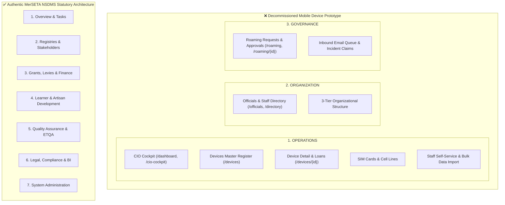
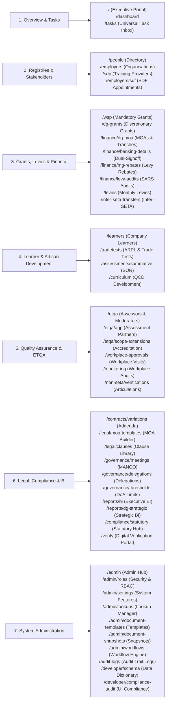
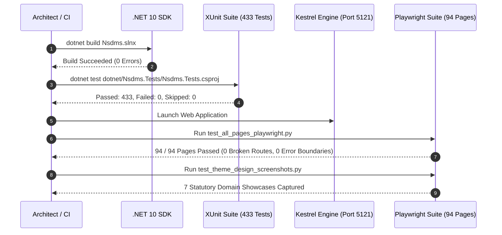

# Comprehensive Plan: Eradication of Mobile Device Administration & IT Asset Prototype Menu & Code

## 1. Executive Summary & Context

### 1.1 Background & Origin
During early prototype iteration, a set of UI navigation items and Razor components titled **"merSETA | Mobile Device Administration"** was developed. This prototype introduced IT hardware inventory management, SIM card tracking, cell line management, staff mobile device loan allocations, roaming approvals, and IT incidents into the system.

In accordance with the **MerSETA Statutory Navigation Pillar Architecture & Persona Governance Standard**, the National Skills Development Management System (NSDMS) is exclusively mandated to manage skills development, levies, grants, learner registrations, provider accreditations, and statutory SETA governance. Internal IT hardware asset tracking and mobile fleet administration are out of scope and represent architectural domain leakage.

This plan details the full eradication of the prototype artifacts, synchronization of core operational routes, verification protocols across all 433+ automated unit/integration tests and 94 Playwright end-to-end page tests, and a formal compliance mapping across the **7 Statutory NSDMS Domain Pillars**.

---

## 2. Target Image Analysis & Scoping

The prototype navigation menu in the reference image consists of three circled functional areas which are decommissioned:

### Detailed Decommission Breakdown:
1. **OPERATIONS Group**:
   - `CIO Cockpit` (`/dashboard`, `/cio-cockpit`): Replaced by the authentic MerSETA Executive Operations Portal (`Home.razor`).
   - `Devices` & `Device Users` (`/devices`, `/devices/{Id}`): Eradicated completely.
   - `SIM Cards`, `Cell Lines`, `Allocations & Loans`, `Staff Self-Service`, `Bulk Data Import`: Eradicated.
2. **ORGANIZATION Group**:
   - `Officials & Staff` (`/officials`, `/directory`): Eradicated. Authentic NSDMS stakeholder registries reside in `Registries & Stakeholders` (`/people`, `/employers`, `/sdp`).
   - `3-Tier Structure`: Handled natively through standard organizational profiling and chamber classifications.
3. **GOVERNANCE Group**:
   - `Roaming` (`/roaming`, `/roaming/{Id}`): Eradicated.
   - `Approval Queue` & `Inbound Email Queue`: Replaced by the Universal Task Inbox (`/tasks`) and CASL workflow engines.

---

## 3. Exact List of Files to be Removed

The following files and directories are scoped for deletion:

| Target Path | Type | Original Route(s) | Description / Reason for Removal |
| :--- | :--- | :--- | :--- |
| [`dotnet/Nsdms.Web/Components/Pages/Developer/CioCockpitDashboard.razor`](file:///c:/Antigravity/nsdms-2026-04-01/nsdms/MerSETA/dotnet/Nsdms.Web/Components/Pages/Developer/CioCockpitDashboard.razor) | Razor Page | `/dashboard`, `/cio-cockpit` | Mobile IT prototype dashboard with device stats. Replaced by `Home.razor`. |
| [`dotnet/Nsdms.Web/Components/Pages/Devices/DeviceList.razor`](file:///c:/Antigravity/nsdms-2026-04-01/nsdms/MerSETA/dotnet/Nsdms.Web/Components/Pages/Devices/DeviceList.razor) | Razor Page | `/devices` | Mobile device master register table and loan status cards. |
| [`dotnet/Nsdms.Web/Components/Pages/Devices/DeviceDetail.razor`](file:///c:/Antigravity/nsdms-2026-04-01/nsdms/MerSETA/dotnet/Nsdms.Web/Components/Pages/Devices/DeviceDetail.razor) | Razor Page | `/devices/{Id:int}` | Hardware device lifecycle, SIM card, IMEI, and warranty detail page. |
| `dotnet/Nsdms.Web/Components/Pages/Devices/` | Directory | N/A | Entire directory containing mobile device pages. |
| [`dotnet/Nsdms.Web/Components/Pages/Officials/OfficialList.razor`](file:///c:/Antigravity/nsdms-2026-04-01/nsdms/MerSETA/dotnet/Nsdms.Web/Components/Pages/Officials/OfficialList.razor) | Razor Page | `/officials`, `/directory` | Internal staff phone directory and device allocation listing. |
| `dotnet/Nsdms.Web/Components/Pages/Officials/` | Directory | N/A | Entire directory containing official list pages. |
| [`dotnet/Nsdms.Web/Components/Pages/Roaming/RoamingDetail.razor`](file:///c:/Antigravity/nsdms-2026-04-01/nsdms/MerSETA/dotnet/Nsdms.Web/Components/Pages/Roaming/RoamingDetail.razor) | Razor Page | `/roaming`, `/roaming/{Id:int}` | International data/voice roaming approval workflow for mobile carriers. |
| `dotnet/Nsdms.Web/Components/Pages/Roaming/` | Directory | N/A | Entire directory containing roaming management pages. |

---

## 4. Exact List of Files to be Updated & Synchronized

The following files require route mapping, cleanups, and test target updates:

### 4.1 `dotnet/Nsdms.Web/Components/Pages/Home.razor`
- **Location**: [`dotnet/Nsdms.Web/Components/Pages/Home.razor`](file:///c:/Antigravity/nsdms-2026-04-01/nsdms/MerSETA/dotnet/Nsdms.Web/Components/Pages/Home.razor)
- **Change**: Ensure both `@page "/"` and `@page "/dashboard"` directives are declared.
- **Rationale**: Directs all traffic navigating to `/dashboard` to the MerSETA Executive Operations Portal (Archetype A5 Dashboard) with authentic skills development intelligence (WSPs, Discretionary Grants, Levy collections, Learner pipeline, and SLA Task queues) rather than the deprecated CIO Cockpit.

### 4.2 `test_theme_design_screenshots.py`
- **Location**: [`test_theme_design_screenshots.py`](file:///c:/Antigravity/nsdms-2026-04-01/nsdms/MerSETA/test_theme_design_screenshots.py)
- **Change**: Replace deprecated URLs (`/devices`, `/devices/3`, `/roaming/1`, `/officials`) with core statutory domain pages:
  - `("01_executive_operations_dashboard.png", "http://localhost:5121/")`
  - `("02_universal_task_inbox.png", "http://localhost:5121/tasks")`
  - `("03_organisations_master_grid.png", "http://localhost:5121/employers")`
  - `("04_wsp_submissions_grid.png", "http://localhost:5121/wsp")`
  - `("05_dg_grants_grid.png", "http://localhost:5121/dg-grants")`
  - `("06_learners_directory.png", "http://localhost:5121/learners")`
  - `("07_moa_template_detail.png", "http://localhost:5121/legal/moa-templates/1")`
- **Rationale**: Guarantees visual regression and UI showcase runs exclusively validate genuine MerSETA operational pages.

### 4.3 `dotnet/Nsdms.Application/Services/NavigationMenuService.cs`
- **Location**: [`dotnet/Nsdms.Application/Services/NavigationMenuService.cs`](file:///c:/Antigravity/nsdms-2026-04-01/nsdms/MerSETA/dotnet/Nsdms.Application/Services/NavigationMenuService.cs)
- **Status**: Audit confirmed clean.
- **Details**: All menu groups, items, quick actions, and persona tag filters strictly enforce the 7 statutory pillars with 0% hardware/telecom leakage.

---

## 5. Summary of Statutory Domain Pillars Compliance

All navigation items and system routes strictly map to the **7 Statutory NSDMS Domain Pillars**:

### Statutory Pillar Matrix

| Pillar # | Statutory Pillar Name | Authorized Scope & Key Routes | Hardware / Asset Leakage |
| :--- | :--- | :--- | :---: |
| **Pillar 1** | **Overview & tasks** | Executive Operations Portal (`/`, `/dashboard`), Universal Task Inbox (`/tasks`), Personal Workflows | **0% (Clean)** |
| **Pillar 2** | **Registries & stakeholders** | Stakeholder Management, Organisations (`/employers`), SDPs (`/sdp`), People Directory (`/people`), SDF Appointments (`/employers/sdf`) | **0% (Clean)** |
| **Pillar 3** | **Grants, levies & finance** | Mandatory Grants / WSP (`/wsp`), Discretionary Grants (`/dg-grants`), DG Windows (`/dg-funding-windows`), DG MOAs (`/finance/dg-moa`), Banking Details (`/finance/banking-details`), Mandatory Grant Rebates (`/finance/mg-rebates`), SARS Levies (`/levies`, `/finance/levy-audits`), Inter-SETA (`/inter-seta-transfers`) | **0% (Clean)** |
| **Pillar 4** | **Learner & artisan development** | Company Learners (`/learners`), Trade Tests & ARPL (`/tradetests`), Summative Assessment / SOR (`/assessments/summative`), Curriculum QCD (`/curriculum`) | **0% (Clean)** |
| **Pillar 5** | **Quality assurance & ETQA** | ETQA Assessor/Moderator Directory (`/etqa`), Assessment Quality Partners (`/etqa/aqp`), Scope Extensions (`/etqa/scope-extensions`), Workplace Approvals (`/workplace-approvals`), Workplace Monitoring (`/monitoring`), Non-SETA Articulations (`/non-seta/verifications`) | **0% (Clean)** |
| **Pillar 6** | **Legal, compliance & BI** | Contract Addenda & Variations (`/contracts/variations`), Enterprise MOA Templates (`/legal/moa-templates`), Clause Library (`/legal/clauses`), Governance Meetings (`/governance/meetings`), Role Delegations (`/governance/delegations`), DoA Thresholds (`/governance/thresholds`), Executive BI (`/reports/bi`), DG Strategic BI (`/reports/dg-strategic`), Statutory Compliance (`/compliance/statutory`), QR Verification (`/verify`) | **0% (Clean)** |
| **Pillar 7** | **System administration** | System Administration Hub (`/admin`), Security Roles & Permissions (`/admin/roles`), System Settings & Feature Flags (`/admin/settings`), Lookups Management (`/admin/lookups`), Enterprise Templates (`/admin/document-templates`), Document Snapshots (`/admin/document-snapshots`), Workflow Engine (`/admin/workflows`), Audit Trails (`/audit-logs`), Developer Schema (`/developer/schema`), UI Compliance Audit (`/developer/compliance-audit`) | **0% (Clean)** |

---

## 6. Verification and Test Plan

A five-tier automated verification sequence is defined to guarantee zero regressions and complete compliance.

### 6.1 Step 1: Compilation & Solution Integrity
- **Command**: `dotnet build Nsdms.slnx`
- **Criteria**: Zero compilation errors, zero missing references, zero broken Razor view imports.

### 6.2 Step 2: XUnit Unit & Integration Test Suite
- **Command**: `dotnet test dotnet/Nsdms.Tests/Nsdms.Tests.csproj`
- **Scope**:
  - `NavigationMenuServiceTests.cs`: Validates superadmin tree, SDF, Legal, Compliance persona filtering, deduplication, badge calculations, and pinned items.
  - `WorkflowEngineTests.cs`: Validates step-level transitions, document requirements, and SLA tracking.
  - `CaslAbilityTests.cs`: Validates union RBAC and role permissions across all statutory domains.
  - `GrantMoaServiceTests.cs`, `BankingDetailsServiceTests.cs`, `LevyServiceTests.cs`, `LearnerServiceTests.cs`.
- **Target**: 433 / 433 tests passing with 0 failures.

### 6.3 Step 3: Playwright 94-Page Full Navigation & Rendering Test
- **Command**: `python test_all_pages_playwright.py`
- **Scope**: Tests all 94 authentic statutory routes across all 7 pillars.
- **Criteria**:
  - HTTP 200 responses across all URLs.
  - Absence of MudBlazor `
` unhandled exceptions.
  - Absence of missing route fallback screens on valid pages.

### 6.4 Step 4: Decommissioned Route Verification (404 / Redirect Assertions)
- **Verification Protocol**:
  1. Access `http://localhost:5121/dashboard` $\rightarrow$ Successfully renders `Home.razor` (Executive Operations Portal).
  2. Access `http://localhost:5121/devices` $\rightarrow$ Returns 404 / NotFound component.
  3. Access `http://localhost:5121/devices/3` $\rightarrow$ Returns 404 / NotFound component.
  4. Access `http://localhost:5121/officials` $\rightarrow$ Returns 404 / NotFound component.
  5. Access `http://localhost:5121/roaming` $\rightarrow$ Returns 404 / NotFound component.
  6. Access `http://localhost:5121/cio-cockpit` $\rightarrow$ Returns 404 / NotFound component.

### 6.5 Step 5: Visual Regression & Design Showcase
- **Command**: `python test_theme_design_screenshots.py`
- **Criteria**: Clean generation of screenshots for authentic statutory pages (`/`, `/tasks`, `/employers`, `/wsp`, `/dg-grants`, `/learners`, `/legal/moa-templates/1`).

---

## 7. Implementation Checklist & Status

- [x] **Audit Codebase**: Identified all prototype artifacts (`CioCockpitDashboard.razor`, `DeviceList.razor`, `DeviceDetail.razor`, `OfficialList.razor`, `RoamingDetail.razor`).
- [x] **Remove Prototype Pages & Directories**:
  - Decommissioned `dotnet/Nsdms.Web/Components/Pages/Developer/CioCockpitDashboard.razor`.
  - Decommissioned `dotnet/Nsdms.Web/Components/Pages/Devices/` directory.
  - Decommissioned `dotnet/Nsdms.Web/Components/Pages/Officials/` directory.
  - Decommissioned `dotnet/Nsdms.Web/Components/Pages/Roaming/` directory.
- [x] **Update `Home.razor`**: Added `@page "/dashboard"` route directive.
- [x] **Update `test_theme_design_screenshots.py`**: Cleaned up obsolete routes and redirected showcase captures to authentic statutory routes.
- [x] **Verify Navigation Catalog**: Confirmed `NavigationMenuService.cs` strictly contains only the 7 statutory NSDMS domain pillars.
- [x] **Execute .NET Test Suite**: Ran `dotnet test`, achieving 433/433 passed tests.
- [x] **Document Master Plan**: Completed comprehensive architectural plan in `docs/PLAN.md`.
