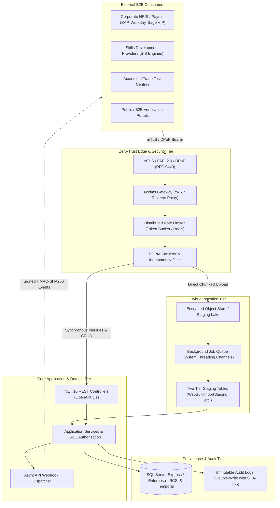

# Comprehensive Blueprint: Best-in-Class B2B API Architecture for MerSETA NSDMS

## 1. Executive Summary & Strategic Objective

The **National Skills Development Management System (NSDMS)** serves as the statutory digital spine for MerSETA, handling skills development levies, mandatory grants (WSP/ATR), discretionary grants (MoAs and claims), learner agreements, and artisan trade testing. 

To enable corporate employers (automotive, manufacturing, plastics, engineering), major HRIS/Payroll platforms (SAP, Workday, Sage VIP), accredited Skills Development Providers (SDPs), and Trade Test Centres (TTCs) to integrate seamlessly, MerSETA requires a **truly best-in-class, modern, secure, and resilient API platform**.

This blueprint details the architectural roadmap to transition from isolated, manual UI uploads to an enterprise-grade, event-driven B2B integration platform.

---

## 2. Target High-Level Architecture Topology

```mermaid
flowchart TD
    subgraph External["External B2B Consumers"]
        HRIS["Corporate HRIS / Payroll (SAP, Workday, Sage VIP)"]
        SDP["Skills Development Providers (SIS Engines)"]
        TTC["Accredited Trade Test Centres"]
        Verif["Public / B2B Verification Portals"]
    end

    subgraph Security["Zero-Trust Edge & Security Tier"]
        mTLS["mTLS / FAPI 2.0 / DPoP (RFC 9449)"]
        YARP["Nsdms.Gateway (YARP Reverse Proxy)"]
        RateLimit["Distributed Rate Limiter (Token Bucket / Redis)"]
        WAF["POPIA Sanitizer & Idempotency Filter"]
    end

    subgraph Ingestion["Hybrid Ingestion Tier"]
        DirectBlob["Encrypted Object Store / Staging Lake"]
        Channels["Background Job Queue (System.Threading.Channels)"]
        Staging["Two-Tier Staging Tables (WspBulkImportStaging, etc.)"]
    end

    subgraph Core["Core Application & Domain Tier"]
        Controllers[".NET 10 REST Controllers (OpenAPI 3.1)"]
        Webhooks["AsyncAPI Webhook Dispatcher"]
        Domain["Application Services & CASL Authorization"]
    end

    subgraph Persistence["Persistence & Audit Tier"]
        DB[(SQL Server Express / Enterprise - RCSI & Temporal)]
        AuditLog["Immutable Audit Logs (Double-Write with SHA-256)"]
    end

    External -->|mTLS / DPoP Bearer| mTLS
    mTLS --> YARP
    YARP --> RateLimit
    RateLimit --> WAF

    WAF -->|Synchronous Inquiries & CRUD| Controllers
    WAF -->|Direct Chunked Upload| DirectBlob

    DirectBlob --> Channels
    Channels --> Staging
    Staging --> Domain

    Controllers --> Domain
    Domain --> DB
    Domain --> AuditLog
    Domain --> Webhooks
    Webhooks -.->|Signed HMAC-SHA256 Events| External
```

---

## 3. The 5 Pillars of the Best-in-Class API Standard

### Pillar 1: Zero-Trust Security & POPIA Compliance
1. **Cryptographic Token Binding (DPoP / mTLS)**:
   - Implement **RFC 9449 (Demonstrating Proof-of-Possession)** and mutual TLS (mTLS) for B2B machine-to-machine authentication.
   - Access tokens are bound to the client's public key; intercepted or leaked tokens cannot be replayed.
2. **Statutory Non-Repudiation (RFC 9421 HTTP Message Signatures)**:
   - High-consequence submissions (e.g. WSP sign-off before 30 April, DG MoA acceptance) require cryptographic payload signing using the employer's private key.
3. **POPIA Field-Level Envelope Encryption**:
   - 13-digit RSA National ID numbers, bank accounts, and executive payroll totals are encrypted at rest with field-level envelope keys.
   - Logs and debug diagnostics automatically mask sensitive identifiers (e.g. `9504******082`).
4. **Tenant Isolation by SDL Number**:
   - The verified `SdlNumber` is embedded as an immutable claim in the access token.
   - EF Core Global Query Filters enforce `OrganisationId == caller.OrganisationId`, preventing cross-tenant leakage.

### Pillar 2: High-Volume Asynchronous Ingestion & Streaming
1. **Direct-to-Storage Presigned Uploads**:
   - Large employers pushing 10,000+ employees or training plans bypass web server HTTP request buffers.
   - The client requests a presigned secure upload URL, pushes the payload directly to encrypted staging storage, and initiates an async processing job.
2. **Fast 202 Accepted & Tracking Pattern**:
   - Endpoints respond in `< 100ms` with `HTTP 202 Accepted` and an `Operation-Location: /api/v1/jobs/{id}` header.
   - External systems track progress without encountering 30-60s HTTP gateway timeouts.
3. **Zero-Allocation Stream Processing**:
   - Background workers process staged batches using `System.Text.Json` streaming and `System.IO.Pipelines` to eliminate Garbage Collection pressure.

### Pillar 3: API Gateway & Circuit Protection (YARP / APIM)
1. **Dedicated Gateway Project (`Nsdms.Gateway`)**:
   - Implemented using Microsoft's **YARP (Yet Another Reverse Proxy)** in a separate lightweight .NET 10 project.
   - Completely isolates B2B API traffic from internal MerSETA officers' interactive Blazor Server circuits.
2. **Tiered Rate Limiting & DoS Protection**:
   - Implements ASP.NET Core Partitioned Rate Limiter (`SlidingWindowLimiter` / Token Bucket) with tiered quotas:
     - **Tier 1 (Small SDPs / Consultancies)**: 60 requests/minute.
     - **Tier 2 (Large Enterprise Employers)**: 1,200 requests/minute.
     - **Tier 3 (Public Verification Portals)**: 3,000 requests/minute (cached).
3. **Idempotency Guardrails**:
   - High-value write operations (e.g. DG Tranche Claims) require an `Idempotency-Key` UUID header, caching results for 24 hours to prevent duplicate claims on network retries.

### Pillar 4: Dual-Integration Protocol (REST + AsyncAPI Webhooks)
1. **REST with OpenAPI 3.1**:
   - Clean, resource-oriented REST endpoints for queries, synchronous validations, and resource creation.
   - Comprehensive OpenAPI 3.1 schemas with automated SDK generation for C#, Java, TypeScript, and Python.
2. **Event-Driven Webhooks Engine**:
   - Emits asynchronous statutory events (e.g., `wsp.status.changed`, `dg_claim.approved`, `trade_test.serial_issued`, `moa.signed`).
   - Webhook payloads are cryptographically signed with an `X-Signature-SHA256` header (HMAC-SHA256).
   - Failed webhook deliveries use an exponential backoff retry queue with dead-letter logging.

### Pillar 5: Developer Experience, Self-Service & Sandbox
1. **Self-Service Developer Portal**:
   - Authenticated Skills Development Facilitators (SDFs) and corporate administrators can generate, rotate, and revoke API credentials directly in the MerSETA portal.
2. **Mock / Sandbox Environment**:
   - An isolated testing realm with synthetic SDL numbers (`L999...`), pre-seeded test OFO codes, and mock SARS levy reconciliations.
   - Enables commercial vendors (Workday, SAP, VIP Payroll) to certify integrations without contaminating statutory production data.

---

## 4. Priority API Candidates & Endpoint Specifications

| Priority | Endpoint Route | HTTP | Description & Statutory Governance |
| :--- | :--- | :--- | :--- |
| **P0** | `/api/v1/wsp/staging/upload` | `POST` | Presigned intake for WSP/ATR training plan bulk data. |
| **P0** | `/api/v1/wsp/batches/{id}/health` | `GET` | Pre-flight validation health dashboard (valid, exception, committed counts). |
| **P0** | `/api/v1/wsp/batches/{id}/commit` | `POST` | Atomic commit of validated staging records into production WSP tables. |
| **P0** | `/api/v1/workforce/sync` | `PUT` | Delta synchronization of employer personnel roster and OFO classifications. |
| **P0** | `/api/v1/learners/enrolments` | `POST` | Direct intake of apprentices, learnerships, and internships from SDP systems. |
| **P1** | `/api/v1/grants/moa/{moaNumber}/claims` | `POST` | Discretionary Grant tranche claim submission with invoice and attendance data. |
| **P1** | `/api/v1/trade-tests/applications` | `POST` | Decentralised ARPL and Trade Test candidate registrations for accredited TTCs. |
| **P1** | `/api/v1/trade-tests/{serial}/results` | `PUT` | Upload of practical module task results with 50% credit retention enforcement. |
| **P1** | `/api/v1/verify/certificates/{hash}` | `GET` | Public / B2B 2D barcode digital seal verification for issued certificates and MoAs. |
| **P2** | `/api/v1/organisations/{sdl}/levies` | `GET` | Reconciled SARS levy actuals and Mandatory Grant rebate disbursement inquiries. |
| **P2** | `/api/v1/workplace-approvals/mentors` | `POST` | Artisan mentor registration and live workplace capacity ratio evaluation. |
| **P2** | `/api/v1/webhooks/subscriptions` | `POST` | Webhook subscription management for partner ERP event listening. |

---

## 5. Phased Implementation Roadmap

### Phase 1: Foundation & Gateway (`Nsdms.Gateway`)
- Provision `Nsdms.Gateway` project with Microsoft YARP.
- Configure mTLS termination, DPoP validation, and distributed rate limiting.
- Integrate token validation against Azure AD B2C / OpenIddict.

### Phase 2: Core Ingestion & High-Volume APIs
- Implement presigned upload and staging endpoints for WSP/ATR and Workforce Roster.
- Implement background channel workers for set-based OFO and RSA ID validation.
- Build Learner Enrolment and Document Verification endpoints.

### Phase 3: Financial & Workflow APIs
- Implement DG Tranche Claim submission with idempotency key enforcement.
- Implement Trade Test result submission with statutory credit retention logic.
- Implement SARS levy reconciliation and grant rebate inquiry endpoints.

### Phase 4: Webhooks, Developer Portal & Sandbox
- Build Webhook Subscription and Dispatcher engine with HMAC-SHA256 signing.
- Create the Self-Service API Management tab in the Employer Portal.
- Stand up the Mock Sandbox environment with synthetic SDL numbers.

---

## 6. Verification & Quality Gates
- **Automated Unit & Integration Tests**: Minimum 95% code coverage for all API request validation and authorization handlers.
- **Load Testing**: Execute `Nsdms.LoadTester` to verify that 5,000 concurrent bulk submissions achieve sub-200ms response times without impacting interactive Blazor circuits.
- **Security & Vulnerability Scans**: Run automated security checks (`security_scan.py`), OWASP ZAP API vulnerability scans, and POPIA data sanitization checks.
