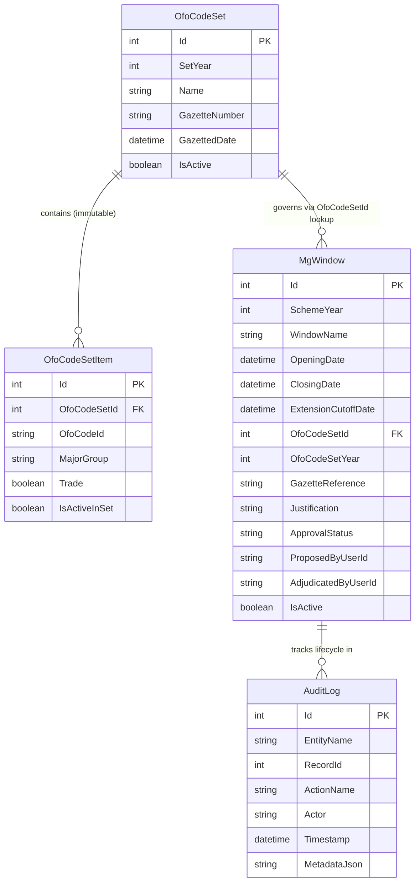

# Architectural Specification & Implementation Plan
# Option A: Clean Single-Schedule Hub with Dropdown Lookup
## Streamlined Mandatory Grant Window Management & Gazetted OFO Version Binding

---

| Metadata Field | Architectural Specification Details |
| :--- | :--- |
| **System** | merSETA National Skills Development Management System (NSDMS) |
| **Platform Target** | .NET 10 Blazor Interactive Server / MudBlazor 8 / Clean Architecture |
| **Document Version** | 3.0 (Option A Statutory Alignment Baseline) |
| **Design Standard** | [UI-STANDARD.md](file:///c:/Antigravity/nsdms-2026-04-01/nsdms/MerSETA/UI-STANDARD.md) · WCAG 2.2 AA · Public Finance Management Act (PFMA) §51(1) |
| **Statutory Framework** | Skills Development Act 97 of 1998 · SETA Grant Regulations (Regulation 4) · DHET Gazetted OFO Framework Releases |
| **Author / Agent** | Enterprise Architecture & Planning Agent (`project_planner`) |
| **Target Route** | `/admin/mg-windows` and `/admin/mg-windows/{id:int}` |

---

## 1. Executive Summary & Statutory Domain Insight

### 1.1 Statutory Domain Reality
The Organising Framework for Occupations (OFO) is a national, gazetted classification taxonomy published periodically by the Department of Higher Education and Training (DHET)—historically as OFO 2019, OFO 2021, and OFO 2025 releases. 

In statutory governance:
1. **OFO Taxonomies are Immutable Gazetted Benchmarks**: Once an OFO release is gazetted by the Minister and loaded into the SETA system, its 3,000+ occupational classifications, designated trades, and unit groups are fixed statutory reference data. They are **not** created, curated, altered, or negotiated on a per-window or per-grant basis.
2. **Submission Windows Simply Bind to an Active Set**: Under Regulation 4 of the SETA Grant Regulations, merSETA establishes an annual Mandatory Grant (WSP / ATR) submission window. For that cycle, the SETA simply dictates which DHET Gazetted OFO Framework version employers must classify their workplace skills plans against.
3. **ChildGrid Redundancy Problem**: The previous UI implementation presented a 3-tab layout at `/admin/mg-windows/{id:int}`, featuring an entire ChildGrid dedicated to "Designated Statutory Occupations Register (OFO Scope)", accompanied by manual "Bulk Sync from Set", "Add Designated Occupation", and per-code deletion/toggle controls. This was artificial design pattern complexity that contradicted domain reality: administrators do not curate individual occupations per window. It introduced unnecessary cognitive load, accidental desynchronization risks, and redundant database records.

### 1.2 Architectural Objective: Option A (Clean Single-Schedule Hub with Dropdown Lookup)
Option A refactors the Mandatory Grant Window administration experience into a streamlined, high-efficiency, governance-focused hub:
- **Streamlined 2-Tab Layout**: Eliminates the redundant ChildGrid OFO tab entirely. The detail view is simplified into exactly two purpose-driven tabs:
  - **Tab 1: General & Statutory Schedule**: Full operational governance view encompassing statutory dates (Regulation 4(1) deadline, Regulation 4(2) extension cutoff, portal open state) and an enhanced **Governing OFO Framework Version & Statutory Authority** card with active version badge and gazette provenance.
  - **Tab 2: Audited Proposal & Review History**: Non-repudiable audit timeline recording all dual-authorisation maker-checker lifecycle events.
- **Pure Version Lookup Binding**: Submission windows bind to the authoritative DHET release via a simple dropdown selection (`OfoCodeSetId`) at window creation or edit.
- **Streamlined Master Register**: On `/admin/mg-windows`, the data grid showcases the governing OFO Version release badge prominently in every table row, replacing redundant per-window occupational count columns.
- **Dialog Simplification**: Verifies `ProposeMgWindowDialog.razor` as the sole scheduling modal with a clean OFO version dropdown, while deprecating and removing `AddWindowOfoCodeDialog.razor`.

```
┌──────────────────────────────────────────────────────────────────────────────────────────────────┐
│                                   OPTION A REFACTORED ARCHITECTURE                               │
│                                                                                                  │
│   DHET Gazetted Releases (Master)                 Mandatory Grant Annual Window (Aggregate)      │
│   ┌─────────────────────────────┐                 ┌──────────────────────────────────────────┐   │
│   │ OfoCodeSet (Entity)         │                 │ MgWindow (Entity)                        │   │
│   │ ─────────────────────────── │                 │ ──────────────────────────────────────── │   │
│   │ • Id: 1                     │ 1             * │ • Id: 1                                  │   │
│   │ • SetYear: 2025             │ ◄────────────── │ • SchemeYear: 2026                       │   │
│   │ • Name: "DHET OFO 2025 Set" │  OfoCodeSetId   │ • WindowName: "2026/27 WSP/ATR Window"   │   │
│   │ • GazetteNumber: "No. 51234"│  (Immutable FK) │ • OpeningDate: 2026-01-01 00:00          │   │
│   │ • IsActive: true            │                 │ • ClosingDate: 2026-04-30 23:59          │   │
│   │ • 3,842 Total Occupations   │                 │ • ExtensionCutoffDate: 2026-04-15 23:59  │   │
│   └─────────────────────────────┘                 │ • ApprovalStatus: "Approved"             │   │
│                                                   └────────────────────┬─────────────────────┘   │
│                                                                        │                         │
│                                                   ┌────────────────────┴─────────────────────┐   │
│                                                   ▼                                          ▼   │
│                                     ┌───────────────────────────┐  ┌─────────────────────────┐   │
│                                     │ Tab 1: Statutory Schedule │  │ Tab 2: Audited History  │   │
│                                     │  • Dates & Deadlines      │  │  • Maker-Checker Log    │   │
│                                     │  • OFO Version Badge/Card │  │  • Time-stamped Audits  │   │
│                                     │  • PFMA Maker-Checker Box │  │  • Non-Repudiable Trail │   │
│                                     └───────────────────────────┘  └─────────────────────────┘   │
└──────────────────────────────────────────────────────────────────────────────────────────────────┘
```

---

## 2. Domain & Entity Architecture Alignment

### 2.1 Domain Aggregate Relationships
The domain model maintains strict Clean Architecture separation:


```mermaid
erDiagram
    OfoCodeSet ||--o{ OfoCodeSetItem : "contains (immutable)"
    OfoCodeSet ||--o{ MgWindow : "governs via OfoCodeSetId lookup"
    MgWindow ||--o{ AuditLog : "tracks lifecycle in"
    
    OfoCodeSet {
        int Id PK
        int SetYear
        string Name
        string GazetteNumber
        datetime GazettedDate
        boolean IsActive
    }
    
    OfoCodeSetItem {
        int Id PK
        int OfoCodeSetId FK
        string OfoCodeId
        string MajorGroup
        boolean Trade
        boolean IsActiveInSet
    }
    
    MgWindow {
        int Id PK
        int SchemeYear
        string WindowName
        datetime OpeningDate
        datetime ClosingDate
        datetime ExtensionCutoffDate
        int OfoCodeSetId FK
        int OfoCodeSetYear
        string GazetteReference
        string Justification
        string ApprovalStatus
        string ProposedByUserId
        string AdjudicatedByUserId
        boolean IsActive
    }

    AuditLog {
        int Id PK
        string EntityName
        int RecordId
        string ActionName
        string Actor
        datetime Timestamp
        string MetadataJson
    }
```

### 2.2 Aggregate Invariant Rules
1. **Immutable Taxonomy Benchmark**: An `OfoCodeSet` is a read-heavy statutory catalog. Once activated, its occupational items are not modified by grant administrative windows.
2. **Mandatory Version Association**: Every `MgWindow` must possess a valid, non-null `OfoCodeSetId` referencing an active `OfoCodeSet`.
3. **Statutory Date Chronology (Regulation 4)**:
   - `OpeningDate < ClosingDate` (Portal opening must precede standard submission deadline).
   - `ExtensionCutoffDate <= ClosingDate` (Extension request cutoff cannot exceed the closing deadline).
4. **PFMA Dual Authorisation (Maker-Checker)**:
   - An officer cannot adjudicate (approve/reject) a window schedule they proposed (`ProposedByUserId != AdjudicatedByUserId`).
5. **Dormant Scoped Occupations Entity**: The existing `MgWindowOfoCode` entity and table remain in the database schema to ensure backward compatibility and prevent destructive database migrations, but are completely decoupled from the active UI and scheduling lifecycle.

---

## 3. UI/UX Refactoring Specifications

### 3.1 Detail Hub Refactoring: [`MgWindowDetail.razor`](file:///c:/Antigravity/nsdms-2026-04-01/nsdms/MerSETA/dotnet/Nsdms.Web/Components/Pages/Admin/MgWindowDetail.razor)

#### Changes to be Implemented:
1. **Remove ChildGrid Tab (Tab 2)**:
   - Delete lines 256–437 containing `<MudTabPanel Text="Designated Statutory Occupations">` and its nested `DataGridShell`, search bar, major group filters, priority skill switches, and action buttons.
2. **Reconfigure Tab Structure into Clean 2-Tab Layout**:
   - **Tab 1**: `Schedule & Statutory Governance` (Icon: `@Icons.Material.Filled.CalendarMonth`)
   - **Tab 2**: `Audited Proposal & Review History` (Icon: `@Icons.Material.Filled.History`)
3. **Enhance Tab 1 "Governing OFO Framework & Statutory Authority" Card**:
   - Prominently display the governing OFO version with a rich metadata card:
     - Version Title & Year (e.g., `DHET OFO 2025 Gazetted Set (v25)`)
     - Government Gazette citation and gazetted date
     - Active status chip (`Statutory Baseline Active`)
     - Clear informational notice explaining that all occupations within this framework version are statutory baselines for WSP/ATR lodgement.
4. **Strip Redundant Code-Behind Variables & Methods**:
   - Remove:
     - `_scopedCodes`, `_scopedTotalCount`, `_ofoSearch`, `_ofoMajorGroup`, `_ofoPriorityOnly`, `_ofoTradeOnly`, `_isLoadingOfo`, `_isSyncing`.
     - `ReloadOfoCodesAsync()`, `BulkSyncFromSet()`, `OpenAddOfoCodeDialog()`, `TogglePrioritySkill()`, `RemoveOfoCode()`.
   - Retain & Clean:
     - `LoadWindowDataAsync()`, `LoadAuditLogsAsync()`, `OpenEditDialog()`, `SubmitForReview()`, `OpenAdjudicateDialog()`, `WithdrawProposal()`, `ExportOfoFramework()`.

```html
<!-- TAB 1: SCHEDULE & GOVERNANCE (Option A Layout) -->
<MudTabs Elevation="0" Rounded="true" ApplyEffectsToContainer="true" PanelClass="pt-4" Color="Color.Transparent">
    <MudTabPanel Text="General & Statutory Schedule" Icon="@Icons.Material.Filled.CalendarMonth">
        <MudGrid Spacing="4">
            <!-- Card 1: Statutory Submission Dates -->
            <MudItem xs="12" md="6">
                <MudCard Elevation="1" Class="h-100 border border-default">
                    <MudCardHeader>
                        <CardHeaderAvatar>
                            <MudAvatar Color="Color.Primary" Variant="Variant.Filled" Size="Size.Small">
                                <MudIcon Icon="@Icons.Material.Filled.AccessTime" Size="Size.Small" />
                            </MudAvatar>
                        </CardHeaderAvatar>
                        <CardHeaderContent>
                            <MudText Typo="Typo.subtitle1" Class="font-weight-bold">Statutory Submission Dates</MudText>
                            <MudText Typo="Typo.caption" Color="Color.Secondary">Skills Development Act Grant Regulations (Regulation 4)</MudText>
                        </CardHeaderContent>
                    </MudCardHeader>
                    <MudCardContent>
                        <ReadOnlyField Label="Scheme Year" Value="@Window.SchemeYear.ToString()" IsMonospace="true" />
                        <ReadOnlyField Label="Submission Portal Opens" Value="@Window.OpeningDate.ToString("yyyy-MM-dd HH:mm SAST")" Icon="@Icons.Material.Filled.LockOpen" />
                        <ReadOnlyField Label="Standard Submission Deadline" Value="@Window.ClosingDate.ToString("yyyy-MM-dd HH:mm SAST")" Icon="@Icons.Material.Filled.Lock" />
                        <ReadOnlyField Label="Regulation 4(2) Extension Cutoff" Value="@Window.ExtensionCutoffDate.ToString("yyyy-MM-dd SAST")" Icon="@Icons.Material.Filled.HourglassTop" />
                        <ReadOnlyField Label="Current Operational State">
                            @if (Window.IsCurrentlyOpen)
                            {
                                <MudChip T="string" Color="Color.Success" Size="Size.Small" Variant="Variant.Filled">
                                    Open for Employer Submissions
                                </MudChip>
                            }
                            else
                            {
                                <MudChip T="string" Color="Color.Default" Size="Size.Small" Variant="Variant.Outlined">
                                    @(DateTime.UtcNow < Window.OpeningDate ? "Upcoming Lodgement Period" : "Closed for Submissions")
                                </MudChip>
                            }
                        </ReadOnlyField>
                    </MudCardContent>
                </MudCard>
            </MudItem>

            <!-- Card 2: Enhanced Governing OFO Framework & Statutory Provenance -->
            <MudItem xs="12" md="6">
                <MudCard Elevation="1" Class="h-100 border border-default">
                    <MudCardHeader>
                        <CardHeaderAvatar>
                            <MudAvatar Color="Color.Info" Variant="Variant.Filled" Size="Size.Small">
                                <MudIcon Icon="@Icons.Material.Filled.Gavel" Size="Size.Small" />
                            </MudAvatar>
                        </CardHeaderAvatar>
                        <CardHeaderContent>
                            <MudText Typo="Typo.subtitle1" Class="font-weight-bold">Governing OFO Framework Version & Statutory Authority</MudText>
                            <MudText Typo="Typo.caption" Color="Color.Secondary">DHET Gazette Publication & PFMA Compliance</MudText>
                        </CardHeaderContent>
                    </MudCardHeader>
                    <MudCardContent>
                        <div class="pa-3 mb-3 rounded border border-default" style="background: var(--mud-palette-background-grey);">
                            <div class="d-flex align-center justify-space-between mb-1">
                                <span class="text-secondary" style="font-size: 0.75rem; text-transform: uppercase; font-weight: 600;">Governing Taxonomy Release</span>
                                <MudChip T="string" Size="Size.Small" Color="Color.Primary" Variant="Variant.Filled">Active Baseline</MudChip>
                            </div>
                            <MudText Typo="Typo.body1" Class="font-weight-bold text-primary d-flex align-center gap-2">
                                <MudIcon Icon="@Icons.Material.Filled.AccountTree" Size="Size.Small" />
                                @Window.OfoCodeSetName
                            </MudText>
                            <MudText Typo="Typo.caption" Color="Color.Secondary" Class="d-block mt-1">
                                All workplace skills plans and annual training reports submitted under this window bind exclusively to this gazetted framework release.
                            </MudText>
                        </div>

                        <ReadOnlyField Label="Government Gazette Citation" Value="@(Window.GazetteReference ?? "Not gazetted / departmental notice")" Icon="@Icons.Material.Filled.MenuBook" />
                        <ReadOnlyField Label="Statutory Motivation & Operational Rationale" Value="@Window.Justification" />

                        <MudDivider Class="my-3" />

                        <MudText Typo="Typo.caption" Class="font-weight-bold text-uppercase text-secondary mb-2 d-block">
                            Dual Authorisation Governance Trail
                        </MudText>
                        <div class="d-flex justify-space-between align-center mb-2">
                            <span class="text-secondary" style="font-size: 0.8125rem;">Proposed By:</span>
                            <span class="font-weight-bold" style="font-size: 0.8125rem;">
                                @(Window.ProposedByUserName ?? Window.ProposedByUserId ?? "SYSTEM")
                                <span class="text-secondary font-weight-normal">(@(Window.ProposedDate?.ToString("yyyy-MM-dd HH:mm") ?? "—"))</span>
                            </span>
                        </div>
                        <div class="d-flex justify-space-between align-center mb-2">
                            <span class="text-secondary" style="font-size: 0.8125rem;">Adjudicated By:</span>
                            <span class="font-weight-bold" style="font-size: 0.8125rem;">
                                @(Window.AdjudicatedByUserName ?? Window.AdjudicatedByUserId ?? "Awaiting Decision")
                                @if (Window.AdjudicatedDate.HasValue)
                                {
                                    <span class="text-secondary font-weight-normal">(@Window.AdjudicatedDate.Value.ToString("yyyy-MM-dd HH:mm"))</span>
                                }
                            </span>
                        </div>
                        @if (!string.IsNullOrWhiteSpace(Window.AdjudicationComments))
                        {
                            <div class="mt-2 pa-2 rounded border border-default" style="background: var(--mud-palette-background-grey); font-size: 0.8125rem;">
                                <strong>Auditor Comments:</strong> @Window.AdjudicationComments
                            </div>
                        }
                    </MudCardContent>
                </MudCard>
            </MudItem>
        </MudGrid>
    </MudTabPanel>

    <!-- TAB 2: AUDITED PROPOSAL & REVIEW HISTORY -->
    <MudTabPanel Text="Audited Proposal & Review History" Icon="@Icons.Material.Filled.History">
        <!-- Audit timeline preserved intact -->
    </MudTabPanel>
</MudTabs>
```

---

### 3.2 Master Register Refactoring: [`MgWindowList.razor`](file:///c:/Antigravity/nsdms-2026-04-01/nsdms/MerSETA/dotnet/Nsdms.Web/Components/Pages/Admin/MgWindowList.razor)

#### Changes to be Implemented:
1. **Streamline DataGrid Columns**:
   - Remove redundant `<MudTh>Scoped Occupations</MudTh>` and corresponding `<MudTd DataLabel="Scoped Occupations">` column (lines 125 and 201–212).
   - Enhance the **Gazetted OFO Set** column:
     - Render a prominent, elegant chip displaying the OFO Version release name and year:
       ```html
       <MudTd DataLabel="Governing OFO Framework">
           <MudChip T="string"
                    Size="Size.Small"
                    Color="Color.Primary"
                    Variant="Variant.Filled"
                    Icon="@Icons.Material.Filled.AccountTree">
               @context.OfoCodeSetName
           </MudChip>
       </MudTd>
       ```
2. **Align StatCardRow**:
   - Card 1: Active Window (`MG-WIN-2026`)
   - Card 2: Upcoming & Pending Proposals
   - Card 3: Gazetted OFO Sets Cataloged
   - Card 4: Current Governing Framework Version (e.g. `2025 Release` / `DHET OFO 2025`) replacing the misleading "Total Scoped Priority Skills" stat.

---

### 3.3 Dialog Verification & Deprecation

#### 1. [`ProposeMgWindowDialog.razor`](file:///c:/Antigravity/nsdms-2026-04-01/nsdms/MerSETA/dotnet/Nsdms.Web/Components/Pages/Admin/Dialogs/ProposeMgWindowDialog.razor)
- **Status**: Verified & Retained.
- Already features clean `MudSelect T="int" @bind-Value="_ofoCodeSetId"` populated via `OfoSetService.GetActiveSetsAsync()`.
- Validates selection of the governing OFO framework release without any child scoping side-effects.
- Ensures seamless creation of draft windows and editing of proposed schedules.

#### 2. [`AddWindowOfoCodeDialog.razor`](file:///c:/Antigravity/nsdms-2026-04-01/nsdms/MerSETA/dotnet/Nsdms.Web/Components/Pages/Admin/Dialogs/AddWindowOfoCodeDialog.razor)
- **Status**: Deprecated & Removed.
- Because occupations are immutable statutory members of the chosen OFO Set, manual addition of occupations to a window schedule is obsolete.
- Safe to remove completely from the codebase without breaking any other dependencies.

---

## 4. Backend & Domain Alignment

### 4.1 Service Layer Integrity: [`IMgWindowGovernanceService.cs`](file:///c:/Antigravity/nsdms-2026-04-01/nsdms/MerSETA/dotnet/Nsdms.Application/Services/MgWindowGovernanceService.cs)
The backend service methods for window governance remain completely stable and backwards-compatible:
- `GetWindowsAsync()`: Continues returning the full list of windows with resolved `OfoCodeSetName` and `OfoCodeSetYear`.
- `GetWindowDetailAsync(windowId)`: Fetches the window details including foreign-key navigation to `OfoCodeSet`.
- `CreateDraftWindowAsync()`: Enforces date invariants, maker assignment, and binds `OfoCodeSetId`.
- `UpdateDraftWindowAsync()`: Allows updating window dates, title, justification, and `OfoCodeSetId`.
- `SubmitForReviewAsync()`, `AdjudicateWindowAsync()`, `WithdrawWindowProposalAsync()`: Full dual-authorisation maker-checker lifecycle preserved.
- ChildGrid methods (`GetScopedOfoCodesAsync`, `BulkSyncFromSetAsync`, `AddScopedOfoCodeAsync`, `TogglePrioritySkillAsync`, `RemoveScopedOfoCodeAsync`): Kept in the service layer for backwards compatibility without runtime regressions, but uncoupled from the primary UI navigation.

---

## 5. Test Suite & Verification Strategy

### 5.1 Unit Testing: [`MgWindowDomainTests.cs`](file:///c:/Antigravity/nsdms-2026-04-01/nsdms/MerSETA/dotnet/Nsdms.Tests/MgWindowDomainTests.cs)
Streamline unit tests to focus on the Option A domain invariants:
1. `CreateDraftWindow_InvalidDateSequence_ThrowsArgumentException`: Verify statutory date validation.
2. `AdjudicateWindow_ProposerAttemptsApproval_ThrowsInvalidOperationException`: Verify Segregation of Duties (Dual Authorisation).
3. `ApproveWindow_SynchronizesSystemConfig_AndArchivesPriorWindow`: Verify single-live-window invariant and `SystemConfig` updates.
4. `CreateDraftWindow_BindsOfoCodeSet_Successfully`: New test verifying window creation cleanly binds the `OfoCodeSetId` lookup and displays proper taxonomy information.
5. Retain existing child-grid unit tests as regression tests for the underlying service layer methods.

### 5.2 End-to-End Testing: [`test_mg_window_master_detail_playwright.py`](file:///c:/Antigravity/nsdms-2026-04-01/nsdms/MerSETA/test_mg_window_master_detail_playwright.py)
Refactor the Playwright E2E script to match Option A:
1. **Gate 1: Login & Navigation**: Authenticate as System Administrator and navigate to `/admin/mg-windows`.
2. **Gate 2: Master List Verification**: Verify table columns, assert governing OFO Version badge is present, and assert absence of redundant "Scoped Occupations" column.
3. **Gate 3: Detail Hub Drill-Down**: Navigate to `/admin/mg-windows/1`. Verify sticky header and context badges.
4. **Gate 4: Tab 1 Verification**: Verify Schedule card and the enhanced "Governing OFO Framework Version & Statutory Authority" card. Assert absence of Tab 2 ChildGrid.
5. **Gate 5: Tab 2 Verification**: Switch to Tab 2 (`Audited Proposal & Review History`) and verify the non-repudiable audit timeline.
6. **Gate 6: Artifacts Generation**: Capture screenshots and video recordings into the brain artifact directory.

---

## 6. Detailed Implementation Roadmap & Work Packages

```
┌────────────────────────────────────────────────────────────────────────────────────────┐
│                        OPTION A IMPLEMENTATION PHASES                                  │
├────────────┬─────────────────────────────────────────────────┬─────────────────────────┤
│ Phase      │ Deliverables                                    │ Target Components       │
├────────────┼─────────────────────────────────────────────────┼─────────────────────────┤
│ **WP-01**  │ UI Refactor: MgWindowDetail.razor               │ Detail Hub Razor & Code │
│            │ • Remove Tab 2 (ChildGrid OFO Manager)          │                         │
│            │ • Convert to 2-Tab Layout                       │                         │
│            │ • Enhance Governing OFO Framework Card          │                         │
├────────────┼─────────────────────────────────────────────────┼─────────────────────────┤
│ **WP-02**  │ UI Refactor: MgWindowList.razor & Dialogs       │ List Razor & Dialogs    │
│            │ • Remove "Scoped Occupations" column            │                         │
│            │ • Prominently style OFO Version chip            │                         │
│            │ • Deprecate AddWindowOfoCodeDialog.razor        │                         │
├────────────┼─────────────────────────────────────────────────┼─────────────────────────┤
│ **WP-03**  │ Unit Test Alignment: MgWindowDomainTests.cs     │ Nsdms.Tests             │
│            │ • Add Option A OFO Set lookup test              │                         │
│            │ • Run full dotnet test suite                    │                         │
├────────────┼─────────────────────────────────────────────────┼─────────────────────────┤
│ **WP-04**  │ E2E Playwright Suite: test_mg_window_master...  │ Python Playwright E2E   │
│            │ • Update test steps for 2-tab layout            │                         │
│            │ • Execute and verify clean pass                 │                         │
├────────────┼─────────────────────────────────────────────────┼─────────────────────────┤
│ **WP-05**  │ Final Build & Antigravity Checklist             │ Build, Lints, Report    │
│            │ • 0 build errors, 0 test failures               │                         │
│            │ • Session report to caller agent                │                         │
└────────────┴─────────────────────────────────────────────────┴─────────────────────────┘
```

### WP-01: Detail Hub Refactoring (`MgWindowDetail.razor`)
- **Step 1.1**: Open [`MgWindowDetail.razor`](file:///c:/Antigravity/nsdms-2026-04-01/nsdms/MerSETA/dotnet/Nsdms.Web/Components/Pages/Admin/MgWindowDetail.razor).
- **Step 1.2**: Remove Tab 2 (`<MudTabPanel Text="@($"Designated Statutory Occupations ({_scopedTotalCount})")">` and lines 256–437).
- **Step 1.3**: Update Tab 3 to become Tab 2 (`Audited Proposal & Review History`).
- **Step 1.4**: Enhance the Governing OFO Framework card in Tab 1 with a rich taxonomy version box and clear regulatory guidance.
- **Step 1.5**: Remove unused private fields (`_scopedCodes`, `_scopedTotalCount`, etc.) and methods (`ReloadOfoCodesAsync`, `BulkSyncFromSet`, `OpenAddOfoCodeDialog`, etc.).

### WP-02: Register Refactoring (`MgWindowList.razor`) & Dialog Cleanup
- **Step 2.1**: In [`MgWindowList.razor`](file:///c:/Antigravity/nsdms-2026-04-01/nsdms/MerSETA/dotnet/Nsdms.Web/Components/Pages/Admin/MgWindowList.razor), replace the "Scoped Occupations" column with enhanced styling on the "Governing OFO Framework" column.
- **Step 2.2**: Update StatCards to highlight Active Window, Pending Proposals, Gazetted OFO Sets, and Governing Framework Version.
- **Step 2.3**: Remove or safely deprecate [`AddWindowOfoCodeDialog.razor`](file:///c:/Antigravity/nsdms-2026-04-01/nsdms/MerSETA/dotnet/Nsdms.Web/Components/Pages/Admin/Dialogs/AddWindowOfoCodeDialog.razor).

### WP-03: Domain Test Verification (`MgWindowDomainTests.cs`)
- **Step 3.1**: In [`dotnet/Nsdms.Tests/MgWindowDomainTests.cs`](file:///c:/Antigravity/nsdms-2026-04-01/nsdms/MerSETA/dotnet/Nsdms.Tests/MgWindowDomainTests.cs), verify test cases for Option A schedule creation and OFO lookup.
- **Step 3.2**: Execute `dotnet test` to ensure 100% passing status across the domain test project.

### WP-04: E2E Playwright Suite Execution
- **Step 4.1**: Refactor [`test_mg_window_master_detail_playwright.py`](file:///c:/Antigravity/nsdms-2026-04-01/nsdms/MerSETA/test_mg_window_master_detail_playwright.py) to validate the new 2-tab architecture.
- **Step 4.2**: Verify that Tab 1 and Tab 2 render correctly, and assert that no ChildGrid OFO Manager elements are present.
- **Step 4.3**: Execute script and generate screenshots/recordings in the brain artifact directory.

### WP-05: Verification & Governance Handoff
- **Step 5.1**: Execute `dotnet build` ensuring 0 warnings and 0 errors.
- **Step 5.2**: Transmit final status report via `send_message` to the parent coordinator agent.
