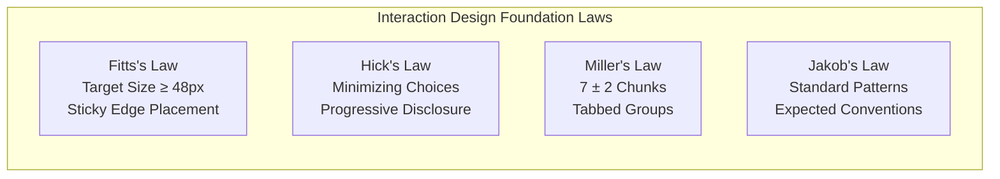

# UI/UX Enterprise Compliance Standards Matrix & Governance Framework
**Target Platform:** .NET 10 Blazor Server (`Nsdms.Web` with MudBlazor)  
**Governance Scope:** Enterprise Multi-Tenant NSDMS Portal  
**Standards Covered:** W3C WCAG 2.2 AA, NN/g 10 Usability Heuristics, ISO 9241-110 & ISO/IEC 25010, IxDF Interaction Design Laws, Google Lighthouse Core Web Vitals.

---

## 1. Executive Framework Overview

The **NSDMS UI/UX Compliance Framework** establishes a deterministic, measurable governance standard for all Razor components, pages, forms, and workflows in `.NET 10 Blazor`. It bridges human-centered cognitive principles with automated DOM-level accessibility and runtime performance benchmarks.

```
┌─────────────────────────────────────────────────────────────────────────────────────────────┐
│                               5-PILLAR COMPLIANCE ARCHITECTURE                              │
├───────────────────┬───────────────────┬───────────────────┬───────────────────┬─────────────┤
│   1. W3C WCAG     │     2. NN/g       │    3. ISO 9241    │     4. IxDF       │5. LIGHTHOUSE│
│     2.2 AA        │   10 Heuristics   │  & ISO/IEC 25010  │   Design Laws     │ Core Vitals │
├───────────────────┼───────────────────┼───────────────────┼───────────────────┼─────────────┤
│• Color Contrast   │• Status Visibility│• Task Suitability │• Fitts's Law      │• LCP ≤ 2.5s │
│• Focus Indicators │• Real-World Match │• Self-Descriptive │• Hick's Law       │• CLS ≤ 0.1  │
│• ARIA Semantics   │• User Control     │• Controllability  │• Miller's 7±2 Law │• INP ≤ 200ms│
│• Keyboard Nav     │• Error Prevention │• Error Tolerance  │• Affordances      │• A11y ≥ 90  │
│• Screen Readers   │• Recognition      │• Individualization│• Feedback Loops   │• Best Pract.│
└───────────────────┴───────────────────┴───────────────────┴───────────────────┴─────────────┘
```

---

## 2. Pillar 1: W3C WCAG 2.2 Level AA (Accessibility & Inclusivity)

| WCAG Rule | Principle | Success Criterion | MudBlazor Implementation Rule | Violation Severity |
| :--- | :--- | :--- | :--- | :--- |
| **1.4.3** | Contrast (Minimum) | Text contrast $\ge 4.5:1$ (normal), $\ge 3:1$ (large $\ge 18\text{pt}$ / bold $\ge 14\text{pt}$). | In `NsdmsTheme.cs`, Primary `#cc9c47` text contrast must be verified against `#ffffff` surface. Use darker `#875224` or `#524436` for body text. | **P0** (if $<3:1$)<br/>**P1** (if $3-4.5:1$) |
| **1.4.11** | Non-text Contrast | Visual boundaries of UI components & icons $\ge 3:1$ against background. | Input borders (`LinesInputs = "#857464"`), active tab underlines, and icon buttons must pass $3:1$ ratio. | **P1** |
| **2.1.1 / 2.1.2** | Keyboard Accessible | All interactive elements operable via keyboard; no keyboard traps. | `MudDialog`, `MudMenu`, and `MudSelect` popovers must cycle focus and trap `Tab` within dialog; `Esc` must close modal. | **P0** |
| **2.4.7** | Focus Visible | Any keyboard-operable interface has a mode of operation where keyboard focus indicator is visible. | Apply high-visibility focus ring CSS: `:focus-visible { outline: 2px solid var(--mud-palette-primary); outline-offset: 2px; }`. | **P0** |
| **1.3.1** | Info and Relationships | Form controls have programmatically determinable labels and groupings. | Every `MudTextField`, `MudSelect`, and `MudCheckBox` must define `Label="..."` or explicit `aria-label="..."`. | **P0** |
| **1.1.1** | Non-text Content | All non-text content (images, icons) has a text alternative. | `` tags must include descriptive `alt` attribute. Icon-only buttons must specify `aria-label` or be wrapped in `<MudTooltip>`. | **P1** |
| **2.4.4** | Link Purpose | The purpose of each link can be determined from the link text alone. | Table action links must not use generic "View"; use "View Employer Details for {Name}". | **P1** |
| **3.3.1 / 3.3.2** | Error Identification | Input errors detected automatically and described in text to the user. | Bind `Validation="@(new Func<string, string>(...))"` or FluentValidation with visible helper text and `ErrorText`. | **P0** |

---

## 3. Pillar 2: Nielsen Norman Group (NN/g) 10 Usability Heuristics

| # | Heuristic | NSDMS Operational Meaning | MudBlazor Implementation Pattern | Severity |
| :-: | :--- | :--- | :--- | :-: |
| **1** | **Visibility of System Status** | Users always know current workflow state and system processing state. | • Async operations bind `_isSaving` / `_loading` with `<MudProgressLinear>` or disabled button states.<br/>• Workflow transitions render `<WorkflowProgressBar>` and real-time SignalR snackbars. | **P0** |
| **2** | **Match Between System and Real World** | Language, concepts, and conventions match South African Skills Development domain. | • Strict nomenclature: `Organisation`, `SDL Number`, `WSP/ATR`, `OFO Code`, `SAQA ID`, `SETA Trade Test`, `Assessor Accreditation`.<br/>• Never use generic software terms like `Company Record` or `Entity #123`. | **P1** |
| **3** | **User Control & Freedom** | Users can easily cancel, backtrack, or correct mistakes without penalty. | • Master-Detail pages MUST provide a **Back to List** button and **Cancel** button.<br/>• Destructive actions (Delete, Reject, Clawback) MUST trigger confirmation dialogs with cancellation option. | **P0** |
| **4** | **Consistency & Standards** | Consistent layout, typography, action button positioning across all 30+ pages. | • Unified Sticky Top Bar (`.sticky-top pa-4 mb-4 rounded-lg d-flex justify-space-between`) at `top: var(--mud-appbar-height, 64px)`.<br/>• Save is always `Color.Primary` with `Icons.Material.Filled.Save`; Delete is `Color.Error`. | **P1** |
| **5** | **Error Prevention** | Proactively prevent errors through smart inputs, validation, and constraints. | • Auto-extract DOB, Gender, and Citizenship from RSA ID via `RsaIdValidator.Parse`.<br/>• Enforce mandatory Contact Person selection on all Employer Visit forms (`contactPersonId`). | **P0** |
| **6** | **Recognition Rather Than Recall** | Minimize memory load by making objects, actions, and options visible. | • `<MudAutocomplete>` for large lookups (OFO codes, standard qualifications, SIC codes).<br/>• Breadcrumbs at the top of every detail page showing path hierarchy. | **P1** |
| **7** | **Flexibility & Efficiency of Use** | Accelerate expert workflows while remaining accessible to novices. | • Server-side search & filtering on all `MudTable` lists.<br/>• Batch actions (bulk export, bulk status approve) with quick filter chips. | **P1** |
| **8** | **Aesthetic & Minimalist Design** | Eliminate redundant, low-value information; structure with visual hierarchy. | • Multi-tabbed cards (`MudTabs`) grouping 40+ database columns into 3–4 logical tabs (General, Financials, Audits, Contacts). | **P1** |
| **9** | **Help Users Recognize & Recover from Errors** | Error messages expressed in plain language with constructive recovery advice. | • Inline form validation with clear explanations (e.g. "SDL number must start with 'L' followed by 8 digits").<br/>• Toast notifications indicating exact recovery actions. | **P0** |
| **10** | **Help & Documentation** | Contextual help readily accessible without cluttering the screen. | • Field-level `<MudTooltip>` on complex regulatory fields.<br/>• Embedded Database Dictionary and Workflow Reference guides (`/developer/dictionary`). | **P2** |

---

## 4. Pillar 3: ISO 9241-110 & ISO/IEC 25010 Standards

### ISO 9241-110 Dialogue Principles (Human-System Ergonomics)

```
┌────────────────────────────────────────────────────────────────────────────┐
│                    ISO 9241-110 DIALOGUE PRINCIPLES                        │
├────────────────────────────────┬───────────────────────────────────────────┤
│ 1. Suitability for the Task    │ UI supports task flow with minimum effort │
│ 2. Self-Descriptiveness        │ Every element immediately understandable  │
│ 3. Conformity with Expectation │ Predictable navigation and behavior       │
│ 4. Suitability for Learning    │ Easy onboarding for new SDFs / Case Off.  │
│ 5. Controllability             │ User drives pace, pagination & view modes │
│ 6. Error Tolerance             │ System tolerates mistakes; easy rollback  │
│ 7. Individualization           │ Dark mode, font scaling & column filters  │
└────────────────────────────────┴───────────────────────────────────────────┘
```

1. **Suitability for the Task (Dialogue Principle 1)**:
   * Multi-step grant applications and WSP forms must auto-fill known employer data and calculate rebate sums automatically.
2. **Self-Descriptiveness (Dialogue Principle 2)**:
   * Status indicators must combine **icon + color + label** (e.g., `<MudChip Color="Color.Success" Icon="@Icons.Material.Filled.CheckCircle">Approved</MudChip>`), not color alone.
3. **Controllability (Dialogue Principle 5)**:
   * Pagination controls must support flexible page sizes (10, 25, 50, 100 rows); drawer navigation can be collapsed or pinned.
4. **Error Tolerance (Dialogue Principle 6)**:
   * In-flight form edits must not be wiped if a validation rule fails; invalid fields must highlight without dropping valid form values.

---

## 5. Pillar 4: IxDF (Interaction Design Foundation) Laws & Ergonomics



1. **Fitts's Law (Touch & Click Target Sizing)**:
   * All primary interactive targets (buttons, icons, menu items) must satisfy a minimum touch bounding box of $48\text{px} \times 48\text{px}$ on touch devices and $36\text{px} \times 36\text{px}$ on desktop.
   * Primary action buttons (Save, Cancel, Back) are placed on the **Sticky Top Bar** (`top: 64px`) to minimize cursor/finger travel time regardless of scroll depth.
2. **Hick's Law (Decision Time vs. Number of Choices)**:
   * Deep complex entities (e.g. `Organisation` with 38 database columns) must utilize **Progressive Disclosure** via `MudTabs` rather than a single 2,000px scrollable wall of inputs.
3. **Miller's Law (Working Memory Limits - $7 \pm 2$)**:
   * Form sections must contain no more than $5–7$ related fields per `MudCard` container.
   * Data tables should display $5–7$ primary columns by default, with secondary columns collapsible or visible on detail drill-down.
4. **Affordances & Signifiers**:
   * Interactive rows in `MudTable` must have hover signifiers (`Hover="true"`, cursor pointer) indicating they trigger navigation to `/[resource]/{id}`.
   * Disabled buttons must communicate inertness via opacity and cursor `not-allowed`.

---

## 6. Pillar 5: Google Lighthouse & Core Web Vitals

| Metric | Target Benchmark | Blazor Server / Web Invariant | Remediation / Verification |
| :--- | :--- | :--- | :--- |
| **Accessibility Score** | **$\ge 90/100$** | 0 critical Axe-Core violations; complete ARIA tree; compliant color contrasts. | Run `audit_accessibility_playwright.py` across all routes. |
| **Largest Contentful Paint (LCP)** | **$\le 2.5\text{s}$** | Minimize server-side rendering blocking; optimize MudBlazor CSS and font delivery. | Use system fonts (`Inter`, Segoe UI) with `font-display: swap`. |
| **Cumulative Layout Shift (CLS)** | **$\le 0.1$** | Prevent layout shifts during SignalR circuit initialization or image loading. | Explicit `height` and `width` on brand logos; reserve avatar containers. |
| **Interaction to Next Paint (INP)** | **$\le 200\text{ms}$** | Fast circuit event response; optimize EF Core async queries. | Use asynchronous service calls with `INsdmsDbContextFactory`. |
| **Best Practices Score** | **$\ge 90/100$** | Valid HTML doctype, meta viewport, HTTPS headers, console error-free. | Zero unhandled Blazor circuit JS exceptions in browser console. |

---

## 7. Violation Severity Taxonomy & SLAs

| Severity | Definition & Impact | Examples | Resolution SLA |
| :--- | :--- | :--- | :--- |
| **P0 — Critical** | Blocks accessibility, causes data loss, traps keyboard, or breaks core workflow. | • Contrast $< 3:1$ on body text.<br/>• Form inputs without labels or ARIA names.<br/>• App Bar overlapping content due to incorrect padding.<br/>• Missing Contact Person link on Employer Visit. | Immediate / Pre-merge blocker |
| **P1 — High** | Violates usability standard, causes cognitive friction, or fails WCAG AA non-critical rule. | • Touch targets $< 44\text{px}$.<br/>• Unchunked forms ($> 15$ fields in single card).<br/>• Missing loading state on operations $> 1\text{s}$.<br/>• Missing delete confirmation dialog. | Next sprint / Stabilization pass |
| **P2 — Medium/Low** | Minor cosmetic imperfection, subtle contrast margin, or secondary tooltip omission. | • Secondary icon without tooltip.<br/>• Table column spacing minor asymmetry.<br/>• Contrast ratio $4.3:1$ (close to $4.5:1$). | Backlog / Polish pass |

---

## 8. Governance Checklist for New Razor Components

Before shipping any new `.razor` page or component, the developer/agent must verify:

- [ ] **1. Navigation & Master-Detail**:
  - [ ] Sticky top action bar with `top: var(--mud-appbar-height, 64px) !important;`.
  - [ ] Back button (`Icons.Material.Filled.ArrowBack`), Cancel button, and Save button (`Icons.Material.Filled.Save`).
  - [ ] Breadcrumb hierarchy at top of page.
- [ ] **2. Accessibility & ARIA**:
  - [ ] All inputs have `Label` or `aria-label`.
  - [ ] All icon buttons have `aria-label` or `<MudTooltip>`.
  - [ ] Color contrast passes $4.5:1$ in both Light and Dark themes.
- [ ] **3. Feedback & State Management**:
  - [ ] Async mutations display `_isSaving` loading indicator and disable Save button.
  - [ ] All saves, deletes, and workflow transitions trigger `ISnackbar` toast feedback.
  - [ ] Double-write audit log generated for mutations.
- [ ] **4. Layout Spacing Standard**:
  - [ ] No `Class="pa-*"` directly on `<MudMainContent>` (avoids header overlap bug).
  - [ ] Content wrapped in `<div class="pa-4 pa-md-6 pt-6"><main id="main-content">@Body</main></div>`.
- [ ] **5. Domain Validation**:
  - [ ] RSA ID inputs bind auto-population helper for DOB/Gender.
  - [ ] Employer visits enforce `ContactPersonId`.
