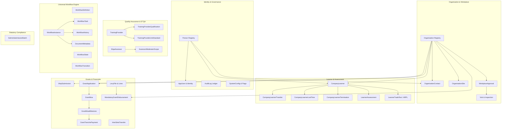

# MerSETA NSDMS — Database Architecture & Governance Specification

> **System Version:** 2.0.0 | **Framework:** .NET 10 &amp; EF Core 10 | **Target Engine:** Microsoft SQL Server Express (`localhost / NSDMS-NET`)  
> **Classification:** Enterprise Skills Development Management System  
> **Last Updated:** August 2026

---

## 1. Executive Summary & Governance Standards

The **MerSETA National Skills Development Management System (NSDMS)** database architecture is engineered to enforce strict statutory compliance, data integrity, auditability, and high-performance operational throughput.

### 🏛️ Core Architectural Standards

1. **Table Naming & Conventions:**
   - **Singular PascalCase** naming convention for all domain tables (`Organisation`, `Person`, `CompanyLearner`, `GrantMoa`, `SetmisSubmissionBatch`).
   - Every entity table features an auto-generated integer primary key (`Id`).
   - Every lookup table features a unique natural primary key (`Code`, `varchar(15)`).

2. **Schema Segregation:**
   - `dbo`: Core transactional domain entities, financial ledgers, audit logs, workflow engine, and system configuration.
   - `lookup`: Reference enum tables (`lookup.*Type`) with unique `Code`, indexed `Name`, description, and active status flag.

3. **Audit Trail & Governance Policy:**
   - **Zero Silent Mutations:** Every service mutation performs a double-write to `AuditLog` capturing user identity, timestamp, action name, and a structured `MetadataJson` delta snapshot (`before` vs `after`).
   - Standard audit columns on every transactional table: `CreatedAt`, `CreatedBy`, `ModifiedAt`, `ModifiedBy`.

4. **Dynamic Configuration & Feature Flags Governance:**
   - **Zero Hardcoding:** Business thresholds, file storage paths, tax percentages, and third-party integration endpoints are stored in `SystemConfig` and resolved via `ISystemConfigurationService` with cascading database overrides.
   - **Integrations Off-By-Default:** External integrations (Dynamics GP, Sage ERP, DHET SFTP, SARS FTP, SMS OTP) default to `IsEnabled = false` in `SystemFeatureFlag`, gracefully falling back to deterministic mock simulations.

5. **Living Documentation & `MS_Description` Sync:**
   - Source of truth is defined in C# XML documentation comments (`/// 
`) in `Nsdms.Domain`.
   - EF Core `ApplyXmlDocumentation()` convention reflects XML summaries onto EF Core table and column comments.
   - Idempotent T-SQL generator synchronizes descriptions to SQL Server `sys.extended_properties` (`@name=N'MS_Description'`) for full visibility in SQL Server Management Studio (SSMS).

---

## 2. Bounded Contexts & Subsystem Topology

---

## 3. Subsystem Specifications

### 3.1 Core Identity & Access Subsystem
- **`Person`**: Single authoritative demographic identity for all individuals (learners, SDFs, assessors, moderators, contacts). Auto-calculates Date of Birth and Gender from 13-digit South African ID numbers.
- **`AppUser` & `AppRole`**: ASP.NET Core Identity authentication layer linked to `PersonId` and `DefaultOrganisationId`.
- **`Organisation`**: Registered employers, host workplaces, trade unions, government bodies, and legal enterprise entities under MerSETA jurisdiction. Indexed on `SdlNumber`, `CompanyName`, and `ChamberCode`.
- **`OrganisationContact`**: Relational link enforcing designated contact persons (Skills Development Facilitators, CEOs, HR Managers).
- **`OrganisationSite`**: Physical training facilities, branch plants, and manufacturing sites.

### 3.2 Learner Management & Lifecycle Subsystem
- **`CompanyLearner`**: Core tripartite learner agreement linking `Person`, `Organisation`, `TrainingProvider`, and registered SAQA qualification.
- **`CompanyLearnerTransfer`**: Formal transfer of learner agreement between releasing and receiving employers with SETA approval gate.
- **`CompanyLearnerLostTime`**: Records training suspensions (medical leave, maternity, industrial action) and automatically recalculates contract end dates.
- **`CompanyLearnerTermination`**: Bilateral or unilateral cancellation of learner contracts with dispute audit logs.
- **`LearnerAssessment`**: Formative and summative unit standard assessment outcomes.
- **`LearnerTradeTest`**: Artisan trade test serial certifications and Accelerated Recognition of Prior Learning (ARPL) competency awards.

### 3.3 Quality Assurance & ETQA Subsystem
- **`TrainingProvider`**: Accredited Skills Development Providers (SDP) offering registered occupational qualifications.
- **`TrainingProviderQualification` & `TrainingProviderUnitStandard`**: Specific SAQA qualification and unit standard delivery scopes accredited to providers.
- **`EtqaAssessor` & `AssessorModeratorScope`**: Registered ETQA assessors and moderators with verified qualification scopes.
- **`WorkplaceApproval`**, **`WorkplaceApprovalMentor`**, **`WorkplaceApprovalToolList`**: Workplace site inspection approval records with mentor-to-learner ratio allocations and required tooling checklists.
- **`Visit`**: On-site monitoring, workplace inspection, and employer liaison visits scheduled and executed by MerSETA staff (enforces mandatory `ContactPersonId`).

### 3.4 Grants & Financial Subsystem
- **`WspSubmission`**, **`WspEmploymentSummary`**, **`WspTrainingPlan`**: Workplace Skills Plan (WSP) & Annual Training Report (ATR) submissions for mandatory grants.
- **`LevyFile` & `LevyFileLine`**: Monthly SARS Skills Development Levy file import batches.
- **`MandatoryGrantDisbursement`**: Statutory 20% Skills Development Levy rebate calculation ledger for compliant employers submitting WSP/ATR.
- **`GrantFundingWindow`**: Gazette-announced Discretionary Grant funding window opening and allocation cycle.
- **`GrantApplication` & `GrantProjectBudget`**: Discretionary Grant funding applications submitted during open funding windows.
- **`GrantMoa`**: Memorandum of Agreement contractual legal commitments for approved discretionary grants.
- **`GrantMoaMilestone`**: Tranche delivery milestones (Inception, Midterm, Final, Closeout) for MOA contracts.
- **`GrantTranchePayment`**: Tranche tax invoice requisitions, finance dual-authorization, and EFT payout batches.
- **`InterSetaTransfer`**: Chamber and SIC code employer migrations with counterpart SETAs and DHET approvals.

### 3.5 Universal Workflow Engine Subsystem
- **`WorkflowDefinition`**: Blueprint state machine configuration for any entity lifecycle.
- **`WorkflowState`**: Defined lifecycle gates (e.g. Draft, Submitted, Under Review, Committee Recommended, Approved, Rejected, Disbursed).
- **`WorkflowTransition`**: Authorized transition paths enforcing CASL/RBAC role gates and required comments.
- **`WorkflowInstance`**: Active execution instance tracking state for a specific entity record.
- **`WorkflowTask`**: Actionable tasks assigned to roles or users with due dates and deep-linking target routes.
- **`WorkflowHistory`**: Immutable transition history capturing actor identity, decisions, and comments.
- **`DocumentMetadata`**: Cryptographically hashed (SHA-256) evidence files stored in the Document Vault.
- **`DocumentRequirementRule`**: Governance rules enforcing mandatory attachments before transition gates advance.

### 3.6 Configuration, Storage & Audit Subsystem
- **`SystemConfig`**: Dynamic key-value configuration overrides (JSON, integer, string, boolean, decimal).
- **`SystemFeatureFlag`**: Granular feature toggles (off-by-default for external integrations).
- **`DocumentAttachment`**: Polymorphic document attachments linked to any entity record.
- **`AuditLog`**: Tamper-evident operational audit trail capturing all user actions and JSON before/after snapshots.

---

## 4. Indexing Strategy & Performance Governance

All tables follow strict indexing guidelines:

| Index Category | Strategy | Example |
| :--- | :--- | :--- |
| **Primary Keys** | Clustered Index on Auto-Generated Integer `Id` / `Code` | `PK_CompanyLearner_Id` |
| **Foreign Keys** | Explicit Non-Clustered Index on every FK column | `IX_CompanyLearner_PersonId`, `IX_GrantTranchePayment_GrantMoaMilestoneId` |
| **Natural Unique Keys** | Unique Non-Clustered Indexes on business identifiers | `UX_Organisation_SdlNumber`, `UX_Person_RsaIdNumber`, `UX_GrantMoa_MoaNumber` |
| **Workflow Status** | Non-Clustered Index on `StatusCode` / `MoaStatusCode` | `IX_CompanyLearner_StatusCode`, `IX_GrantMoa_MoaStatusCode` |
| **Audit Queries** | Index on `TargetEntityName, TargetEntityId` | `IX_AuditLog_Entity_Record` |

---

## 5. SQL Server `MS_Description` Extended Properties

In Microsoft SQL Server Express, table and column descriptions viewed in SSMS Table Designer are stored in `sys.extended_properties`.

### Synchronization Flow:
1. C# XML documentation comments (`/// 
`) are compiled into `Nsdms.Domain.xml`.
2. `ModelBuilderDocumentationExtensions.ApplyXmlDocumentation()` maps summaries onto EF Core comments (`.SetComment(...)`).
3. `DatabaseDocumentationService.SyncExtendedPropertiesToDatabaseAsync()` or the idempotent T-SQL script `Sync_Database_Extended_Properties.sql` applies `sp_addextendedproperty` / `sp_updateextendedproperty` across all 79 tables and columns.
4. Descriptions appear immediately in SSMS Object Explorer, Table Properties, and Column Properties.
