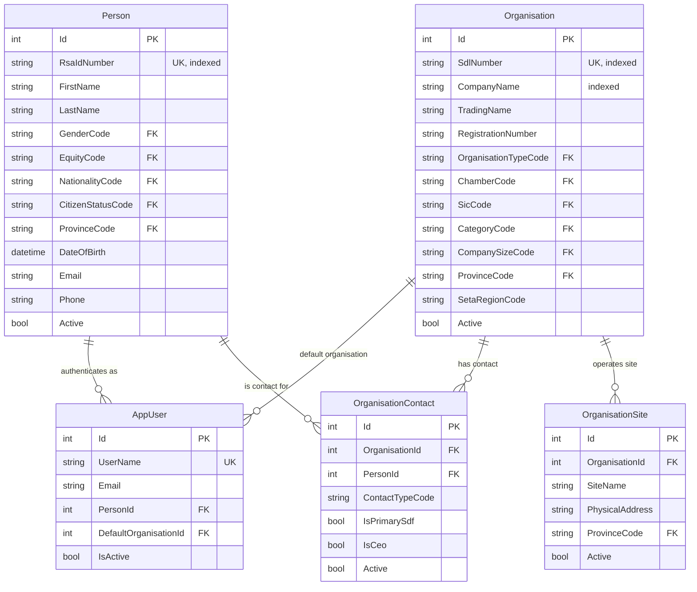
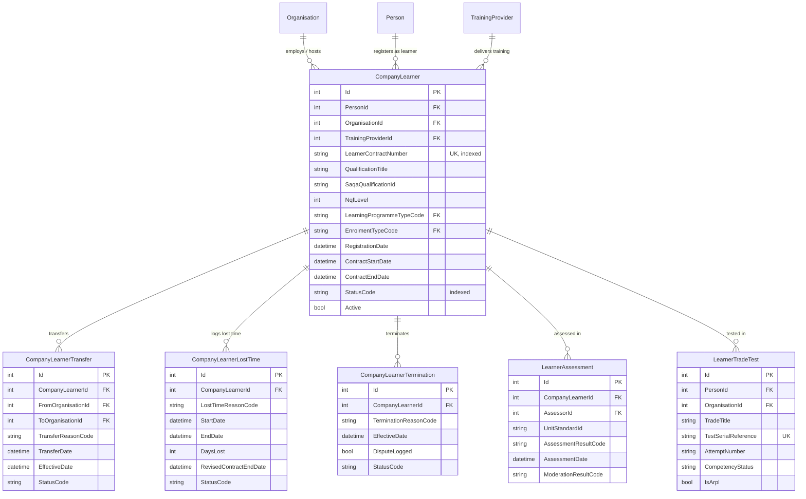
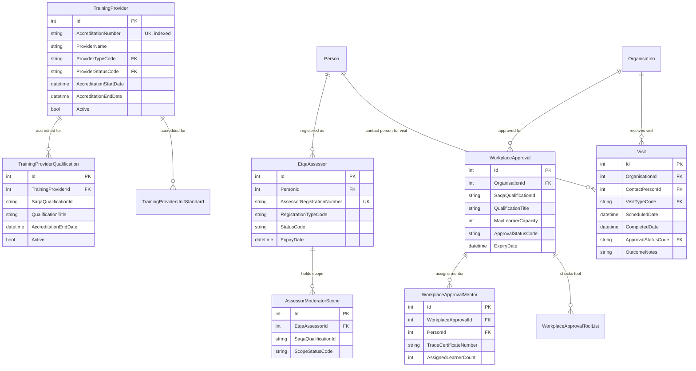
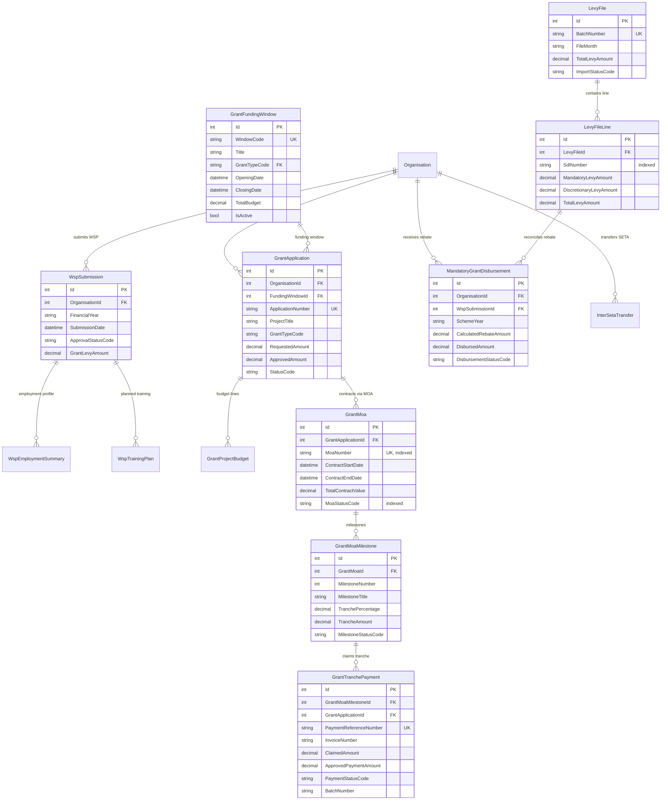
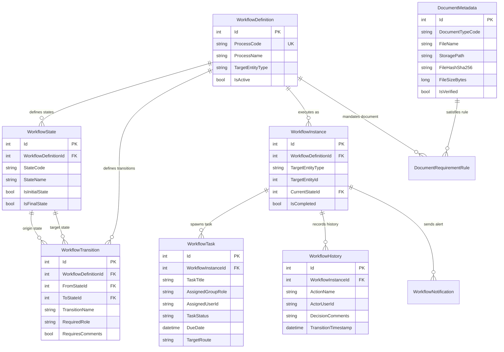

# MerSETA NSDMS — Entity-Relationship (ER) Diagrams

> **Target Engine:** Microsoft SQL Server Express (`localhost / NSDMS-NET`)  
> **Schema Count:** 2 (`dbo`, `lookup`) | **Total Tables:** 79  
> **Last Updated:** August 2026

---

## 1. Core Identity & Organisation Subsystem

---

## 2. Learner Management & Lifecycle Subsystem

---

## 3. Quality Assurance & ETQA Subsystem

---

## 4. Grants & Financial Subsystem

---

## 5. Universal Workflow Engine & Document Management

