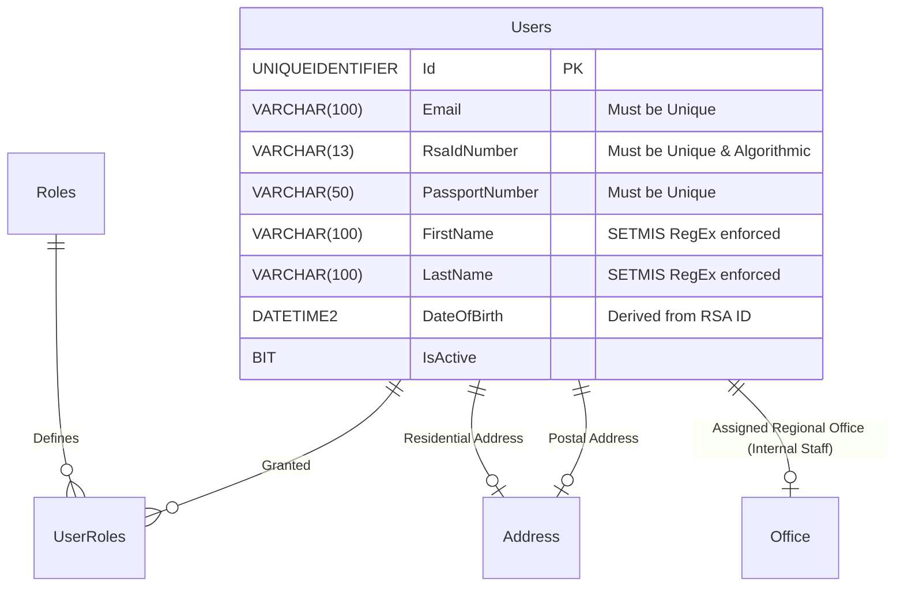

# Spec 01: Core Identity, Users & Authorization (COT Access Control Rules)

## 1. Domain Overview
The User Management and Identity module is the foundational layer of the entire NSDMS architecture. It draws a strict architectural boundary between **Authentication** (the act of signing in via email/password or SSO) and **Demographics** (the physical person represented by a statutory ID number). Due to SETMIS constraints, demographic data requires immense rigidity, ensuring zero duplication and strict syntactic correctness.

## 2. SQL Server Schema Strategy

**Core Tables Needed:**
- `Users` (The monolithic demographic entity holding physical human traits, contact details, and statutory identifiers).
- `UserRoles` / `Roles` (The RBAC/COT Access Control Rules mapping enabling explicit permissions across the application).
- `PreviousSchools` / `Qualifications` (Optional 1-to-Many metadata tracking historical education, used during Learner profiling).



## 3. MVC Controllers & Routing

**Target Controllers:**
* `[Route("Identity/Account")]` (Handles Login, Registration, MFA, and Password Resets).
* `[Route("Identity/Profile")]` (Self-service portal for users to update demographics and addresses).
* `[Route("Admin/UserManagement")]` (Centralized dashboard for SysAdmins to reset accounts, verify IDs, and assign Roles).

**Security / Policies (`[Authorize]`):**
* `SYS_ADMIN` (Full CRUD across all users and role matrices).
* *Anonymous* restrictions strictly bound to Login/Register endpoints. All other Application endpoints require a resolved `User` token.

## 4. View Requirements (UI/UX)

The user enrollment process combines identity proofing with demographic completion.

1.  **Registration Gateway:** Basic Auth collection (Email, Password) which immediately provisions a disabled User.
2.  **Demographic Wizard (Onboarding):** Upon first login, users MUST complete a locked demographic wizard before accessing external routing.
    *   Nationality selection (RSA Citizen vs Non-Citizen).
    *   Identity input (RSA ID vs Passport), automatically deriving `DateOfBirth`.
    *   Contact grids (Strict regex for MSISDN / Phone numbers).
3.  **Role Management Component (Admin Only):** A dual-listbox or interactive grid showing Active Claims / Tokens assigned to a user, allowing rapid application of `QA_MANAGER`, `CLO`, `SDF`, etc.

## 5. State Machine & Workflows

**Primary Transitions:**
1.  **Registered / Unverified:** Record exists, Email unconfirmed.
2.  **Active:** Email confirmed, basic demographics completed. Fully operational.
3.  **Suspended:** Administratively blocked (e.g., suspected fraud or termination).
4.  **Pending Details:** Auth successful, but missing critical SETMIS fields (often triggered when a new data requirement is added mid-year, forcing the user into a completion gate upon next login).

## 6. Business Rules Engine (The "Gotchas")

### 6.1 Code On Time (COT) Native Form Validations
To satisfy the rapid Touch UI generation of COT, the following rules must be directly injected into the Data Controllers mapping to `FILE 400` to handle synchronous database constraints and immediate UI validation.

#### A) SQL Business Rule (Server-Side Validation)
This SQL snippet overrides insert logic in the `[Controller].xml` to strictly block duplicate RSA IDs at the database level before COT natively commits the transaction.

```sql
-- Pattern: Code On Time SQL Business Rule (Before Insert/Update)
-- Target Controller: FILE 400 (Person)
-- Action: Insert, Update

IF EXISTS (
    SELECT 1 
    FROM [dbo].[FILE 400] 
    WHERE [National_Id] = @National_Id 
      AND ISNULL(@National_Id, '') <> ''
      AND [File400_ID] <> ISNULL(@File400_ID, 0)
)
BEGIN
    SET @BusinessRules_PreventDefault = 1;
    SET @Result_ShowMessage = 'Another user is already registered with the given RSA ID number. Duplication is restricted.';
END
```

#### B) JavaScript validation (Client-Side Touch UI)
This JS snippet enforces immediate numeric format length and mathematical basic validity on the UI input before network dispatch.

```javascript
// Pattern: Code On Time JavaScript Business Rule (Before Insert/Update)
// Target Controller: FILE 400 (Person)
function override_before_insert(args) {
    var natId = $v('National_Id');
    var isRsa = $v('Nationality_Code') === 'SA'; // Example
    
    if (isRsa) {
        if (natId == null || natId.length !== 13 || isNaN(natId)) {
            this.preventDefault();
            this.result.showMessage('RSA ID must be exactly 13 numeric digits.');
            this.result.focus('National_Id');
            return;
        }
    }
}
```

Extracted directly from the legacy application's `UsersService` constraints:

**Constraint A: Strict Uniqueness Invariants**
*   "Another user is already registered with the given email"
*   "Another user is already registered with the given RSA ID number"
*   "Another user is already registered with the given passport number"
*   **Rule:** The database MUST enforce unique constraints across Email, RSA ID, and Passport Number (where not null). The MVC Controller should capture `SqlException` 2601/2627 and map them to friendly UI validation messages.
    *   ✨ **Modernization Directive (How-To Mapping):** In .NET, implement Code On Time Data Controller `[Index(IsUnique = true)]` on the `Person` entity. Catch `DbUpdateException` in the repository or COT BusinessRules class pipeline and translate it to validation failure before it hits the UI.

**Constraint B: SETMIS Character Restrictions**
*   **Rule:** Names and Surnames undergo aggressive string scrubbing:
    *   May NOT start with a space.
    *   Uppercase variants may ONLY contain characters `ABCDEFGHIJKLMNOPQRTSUVWXYZ'-`.
    *   Bans wildcard dummy inputs: `%UNKNOWN%`, `%AS ABOVE%`, `%DELETE%`, `N/A`, `TEST`, `NIL`.
    *   ✨ **Modernization Directive (How-To Mapping):** Implement these checks centrally using a custom `COT Business Rules Validation (Result.ShowMessage)` rule (`RuleFor(x => x.FirstName).MustBeValidSetmisName()`) applied consistently across all request DTOs.

**Constraint C: Algorithmic ID Validation (RSA)**
*   **Rule:** If Nationality is RSA, the ID must be exactly 13 digits. The Controller must execute a Modulus 10 (Luhn algorithm) check to verify the mathematical integrity of the ID before accepting it, extracting the DOB from the first 6 digits to explicitly populate `DateOfBirth`.
    *   ✨ **Modernization Directive (How-To Mapping):** Abstract this into an `RsaIdNumber` Value Object in C# Domain Driven Design. The constructor of this value object will throw an exception if the Luhn check fails, ensuring invalid IDs never enter the application.

**Constraint D: The "Overloaded God-Table" Architecture**
*   **⚠️ Legacy Reality:** The legacy `users` table is overloaded. It does not merely store login credentials; it simultaneously stores physical Person demographics (Learners, Assessors, SDFs) and also acts as a repository for specific permission states.
*   **Migration Rule:** When porting to .NET MVC, developers must be careful. While modern ASP.NET Identity separates `AspNetUsers` from domain entities, the legacy system tightly couples "Learner X" with "User Y". If a Learner (who never logs in) is added via an Excel WSP upload, they still populate the core `Users` table, simply remaining in an un-authenticated or disabled status. This dual-purpose setup (Login + Person) must be carefully navigated during data migration.
    *   ✨ **Modernization Directive (How-To Mapping):** Strictly split the tables. Use ASP.NET Identity `AspNetUsers` strictly for login/credentials (User context) and map it a 1-to-1 or 1-to-0 relationship to a clean `Person` table that stores demographic information independent of authentication state.

## 7. Document Generation Component
- No primary formal documents are natively spawned directly from the raw User Profile, apart from potential "Self-Verification Summary" printouts. Documents are tied to downstream actions (e.g., Assessor Certificates, WSP Contracts).

## 8. Required Data Fields Definition

| Field Name | Data Type | Required | Notes (Constants/Validation) |
| :--- | :--- | :--- | :--- |
| `Id` | `UNIQUEIDENTIFIER` | Yes | Primary Key (replaces legacy `bigint`) |
| `Email` | `VARCHAR(100)` | Yes | Strictly unique. Primary login identifier. |
| `Password` | `VARCHAR(255)` | Yes | Hashed value for ASP.NET Identity. |
| `RsaIdNumber` | `VARCHAR(13)` | Conditional | Required if SA Citizen. Must pass Luhn Mod 10 check. Unique. |
| `PassportNumber` | `VARCHAR(50)` | Conditional | Required if Non-RSA Citizen. Unique. |
| `FirstName` | `VARCHAR(100)` | Yes | SETMIS Scrubbed (No spaces first, whitelist chars). |
| `LastName` | `VARCHAR(100)` | Yes | SETMIS Scrubbed. |
| `MiddleName` | `VARCHAR(100)` | No | SETMIS Scrubbed. |
| `DateOfBirth` | `DATETIME2` | Yes | Mathematically derived from RSA ID if applicable. |
| `IsActive` | `BIT` | Yes | Default `1`. Dictates login capability. |
| EntityStatusId | INT | Yes | The rigid business outcome (e.g., Registered, Rejected). |
| CurrentWorkflowStateId | INT | Conditional | Dual-Status push: Points to the active Workflow State for rapid COT routing. |


## 9. Standardized Error Messages

To eliminate ambiguity and ensure UI alignment across the application, the following hardcoded error string literals **MUST** be implemented within the presentation layer and `COT Business Rules Validation (Result.ShowMessage)` constraints for this domain:

| Error Code | Hardcoded String Literal | Trigger Condition |
| :--- | :--- | :--- |
| `ERR_AUTH_001` | `'Invalid RSA ID format. Please ensure your ID matches the standard 13-digit pattern.'` | Primary Validation Failure |
| `ERR_AUTH_002` | `'User session expired. Please log in again to continue.'` | State Machine Blocked |
| `ERR_AUTH_003` | `'Account locked due to multiple failed login attempts. Please contact the administrator.'` | Domain Invariant Violated |
