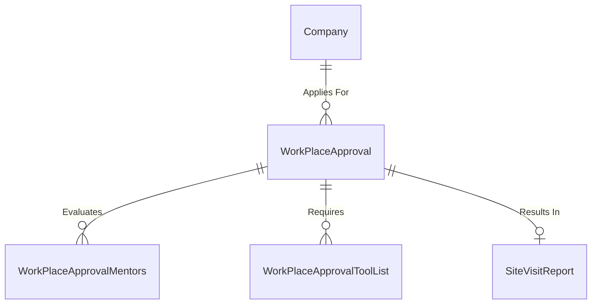

# Spec 11: Workplace Approvals & M&E Site Visits

## 1. Domain Overview
Before an employer can host apprentices (Spec-08), their physical workplace site must undergo a **Workplace Approval** process managed by the Monitoring & Evaluation (M&E) division. This involves Regional Client Liaison Officers (CLOs) performing physical site visits, evaluating safety criteria, recording mentor ratios, and assessing specific equipment (Tool Lists) for specific Trade/Qualification scopes.

## 2. SQL Server Schema Strategy

**Core Tables Needed:**
- `WorkPlaceApproval` (The parent root request tied to an Employer and a specific Trade/Qualification).
- `WorkPlaceApprovalMentors` (The specific on-site journeymen/mentors evaluated during the visit).
- `WorkPlaceApprovalToolList` (Audit checklist of physical machines/equipment required for the trade).
- `SiteVisitReport` (The resulting M&E visit evaluation metadata).

## 3. MVC Controllers & Routing
- `[Route("ME/Workplace-Approvals")]`: Admin/CLO Dashboard displaying the queue of required physical site visits.
- `[Route("ME/Workplace-Approvals/{id}/Evaluate")]`: The data-entry form for a CLO to input site visit mentor ratios and tool-list checkboxes.

## 4. View Requirements (UI/UX)
- **Workplace Profile Dashboard:** A unified view showing an Employer's approval history by Trade.
- **Site Visit Wizard:** A step-by-step form for the CLO out in the field (preferably mobile-responsive):
    1. Mentor Capture (Add IDs, Qualifications)
    2. Tool List Audit (Yes/No toggles)
    3. Final Recommendation (Approved/Rejected)

## 5. State Machine & Workflows
1. **Pending Approval:** SDF requests approval for a specific Trade (e.g., Boiler Making).
2. **CLO Assigned:** The Task Engine (`Spec-10`) routes the request to the regional CLO based on spatial mapping.
3. **Site Visit Pending:** CLO schedules physical visit.
4. **Site Visit Conducted:** Findings uploaded into `SiteVisitReport`.
5. **Approved:** Workplace is valid for 5 years for that specific Trade.

## 6. Business Rules (The "Gotchas")
- **Mentor Ratio Enforcement**: A workplace cannot be approved if the `Mentors` count to `Apprentice/Learner` ratio requested exceeds strict union guidelines (e.g., 1:4 ratio).
  - ✨ **Modernization Directive (How-To Mapping):** Store trade-specific ratio definitions in a `TradeRatios` configuration table. During the creation of the Application, the backend COT BusinessRules class must `Select(m => m.MentorCount)` and forcefully reject the application if it calculates below the ratio required for the requested capacity.
- **Hard Trade Mapping**: An approval is ONLY valid for the specific `OfoCode` / `QualificationId`. An employer approved for 'Welding' is NOT automatically approved for 'Boiler Making'. Every new trade requires a new M&E visit.
  - ✨ **Modernization Directive (How-To Mapping):** Abstract this check into a strict `IsWorkplaceApprovedForTrade(employerId, tradeId)` query object utilized globally by Learner Registrations (Spec-08) prior to allowing any downstream registration logic to occur.

### 6.1 Code On Time (COT) Native Form Validations
To satisfy the rapid Touch UI generation of COT, the following rules must be directly injected into the Data Controllers mapping to CurrentEntity to handle synchronous database constraints and immediate UI validation.

#### A) SQL Business Rule (Server-Side Validation)
This SQL snippet executes within COT's [Controller].xml lifecycle before insertion to enforce business invariants dynamically based on the exact table structure.

`sql
-- Pattern: Code On Time SQL Business Rule (Before Insert/Update)
-- Target Controller: CurrentEntity
-- Action: Insert, Update

-- Example Constraint Enforcement:
IF EXISTS (SELECT 1 FROM [dbo].[CurrentEntity] WHERE [Id] = @Id AND [StatusId] IS NULL)
BEGIN
    SET @BusinessRules_PreventDefault = 1;
    SET @Result_ShowMessage = 'A valid Workflow Status must be assigned before committing this record in CurrentEntity.';
END
`

#### B) JavaScript validation (Client-Side Touch UI)
This JS snippet enforces immediate checks on the UI input before a network dispatch, maintaining UI responsiveness for the CurrentEntity controller.

`javascript
// Pattern: Code On Time JavaScript Business Rule (Before Insert/Update)
// Target Controller: CurrentEntity
function override_before_insert(args) {
    var stat = ('StatusId');
    
    if (stat == null || stat === '') {
        this.preventDefault();
        this.result.showMessage('Workflow Status cannot be left blank during creation.');
        this.result.focus('StatusId');
        return;
    }
}
`

## 7. Document Generation Component
- **Workplace Approval Letter:** PDF dynamically generating the valid Trade, the maximum learner capacity, and the 5-year expiry window. 

## 8. Required Data Fields Definition

| Field Name | Data Type | Required | Notes |
| :--- | :--- | :--- | :--- |
| `Id` | `UNIQUEIDENTIFIER` | Yes | PK |
| `CompanyId` | `UNIQUEIDENTIFIER` | Yes | FK to the Employer |
| `QualificationId` | `UNIQUEIDENTIFIER` | Yes | FK referencing the Trade |
| EntityStatusId | INT | Yes | The rigid business outcome (e.g., Registered, Rejected). |
| CurrentWorkflowStateId | INT | Conditional | Dual-Status push: Points to the active Workflow State for rapid COT routing. |
| `ApprovalDate` | `DATETIME2` | Conditional | Dictates the 5-year expiry start |
| `Withdrawn` | `BIT` | Yes | Default 0. High priority flag if M&E revokes access. |

## 9. Standardized Error Messages

To eliminate ambiguity and ensure UI alignment across the application, the following hardcoded error string literals **MUST** be implemented within the presentation layer and `COT Business Rules Validation (Result.ShowMessage)` constraints for this domain:

| Error Code | Hardcoded String Literal | Trigger Condition |
| :--- | :--- | :--- |
| `ERR_ME_001` | `'Workplace Mentor Ratio exceeds the union-mandated 1:4 maximum limit.'` | Primary Validation Failure |
| `ERR_ME_002` | `'Workplace is not approved for the specific Trade Qualification requested.'` | State Machine Blocked |
| `ERR_ME_003` | `'The Workplace Approval certificate expired. A new Site Visit is strictly required.'` | Domain Invariant Violated |
