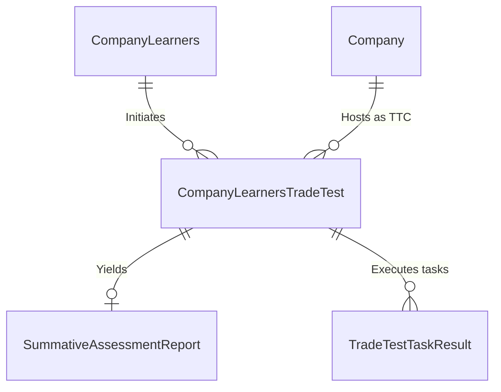

# Spec 12: Trade Testing & Artisan Processing

## 1. Domain Overview
The Trade Testing module governs the final capstone assessment for Apprenticeships (Appeasals / EISA - External Integrated Summative Assessment). When a learner completes their mandatory time (Spec-08), they must apply for and complete a practical Trade Test at an accredited Trade Test Center (TTC) to be legally recognized as an Artisan.

## 2. SQL Server Schema Strategy

**Core Tables Needed:**
- `CompanyLearnersTradeTest` (The application envelope mapping the Learner, their Workplace, and their requested TTC).
- `TradeTestTaskResult` (The granular results of the practical test tasks).
- `SummativeAssessmentReport` (The aggregate outcome triggering certification).

## 3. MVC Controllers & Routing
- `[Route("Trade-Testing/Applications")]`: SDF/Learner view to apply for ARPL (Artisan Recognition of Prior Learning) or standard Apprenticeship trade tests.
- `[Route("Trade-Testing/TTC-Dashboard")]`: Assessor view for the Trade Test Center to input task results.

## 4. View Requirements (UI/UX)
- **Eligibility Grid:** SDF view highlighting which active learners are eligible to apply (based on `CompletionDate` constraints).
- **Assessor Result Entry:** A highly constrained form for Assessors (`Spec-04`) to punch in Competent / Not Yet Competent (C/NYC) values for the `TradeTestTaskResult`.

## 5. State Machine & Workflows
1. **Application:** Learner requests test. Validates against eligibility rules.
2. **TTC Allocation:** Region allocates a specific Trade Test Center (TTC) and scheduling date.
3. **Execution:** Learner performs physical test over 2 days.
4. **Results Input:** TTC Assessor logs `TradeTestTaskResult`.
5. **NAMB Endorsement:** Final status pushed to National Artisan Moderation Body (NAMB).

## 6. Business Rules (The "Gotchas")
- **Assessor Strict-Binding:** The Assessor signing off the `SummativeAssessmentReport` MUST have an active `AssessorModeratorApplication` (Spec-04) explicitly matching the exact `QualificationId` being tested. If the credential expired yesterday, the test cannot be officially logged today.
  - ✨ **Modernization Directive (How-To Mapping):** Build an `IAssessorValidationService` that cross-references the Assessor Identity + Date of Test against the active dates inside the ETQA DB Schema. Reject the payload with a COT Business Rules Validation (Result.ShowMessage) Hard Stop if expired.
- **NAMB Lockout:** Only specific users with the 'NAMB Official' `Roles` claim can transition the test from `Moderated` to `Endorsed`.
  - ✨ **Modernization Directive (How-To Mapping):** Intercept this specific State Transition with COT Access Control Rules `can('endorse', 'TradeTest')`. Any attempts by ordinary admins over APIs will result in an UI Validation Reject.

### 6.1 Code On Time (COT) Native Form Validations
To satisfy the rapid Touch UI generation of COT, the following rules must be directly injected into the Data Controllers mapping to CurrentEntity to handle synchronous database constraints and immediate UI validation.

#### A) SQL Business Rule (Server-Side Validation)
This SQL snippet executes within COT's [Controller].xml lifecycle before insertion to enforce business invariants dynamically based on the exact table structure.

`sql
-- Pattern: Code On Time SQL Business Rule (Before Insert/Update)
-- Target Controller: CurrentEntity
-- Action: Insert, Update

-- Example Constraint Enforcement:
IF EXISTS (SELECT 1 FROM [dbo].[CurrentEntity] WHERE [Id] = @Id AND [StatusId] IS NULL)
BEGIN
    SET @BusinessRules_PreventDefault = 1;
    SET @Result_ShowMessage = 'A valid Workflow Status must be assigned before committing this record in CurrentEntity.';
END
`

#### B) JavaScript validation (Client-Side Touch UI)
This JS snippet enforces immediate checks on the UI input before a network dispatch, maintaining UI responsiveness for the CurrentEntity controller.

`javascript
// Pattern: Code On Time JavaScript Business Rule (Before Insert/Update)
// Target Controller: CurrentEntity
function override_before_insert(args) {
    var stat = ('StatusId');
    
    if (stat == null || stat === '') {
        this.preventDefault();
        this.result.showMessage('Workflow Status cannot be left blank during creation.');
        this.result.focus('StatusId');
        return;
    }
}
`

## 7. Document Generation Component
- **Trade Test Statement of Results (SOR):** PDF sent to learner showing C/NYC.
- **Artisan Certificate:** High security PDF issued via NAMB integration.

## 8. Required Data Fields Definition

| Field Name | Data Type | Required | Notes |
| :--- | :--- | :--- | :--- |
| `Id` | `UNIQUEIDENTIFIER` | Yes | PK |
| `CompanyLearnerId` | `UNIQUEIDENTIFIER` | Yes | FK referencing the core Learner Contract |
| `TradeTestCenterId` | `UNIQUEIDENTIFIER` | Yes | FK referencing the specific Company host |
| `AssessorId` | `UNIQUEIDENTIFIER` | Yes | FK referencing the registered Assessor |
| `OutcomeEnum` | `INT` | Conditional | "Competent" / "Not Yet Competent" |
| `SerialNumber` | `VARCHAR(50)` | Conditional | The strict red-stamp NAMB serialize code |

## 9. Standardized Error Messages

To eliminate ambiguity and ensure UI alignment across the application, the following hardcoded error string literals **MUST** be implemented within the presentation layer and `COT Business Rules Validation (Result.ShowMessage)` constraints for this domain:

| Error Code | Hardcoded String Literal | Trigger Condition |
| :--- | :--- | :--- |
| `ERR_ART_001` | `'Assessor signing the Summative Assessment is not accredited for this exact Qualification ID.'` | Primary Validation Failure |
| `ERR_ART_002` | `'Only officials with the [NAMB Endorser] role can issue the final serialized certificate.'` | State Machine Blocked |
| `ERR_ART_003` | `'The apprentice has not met the statutory minimum time required before requesting a Trade Test.'` | Domain Invariant Violated |
