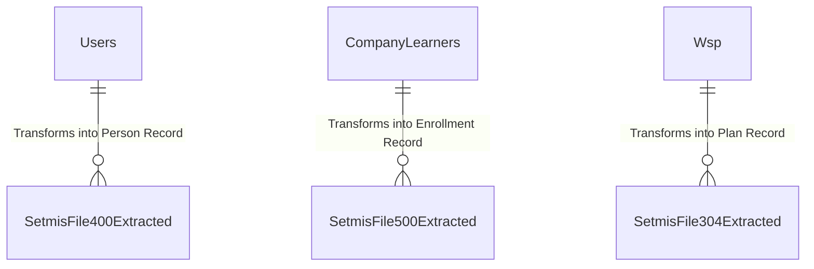

# Spec 13: Statutory Reporting & SETMIS Engine

## 1. Domain Overview
As a statutory body, merSETA is legally forced to report its operational metrics to the Department of Higher Education and Training (DHET). The SETMIS module handles data aggregation, schema extraction, and massive batch processing to generate fixed-width flat files adhering to the DHET data specification protocol.

## 2. SQL Server Schema Strategy

**Core Tables Needed:**
- `SetmisFile100Extracted` to `SetmisFile506Extracted` (Massive denormalized staging tables translating transactional relational data into strict DHET string schemas).
- `NsdpQuarterReporting` (Quarterly aggregation roll-ups).

## 3. MVC Controllers & Routing
- `[Route("Statutory/SETMIS/Dashboard")]`: DBA/Data-Steward portal to initiate a batch extraction.
- `[Route("Statutory/SETMIS/Validations")]`: Warning-grid highlighting relational orphans blocking DHET upload (e.g. "Learner X missing RSA ID").

## 4. View Requirements (UI/UX)
- A highly technical data dashboard displaying a Master/Detail mapping.
- Error Log Grid: Surfacing constraint violations natively before the extraction engine runs, to prevent generating an invalid `.txt` payload.

## 5. State Machine & Workflows
The SETMIS service isn't a human workflow, it is a backend state machine:
1. **Initialize Batch:** Data stewards lock the transactional tables into snapshot.
2. **Extract & Transform (ETL):** `SETMISService` queries domain tables and writes to `SetmisFileXXXExtracted` tables, padding strings and truncating dates.
3. **Validation Check:** Rules engine flags records breaking DHET schema (e.g., missing OFO codes).
4. **Export:** Generates the flat-file payload zipped for DHET consumption.

## 6. Business Rules (The "Gotchas")
- **The SETMIS Hard-Stops:** The legacy Java uses heavy `@SETMISFieldValidation` annotations right on the Entity layer. In the .NET Port, this validation should be fully decoupled into the `Statutory Reporting` domain layer. We should NOT bloat the `Person` domain with "If exporting to SETMIS, name cannot have spaces" logic.
  - ✨ **Modernization Directive (How-To Mapping):** Decouple validation by utilizing a separate COT Business Rules Validation (Result.ShowMessage) instance (`SetmisPersonValidator`) explicitly invoked strictly during the export pipeline, rather than attaching it permanently to the core `Person` COT Business Rule class or Controller DTO.
- **Fixed-Width Pain:** The DHET specification requires strict positional characters (e.g., `Gender` at line pos 42). The export pipeline must pad and truncate string fields aggressively.
  - ✨ **Modernization Directive (How-To Mapping):** Do not substring manually. Lean on an established C# library (like `FlatFile.Core` or `CsvHelper` configured for fixed-widths) to serialize Domain Entities securely into positional streams, preventing off-by-one string index errors.

### 6.1 Code On Time (COT) Native Form Validations
To satisfy the rapid Touch UI generation of COT, the following rules must be directly injected into the Data Controllers mapping to CurrentEntity to handle synchronous database constraints and immediate UI validation.

#### A) SQL Business Rule (Server-Side Validation)
This SQL snippet executes within COT's [Controller].xml lifecycle before insertion to enforce business invariants dynamically based on the exact table structure.

`sql
-- Pattern: Code On Time SQL Business Rule (Before Insert/Update)
-- Target Controller: CurrentEntity
-- Action: Insert, Update

-- Example Constraint Enforcement:
IF EXISTS (SELECT 1 FROM [dbo].[CurrentEntity] WHERE [Id] = @Id AND [StatusId] IS NULL)
BEGIN
    SET @BusinessRules_PreventDefault = 1;
    SET @Result_ShowMessage = 'A valid Workflow Status must be assigned before committing this record in CurrentEntity.';
END
`

#### B) JavaScript validation (Client-Side Touch UI)
This JS snippet enforces immediate checks on the UI input before a network dispatch, maintaining UI responsiveness for the CurrentEntity controller.

`javascript
// Pattern: Code On Time JavaScript Business Rule (Before Insert/Update)
// Target Controller: CurrentEntity
function override_before_insert(args) {
    var stat = ('StatusId');
    
    if (stat == null || stat === '') {
        this.preventDefault();
        this.result.showMessage('Workflow Status cannot be left blank during creation.');
        this.result.focus('StatusId');
        return;
    }
}
`

## 7. Document Generation Component
- Generation of the `.dat` or `.txt` ASCII files.
- Internal error-log reconciliation Excel dumps.

## 8. Required Data Fields Definition

| Field Name | Data Type | Required | Notes |
| :--- | :--- | :--- | :--- |
| `Id` | `UNIQUEIDENTIFIER` | Yes | PK |
| `LineContent` | `VARCHAR(MAX)` | Yes | The generated monolithic string record |
| EntityStatusId | INT | Yes | The rigid business outcome (e.g., Registered, Rejected). |
| CurrentWorkflowStateId | INT | Conditional | Dual-Status push: Points to the active Workflow State for rapid COT routing. |
| `FinancialYear` | `INT` | Yes | The batch reporting window |
| `ValidationExceptions` | `NVARCHAR(MAX)` | Conditional | JSON array of exactly why this line breaks DHET rules |

## 9. Standardized Error Messages

To eliminate ambiguity and ensure UI alignment across the application, the following hardcoded error string literals **MUST** be implemented within the presentation layer and `COT Business Rules Validation (Result.ShowMessage)` constraints for this domain:

| Error Code | Hardcoded String Literal | Trigger Condition |
| :--- | :--- | :--- |
| `ERR_SETMIS_001` | `'SETMIS Export Blocked: One or more records contain invalid characters for the Fixed-Width schema.'` | Primary Validation Failure |
| `ERR_SETMIS_002` | `'Orphaned Learner Record: A learner exists without a linked OFO Code or Enrolment Status.'` | State Machine Blocked |
| `ERR_SETMIS_003` | `'Financial Year mismatch during DHET rollover extraction.'` | Domain Invariant Violated |
