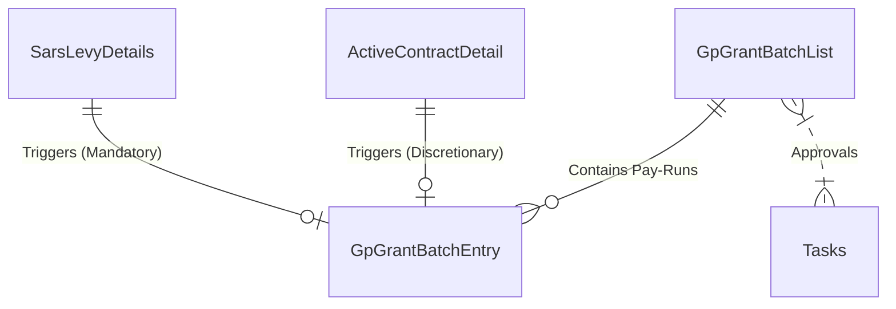

# Spec 14: Dynamics GP ERP Integration & Levy Processing

## 1. Domain Overview
While NSDMS acts as the core management system computing compliance and calculating grant payouts, the actual Treasury release of EFT payments happens in **Microsoft Dynamics GP (Great Plains)**. 

The GP Integration module is the critical outbound financial corridor that maps calculated Mandatory and Discretionary grants into massive "Payment Batches" (`GpGrantBatchList`). Concurrently, the **Sars Levy Details** processing maps inbound fiat contributions directly into the respective "Fund" buckets to ensure the SETA never promises a payment exceeding its internal treasury balances.

## 2. SQL Server Schema Strategy

**Core Tables Needed:**
- `GpGrantBatchList` (The aggregate payment batch header, e.g., "Batch 442 - Discretionary Tranche 2").
- `GpGrantBatchEntry` (The line items translating NSDMS calculations into Vendor Invoices/Returns).
- `SarsLevyDetails` (The granular SARS employer-level contributions mapped via `Spec-09`).
- `ActiveContractDetail` (The legal binding triggering a discretionary schedule, linked to pip milestones).

## 3. MVC Controllers & Routing
- `[Route("Financials/GP-Batches")]`: Financial officer dashboard to review and construct pending batches.
- `[Route("Financials/Levy-Reconciliation")]`: Dashboard comparing inbound `SarsLevyDetails` fiat values against the outbound `GpGrantBatchEntry` exposures.

## 4. State Machine & Workflows
1. **Calculation Event:** Spec-07 (Mandatory) or Spec-03 (Discretionary) calculates an amount owed.
2. **GP Batch Generation:** The `GpGrantBatchListService` rolls these un-paid entries into a new batch list depending on `WspTypeEnum`.
3. **Internal Approval:** Task Engine (`Spec-10`) routes the `GpGrantBatchList` through CFO/CEO approval queues.
4. **GP Export:** Once approved, the system generates XML envelopes conforming strictly to `com.microsoft.schemas.dynamics.gp._2006._01.Vendor` boundaries and pushes them to the ERP system via SOAP/Web API or CSV drops.
5. **Reversal/Returns:** Negative levy amounts (from SARS reversals) automatically generate `GpDocumentType.Return` GP directives to pull funds back.

## 5. Business Rules (The "Gotchas")
- **Sign Flipping Logic:** In the `GpGrantBatchListService`, negative values from SARS are converted to positive absolute values inside GP but flagged as `GpDocumentType.Return`. Positive values are flagged as `GpDocumentType.Invoice`.
- **Tranche Identifiers:** Discretionary Batches require strict document numbering formats embedded in the text. Explicit parsing: e.g. `DGYR20 T1 APP R143` (DGYR20 = Fin Year, T1 = Tranche 1, APP = Intervention Short Name).
- **Vendor Synchronization (ERP Mapping):** The Employer MUST exist in Dynamics GP as a valid Vendor before any financial batch executes. Because Dynamics GP tightly couples financial identity to the Vendor schema, the legacy NSDMS system carried out synchronization locally via Microsoft Web Service `Adapter` patterns using the entity `Vendor`.
  - **Key Mapping:** The `VendorKey.Id` inside GP is set exactly to the Company's **Levy Number**.
  - **Class Mapping:** The GP `ClassKey` maps to the employer's Chamber (e.g., `METAL`, `PLASTICS` using `GPVendorClassEnum`).
  - **Banking Abuse Mapping:** Legacy Java hijacked non-banking GP fields since native bank arrays didn't exist in the base vendor template:
    - `TaxRegistrationNumber` = Database Bank Account Number
    - `TaxIdentificationNumber` = Database Branch Code
  - ✨ **Modernization Directive (Event-Driven Broker):** The .NET modernization MUST drop the synchronous SOAP API calls explicitly triggering out of `BankingDetailsService.java`. Instead, when a target Banking Detail set is successfully verified/approved on the NSDMS UI, the backend will publish a `BankingDetailsApprovedEvent` to Azure Service Bus or external background worker (e.g., Hangfire) integrated via COT Custom Actions. A C# background worker will asynchronously push the Vendor schema to GP, ensuring the COT Touch UI UI is never blocked by synchronous ERP timeout latency.

## 6. Document Generation Component
- Internal PDF verification reports summarizing "Sum of Discretionary Levy" vs "Sum of Mandatory Levy".
- Extracted physical `CSV/XML` payloads for auditing against GP.

## 7. Required Data Fields Definition

| Field Name | Data Type | Required | Notes |
| :--- | :--- | :--- | :--- |
| `Id` | `UNIQUEIDENTIFIER` | Yes | PK |
| `BatchNumber` | `INT` | Yes | Auto-increment sequence for GP tracking |
| `WspType` | `INT` | Yes | Enum linking to Mandatory vs Discretionary |
| EntityStatusId | INT | Yes | The rigid business outcome (e.g., Registered, Rejected). |
| CurrentWorkflowStateId | INT | Conditional | Dual-Status push: Points to the active Workflow State for rapid COT routing. |
| `DocumentType` | `INT` | Yes | In `GpGrantBatchEntry`, maps to Invoice vs Return |
| `DiscretionaryLevyRounded` | `DECIMAL(18,2)` | Conditional | Strict 2-decimal fiat value for DB precision |

## 9. Standardized Error Messages

To eliminate ambiguity and ensure UI alignment across the application, the following hardcoded error string literals **MUST** be implemented within the presentation layer and `COT Business Rules Validation (Result.ShowMessage)` constraints for this domain:

| Error Code | Hardcoded String Literal | Trigger Condition |
| :--- | :--- | :--- |
| `ERR_GP_001` | `'Microsoft Dynamics GP API Rejection: Vendor ID does not exisit in the ERP system.'` | Primary Validation Failure |
| `ERR_GP_002` | `'Payment Batch contains unlinked or orphaned Grant Entries. Recalculation required.'` | State Machine Blocked |
| `ERR_GP_003` | `'Sign-flipping invariant violated. Discretionary Invoices cannot have negative monetary values.'` | Domain Invariant Violated |

### 6.1 Code On Time (COT) Native Form Validations
To satisfy the rapid Touch UI generation of COT, the following rules must be directly injected into the Data Controllers mapping to CurrentEntity to handle synchronous database constraints and immediate UI validation.

#### A) SQL Business Rule (Server-Side Validation)
This SQL snippet executes within COT's [Controller].xml lifecycle before insertion to enforce business invariants dynamically based on the exact table structure.

`sql
-- Pattern: Code On Time SQL Business Rule (Before Insert/Update)
-- Target Controller: CurrentEntity
-- Action: Insert, Update

-- Example Constraint Enforcement:
IF EXISTS (SELECT 1 FROM [dbo].[CurrentEntity] WHERE [Id] = @Id AND [StatusId] IS NULL)
BEGIN
    SET @BusinessRules_PreventDefault = 1;
    SET @Result_ShowMessage = 'A valid Workflow Status must be assigned before committing this record in CurrentEntity.';
END
`

#### B) JavaScript validation (Client-Side Touch UI)
This JS snippet enforces immediate checks on the UI input before a network dispatch, maintaining UI responsiveness for the CurrentEntity controller.

`javascript
// Pattern: Code On Time JavaScript Business Rule (Before Insert/Update)
// Target Controller: CurrentEntity
function override_before_insert(args) {
    var stat = ('StatusId');
    
    if (stat == null || stat === '') {
        this.preventDefault();
        this.result.showMessage('Workflow Status cannot be left blank during creation.');
        this.result.focus('StatusId');
        return;
    }
}
`
