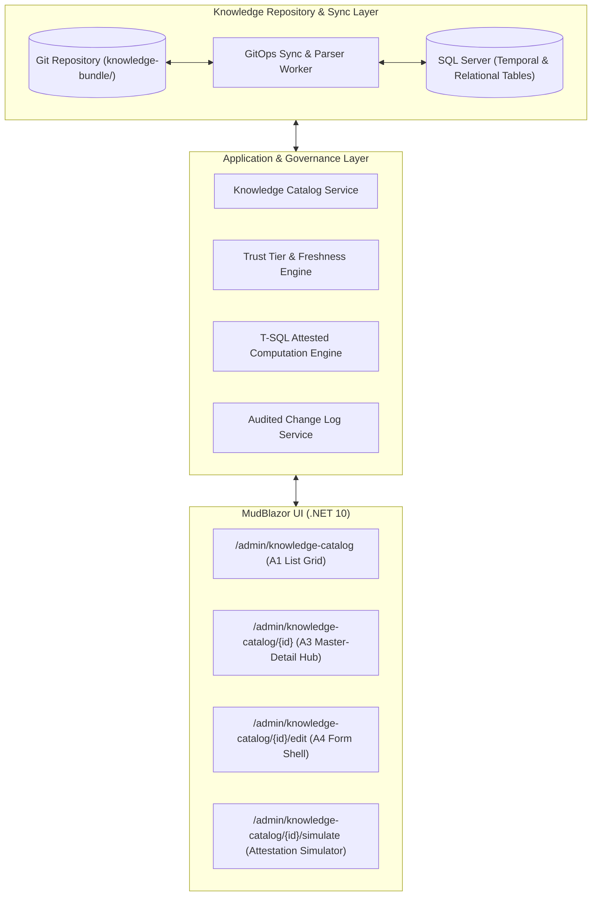
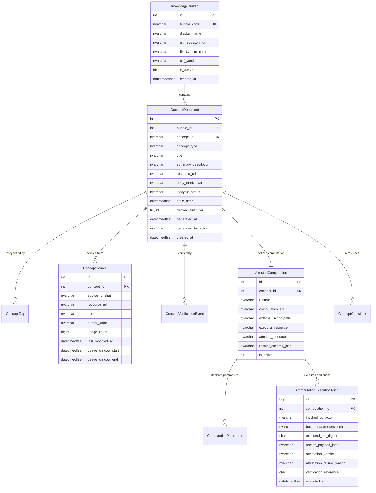
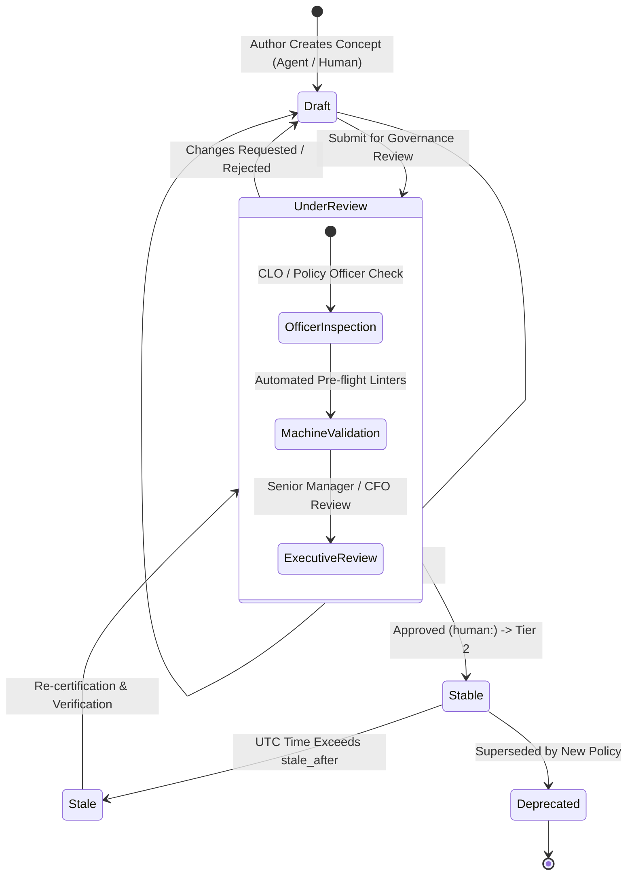
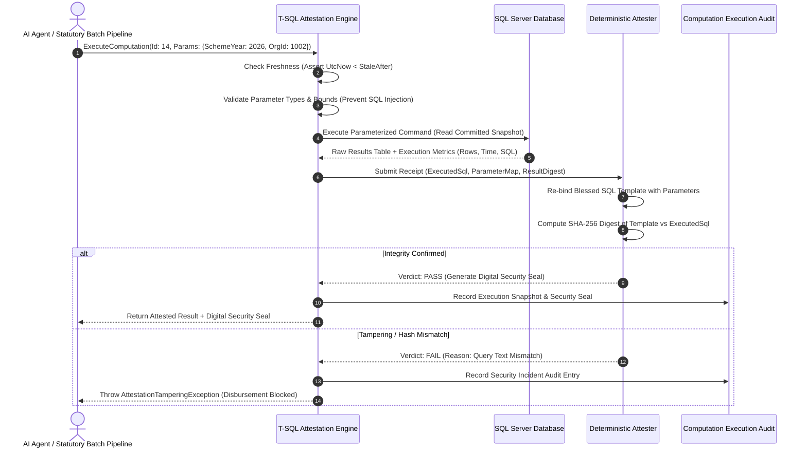
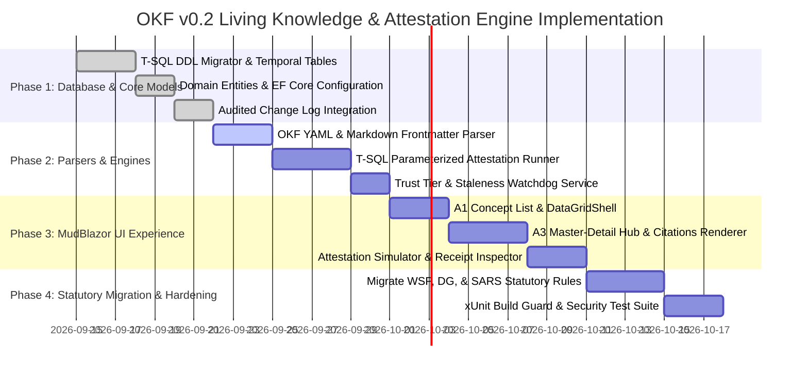

# MerSETA NSDMS — Open Knowledge Format (OKF v0.2) Architecture Specification
## Module 17: Embedded Living Knowledge & T-SQL Attested Computation Engine

---

## 1. Executive Summary & Strategic Context

### 1.1 Purpose
This specification defines the architectural design, data structures, business rules, workflows, validation constraints, and user interface standards for implementing the **Open Knowledge Format (OKF v0.2)**—based on the Google Cloud Platform Knowledge Catalog standard—as an embedded subsystem within the **MerSETA National Skills Development Management System (NSDMS)**.

The objective is to transform statutory skills development rules, financial allocation formulas, quality assurance standards, and database schemas into **machine-verifiable, human-auditable, and agent-consumable knowledge assets**.

### 1.2 Statutory & Governance Alignment
In terms of the **Skills Development Act No. 97 of 1998**, the **SETA Grant Regulations (Government Gazette No. 35940)**, the **Public Finance Management Act (PFMA) No. 1 of 1999**, and the **National Artisan Moderation Body (NAMB)** guidelines:
1. **Verifiable Calculations:** Statutory grant distributions (such as the 20% Mandatory Grant WSP/ATR levy rebates and PIVOTAL Discretionary Grant tranche disbursements) must be executed using non-tamperable, blessed formulas with an immutable audit trail.
2. **Attested Computations:** AI agents and automated batch processes must never synthesize or improvise their own calculation queries. They must execute strictly sanctioned T-SQL computations and produce an authoritative **Execution Receipt** verified by an independent **Deterministic Attester**.
3. **Dual Authorisation & Provenance:** Knowledge definitions and statutory formulas must document explicit legal provenance (Government Gazettes, Departmental Circulars) and require Segregation of Duties (Dual Authorisation Control) before attaining official **Human-Reviewed** trust status.
4. **Historical Version Timelines:** All knowledge concepts, schemas, and computations must utilize SQL Server system-versioned temporal tables to support retrospective point-in-time auditing (`AS OF @HistoricalDate`).

---

## 2. OKF v0.2 Standard Alignment

The system strictly adheres to the core constructs defined in the [Google Cloud Platform OKF v0.2 Specification](https://github.com/GoogleCloudPlatform/knowledge-catalog/blob/main/okf/SPEC.md):

| OKF v0.2 Construct | OKF Standard Definition | MerSETA NSDMS Enterprise Implementation |
| :--- | :--- | :--- |
| **Knowledge Bundle** | Directory tree of Markdown files with YAML frontmatter. Unit of distribution. | Physical storage under `App_Data/knowledge-bundles/` synchronized with Git, mirrored into SQL Server relational and temporal tables. |
| **Concept Document** | Single Markdown file representing an asset, metric, or playbook. | `ConceptDocument` entity with structured YAML frontmatter and Markdown body, keyed by a canonical `ConceptId` (e.g., `grants/mandatory-grant-rebate`). |
| **Reserved Files** | `index.md` (progressive disclosure) and `log.md` (update history). | Automated background generators compile `index.md` directory trees and `log.md` chronologies from database transaction logs. |
| **Actor Convention** | `human:<id>`, `process:<id>`, or `<producer>/<version>`. | Standardized identity strings mapping to MerSETA Staff/Officers (`human:clo_042`), background workers (`process:sars-reconciliation-job`), and AI agents (`agent/gemini-2.5-pro`). |
| **Trust Tiers** | `unverified` $\rightarrow$ `machine-confirmed` $\rightarrow$ `human-reviewed`. | Derived automatically from `verified` event actors. Stored as an indexed integer tier for rapid filtering and security gating. |
| **Provenance & Sources** | `sources` list with credibility signals (`author`, `usage_count`, `last_modified`). | Normalized `ConceptSource` records linked to statutory gazettes, SARS levy files, and database entities, with per-claim markdown footnote citations (`[^source-id]`). |
| **Lifecycle & Freshness** | `status` (`draft`, `stable`, `deprecated`) and `stale_after`. | Dynamic staleness watchdog evaluating `DateTimeOffset.UtcNow >= StaleAfter` to trigger recertification workflows and pause automated disbursements. |
| **Attested Computation** | Standalone concept carrying sanctioned code, parameters, executor, and attester. | Dedicated T-SQL execution runner executing parameterized stored procedures/functions, generating cryptographic execution receipts verified by deterministic attesters. |

---

## 3. Core System Features



### 3.1 Hierarchical Bundle Explorer & Search
- **Progressive Directory Disclosure:** Browse hierarchical knowledge bundles (`grants/`, `organisations/`, `artisans/`, `setmis/`, `playbooks/`) with dynamic directory trees.
- **Full-Text & Tag Filtering:** Integrated search across titles, descriptions, Markdown content, and normalized tags.
- **Cross-Concept Graph Visualizer:** Directed relationship graph generated from Markdown hyperlinks (e.g. `[Mandatory Grant Rebate](/grants/mandatory-grant-rebate.md)`).

### 3.2 Provenance & Per-Claim Citation Compiler
- **Statutory Source Catalog:** Record official legal and technical authorities (e.g., Skills Development Act, QCTO Policy, B-BBEE Codes, SARS monthly levy staging).
- **Footnote Linkage:** Body footnotes formatted as `[^gazette-35940]` resolve mechanically to `ConceptSource` records, exposing author authority, usage statistics, and last modification timestamps.

### 3.3 Dynamic Trust Tier & Staleness Watchdog
- **Real-Time Tier Derivation:** Computes Trust Tier (0: Unverified, 1: Machine-Confirmed, 2: Human-Reviewed) dynamically from verified events.
- **Staleness Gating:** Automatically flags expired policies and calculations when `DateTimeOffset.UtcNow >= StaleAfter`, alerting the Governance Committee and preventing unverified batch operations.

### 3.4 T-SQL Attested Computation Engine
- **Blessed Parameterized Templates:** Sanctioned T-SQL queries (e.g. calculation of 20% Mandatory Grant levy rebates from reconciled SARS staging).
- **Agent Immobility Invariant:** AI agents and external consumers can **only** pass values for declared parameters; they are strictly prevented from authoring, altering, or improvising queries.
- **Execution Receipt Generation:** Captures execution metadata: `ExecutionId`, `ExecutedSql`, `ParametersJson`, `ExecutionDurationMs`, `RowsAffected`, and `ResultDigest`.
- **Deterministic Attestation:** Re-binds the blessed SQL template with the declared parameters, computes the cryptographic SHA-256 digest, asserts exact string/hash equality with the executed SQL, and stamps an authoritative **Digital Security Seal**.
- **Financial Disbursement Gate:** Mandatory Grant payment batches (`MandatoryGrantDisbursement`) cannot be generated without an approved, passing Attestation Receipt.

---

## 4. Database Schema Architecture (SQL Server T-SQL)

The database schema adheres strictly to enterprise standards: singular PascalCase table names, auto-generated integer `id` keys (or `long` for high-volume execution logs), explicit audit columns (`CreatedAt`, `CreatedBy`, `ModifiedAt`, `ModifiedBy`), covered non-clustered foreign key indexes, and system-versioned temporal tables in the `history` schema.



### 4.1 Master DDL Migration Script

```sql
-- =====================================================================================
-- MERSETA NSDMS — OPEN KNOWLEDGE FORMAT (OKF v0.2) ENTERPRISE MIGRATION
-- Database: [NSDMS-NET] | Engine: Microsoft SQL Server 2022+ / Azure SQL
-- Standards: Singular PascalCase, System-Versioned Temporal Tables, Universal FK Indexing
-- =====================================================================================

IF NOT EXISTS (SELECT * FROM sys.schemas WHERE name = N'history')
    EXEC('CREATE SCHEMA [history] AUTHORIZATION [dbo];');
GO

-- -------------------------------------------------------------------------------------
-- 1. Table: [KnowledgeBundle]
-- Container for hierarchical knowledge documents, synced with Git repositories
-- -------------------------------------------------------------------------------------
IF NOT EXISTS (SELECT * FROM sys.objects WHERE object_id = OBJECT_ID(N'[dbo].[KnowledgeBundle]') AND type in (N'U'))
BEGIN
    CREATE TABLE [dbo].[KnowledgeBundle] (
        [Id]                  INT IDENTITY(1,1) NOT NULL,
        [BundleCode]          NVARCHAR(50)      NOT NULL,
        [DisplayName]         NVARCHAR(150)     NOT NULL,
        [Description]         NVARCHAR(500)     NULL,
        [GitRepositoryUrl]    NVARCHAR(255)     NULL,
        [FileSystemPath]      NVARCHAR(255)     NOT NULL,
        [OkfVersion]          NVARCHAR(20)      NOT NULL CONSTRAINT [DF_KnowledgeBundle_OkfVersion] DEFAULT ('0.2'),
        [IsActive]            BIT               NOT NULL CONSTRAINT [DF_KnowledgeBundle_IsActive] DEFAULT (1),
        
        -- Audit Columns
        [CreatedAt]           DATETIMEOFFSET    NOT NULL CONSTRAINT [DF_KnowledgeBundle_CreatedAt] DEFAULT (SYSUTCDATETIME()),
        [CreatedBy]           NVARCHAR(100)     NOT NULL CONSTRAINT [DF_KnowledgeBundle_CreatedBy] DEFAULT ('SYSTEM'),
        [ModifiedAt]          DATETIMEOFFSET    NOT NULL CONSTRAINT [DF_KnowledgeBundle_ModifiedAt] DEFAULT (SYSUTCDATETIME()),
        [ModifiedBy]          NVARCHAR(100)     NOT NULL CONSTRAINT [DF_KnowledgeBundle_ModifiedBy] DEFAULT ('SYSTEM'),

        CONSTRAINT [PK_KnowledgeBundle] PRIMARY KEY CLUSTERED ([Id] ASC),
        CONSTRAINT [UQ_KnowledgeBundle_BundleCode] UNIQUE NONCLUSTERED ([BundleCode] ASC)
    );
END;
GO

-- -------------------------------------------------------------------------------------
-- 2. Table: [ConceptDocument] (System-Versioned Temporal Table)
-- Individual knowledge asset, metric, playbook, or schema concept
-- -------------------------------------------------------------------------------------
IF NOT EXISTS (SELECT * FROM sys.objects WHERE object_id = OBJECT_ID(N'[dbo].[ConceptDocument]') AND type in (N'U'))
BEGIN
    CREATE TABLE [dbo].[ConceptDocument] (
        [Id]                  INT IDENTITY(1,1) NOT NULL,
        [BundleId]            INT               NOT NULL,
        [ConceptId]           NVARCHAR(150)     NOT NULL, -- Path without .md (e.g., 'grants/mandatory-grant-rebate')
        [ConceptType]         NVARCHAR(80)      NOT NULL, -- e.g., 'Metric', 'BigQuery Table', 'Attested Computation'
        [Title]               NVARCHAR(200)     NOT NULL,
        [SummaryDescription]  NVARCHAR(500)     NULL,
        [ResourceUri]         NVARCHAR(500)     NULL,
        [BodyMarkdown]        NVARCHAR(MAX)     NOT NULL,
        [LifecycleStatus]     NVARCHAR(30)      NOT NULL CONSTRAINT [DF_ConceptDocument_LifecycleStatus] DEFAULT ('stable'),
        [StaleAfter]          DATETIMEOFFSET    NULL,
        [DerivedTrustTier]    TINYINT           NOT NULL CONSTRAINT [DF_ConceptDocument_DerivedTrustTier] DEFAULT (0), -- 0=Unverified, 1=Machine-Confirmed, 2=Human-Reviewed
        [GeneratedAt]         DATETIMEOFFSET    NOT NULL,
        [GeneratedByActor]    NVARCHAR(150)     NOT NULL,
        [IsActive]            BIT               NOT NULL CONSTRAINT [DF_ConceptDocument_IsActive] DEFAULT (1),

        -- Audit Columns
        [CreatedAt]           DATETIMEOFFSET    NOT NULL CONSTRAINT [DF_ConceptDocument_CreatedAt] DEFAULT (SYSUTCDATETIME()),
        [CreatedBy]           NVARCHAR(100)     NOT NULL CONSTRAINT [DF_ConceptDocument_CreatedBy] DEFAULT ('SYSTEM'),
        [ModifiedAt]          DATETIMEOFFSET    NOT NULL CONSTRAINT [DF_ConceptDocument_ModifiedAt] DEFAULT (SYSUTCDATETIME()),
        [ModifiedBy]          NVARCHAR(100)     NOT NULL CONSTRAINT [DF_ConceptDocument_ModifiedBy] DEFAULT ('SYSTEM'),

        -- Temporal Versioning Columns
        [SysStartTime]        DATETIME2(7) GENERATED ALWAYS AS ROW START HIDDEN NOT NULL,
        [SysEndTime]          DATETIME2(7) GENERATED ALWAYS AS ROW END HIDDEN NOT NULL,
        PERIOD FOR SYSTEM_TIME ([SysStartTime], [SysEndTime]),

        CONSTRAINT [PK_ConceptDocument] PRIMARY KEY CLUSTERED ([Id] ASC),
        CONSTRAINT [UQ_ConceptDocument_ConceptId] UNIQUE NONCLUSTERED ([ConceptId] ASC),
        CONSTRAINT [FK_ConceptDocument_KnowledgeBundle] FOREIGN KEY ([BundleId]) REFERENCES [dbo].[KnowledgeBundle] ([Id])
    )
    WITH (SYSTEM_VERSIONING = ON (HISTORY_TABLE = [history].[ConceptDocumentHistory]));
END;
GO

IF NOT EXISTS (SELECT * FROM sys.indexes WHERE name = N'IX_ConceptDocument_BundleId')
    CREATE NONCLUSTERED INDEX [IX_ConceptDocument_BundleId] ON [dbo].[ConceptDocument] ([BundleId] ASC);
IF NOT EXISTS (SELECT * FROM sys.indexes WHERE name = N'IX_ConceptDocument_ConceptType')
    CREATE NONCLUSTERED INDEX [IX_ConceptDocument_ConceptType] ON [dbo].[ConceptDocument] ([ConceptType] ASC);
IF NOT EXISTS (SELECT * FROM sys.indexes WHERE name = N'IX_ConceptDocument_DerivedTrustTier')
    CREATE NONCLUSTERED INDEX [IX_ConceptDocument_DerivedTrustTier] ON [dbo].[ConceptDocument] ([DerivedTrustTier] ASC);
IF NOT EXISTS (SELECT * FROM sys.indexes WHERE name = N'IX_ConceptDocument_StaleAfter')
    CREATE NONCLUSTERED INDEX [IX_ConceptDocument_StaleAfter] ON [dbo].[ConceptDocument] ([StaleAfter] ASC) WHERE [StaleAfter] IS NOT NULL;
GO

-- -------------------------------------------------------------------------------------
-- 3. Table: [ConceptTag]
-- Cross-cutting categorization tags associated with concepts
-- -------------------------------------------------------------------------------------
IF NOT EXISTS (SELECT * FROM sys.objects WHERE object_id = OBJECT_ID(N'[dbo].[ConceptTag]') AND type in (N'U'))
BEGIN
    CREATE TABLE [dbo].[ConceptTag] (
        [Id]                  INT IDENTITY(1,1) NOT NULL,
        [ConceptId]           INT               NOT NULL,
        [TagName]             NVARCHAR(50)      NOT NULL,
        
        -- Audit Columns
        [CreatedAt]           DATETIMEOFFSET    NOT NULL CONSTRAINT [DF_ConceptTag_CreatedAt] DEFAULT (SYSUTCDATETIME()),
        [CreatedBy]           NVARCHAR(100)     NOT NULL CONSTRAINT [DF_ConceptTag_CreatedBy] DEFAULT ('SYSTEM'),

        CONSTRAINT [PK_ConceptTag] PRIMARY KEY CLUSTERED ([Id] ASC),
        CONSTRAINT [UQ_ConceptTag_Concept_Tag] UNIQUE NONCLUSTERED ([ConceptId] ASC, [TagName] ASC),
        CONSTRAINT [FK_ConceptTag_ConceptDocument] FOREIGN KEY ([ConceptId]) REFERENCES [dbo].[ConceptDocument] ([Id]) ON DELETE CASCADE
    );
END;
GO

IF NOT EXISTS (SELECT * FROM sys.indexes WHERE name = N'IX_ConceptTag_TagName')
    CREATE NONCLUSTERED INDEX [IX_ConceptTag_TagName] ON [dbo].[ConceptTag] ([TagName] ASC);
GO

-- -------------------------------------------------------------------------------------
-- 4. Table: [ConceptSource]
-- Provenance sources and external materials with credibility signals
-- -------------------------------------------------------------------------------------
IF NOT EXISTS (SELECT * FROM sys.objects WHERE object_id = OBJECT_ID(N'[dbo].[ConceptSource]') AND type in (N'U'))
BEGIN
    CREATE TABLE [dbo].[ConceptSource] (
        [Id]                  INT IDENTITY(1,1) NOT NULL,
        [ConceptId]           INT               NOT NULL,
        [SourceIdAlias]       NVARCHAR(80)      NOT NULL, -- Footnote join key: [^source_id]
        [ResourceUri]         NVARCHAR(500)     NOT NULL, -- URL or bundle path
        [Title]               NVARCHAR(200)     NULL,
        [AuthorActor]         NVARCHAR(150)     NULL, -- Who produced source
        [UsageCount]          BIGINT            NULL, -- Adoption/liveness signal
        [LastModifiedAt]      DATETIMEOFFSET    NULL, -- Recency signal
        [UsageWindowStart]    DATETIMEOFFSET    NULL,
        [UsageWindowEnd]      DATETIMEOFFSET    NULL,

        -- Audit Columns
        [CreatedAt]           DATETIMEOFFSET    NOT NULL CONSTRAINT [DF_ConceptSource_CreatedAt] DEFAULT (SYSUTCDATETIME()),
        [CreatedBy]           NVARCHAR(100)     NOT NULL CONSTRAINT [DF_ConceptSource_CreatedBy] DEFAULT ('SYSTEM'),
        [ModifiedAt]          DATETIMEOFFSET    NOT NULL CONSTRAINT [DF_ConceptSource_ModifiedAt] DEFAULT (SYSUTCDATETIME()),
        [ModifiedBy]          NVARCHAR(100)     NOT NULL CONSTRAINT [DF_ConceptSource_ModifiedBy] DEFAULT ('SYSTEM'),

        CONSTRAINT [PK_ConceptSource] PRIMARY KEY CLUSTERED ([Id] ASC),
        CONSTRAINT [UQ_ConceptSource_Concept_Alias] UNIQUE NONCLUSTERED ([ConceptId] ASC, [SourceIdAlias] ASC),
        CONSTRAINT [FK_ConceptSource_ConceptDocument] FOREIGN KEY ([ConceptId]) REFERENCES [dbo].[ConceptDocument] ([Id]) ON DELETE CASCADE
    );
END;
GO

IF NOT EXISTS (SELECT * FROM sys.indexes WHERE name = N'IX_ConceptSource_ConceptId')
    CREATE NONCLUSTERED INDEX [IX_ConceptSource_ConceptId] ON [dbo].[ConceptSource] ([ConceptId] ASC);
GO

-- -------------------------------------------------------------------------------------
-- 5. Table: [ConceptVerificationEvent]
-- Verification events establishing human-review and machine-confirmation trust
-- -------------------------------------------------------------------------------------
IF NOT EXISTS (SELECT * FROM sys.objects WHERE object_id = OBJECT_ID(N'[dbo].[ConceptVerificationEvent]') AND type in (N'U'))
BEGIN
    CREATE TABLE [dbo].[ConceptVerificationEvent] (
        [Id]                  INT IDENTITY(1,1) NOT NULL,
        [ConceptId]           INT               NOT NULL,
        [VerifiedByActor]     NVARCHAR(150)     NOT NULL, -- e.g. 'human:cfo_adjudicator', 'process:nightly-recon'
        [ActorType]           NVARCHAR(30)      NOT NULL, -- 'human', 'process', 'agent'
        [VerifiedAt]          DATETIMEOFFSET    NOT NULL,
        [Notes]               NVARCHAR(500)     NULL,

        -- Audit Columns
        [CreatedAt]           DATETIMEOFFSET    NOT NULL CONSTRAINT [DF_ConceptVerificationEvent_CreatedAt] DEFAULT (SYSUTCDATETIME()),
        [CreatedBy]           NVARCHAR(100)     NOT NULL CONSTRAINT [DF_ConceptVerificationEvent_CreatedBy] DEFAULT ('SYSTEM'),

        CONSTRAINT [PK_ConceptVerificationEvent] PRIMARY KEY CLUSTERED ([Id] ASC),
        CONSTRAINT [FK_ConceptVerificationEvent_ConceptDocument] FOREIGN KEY ([ConceptId]) REFERENCES [dbo].[ConceptDocument] ([Id]) ON DELETE CASCADE
    );
END;
GO

IF NOT EXISTS (SELECT * FROM sys.indexes WHERE name = N'IX_ConceptVerificationEvent_ConceptId')
    CREATE NONCLUSTERED INDEX [IX_ConceptVerificationEvent_ConceptId] ON [dbo].[ConceptVerificationEvent] ([ConceptId] ASC);
IF NOT EXISTS (SELECT * FROM sys.indexes WHERE name = N'IX_ConceptVerificationEvent_ActorType')
    CREATE NONCLUSTERED INDEX [IX_ConceptVerificationEvent_ActorType] ON [dbo].[ConceptVerificationEvent] ([ActorType] ASC);
GO

-- -------------------------------------------------------------------------------------
-- 6. Table: [AttestedComputation]
-- Standalone sanctioned computation definition (Runtime: T-SQL)
-- -------------------------------------------------------------------------------------
IF NOT EXISTS (SELECT * FROM sys.objects WHERE object_id = OBJECT_ID(N'[dbo].[AttestedComputation]') AND type in (N'U'))
BEGIN
    CREATE TABLE [dbo].[AttestedComputation] (
        [Id]                  INT IDENTITY(1,1) NOT NULL,
        [ConceptId]           INT               NOT NULL,
        [Runtime]             NVARCHAR(50)      NOT NULL CONSTRAINT [DF_AttestedComputation_Runtime] DEFAULT ('tsql'),
        [ComputationSql]      NVARCHAR(MAX)     NULL, -- Inline SQL block
        [ExternalScriptPath]  NVARCHAR(255)     NULL, -- Optional file path under references/
        [ExecutorResource]    NVARCHAR(255)     NOT NULL, -- e.g., 'references/skills/run-tsql.md'
        [AttesterResource]    NVARCHAR(255)     NOT NULL, -- e.g., 'references/attesters/tsql-equality.cs'
        [ReceiptSchemaJson]   NVARCHAR(1000)    NOT NULL, -- e.g., '["execution_id", "executed_sql", "rows_affected", "result_digest"]'
        [IsActive]            BIT               NOT NULL CONSTRAINT [DF_AttestedComputation_IsActive] DEFAULT (1),

        -- Audit Columns
        [CreatedAt]           DATETIMEOFFSET    NOT NULL CONSTRAINT [DF_AttestedComputation_CreatedAt] DEFAULT (SYSUTCDATETIME()),
        [CreatedBy]           NVARCHAR(100)     NOT NULL CONSTRAINT [DF_AttestedComputation_CreatedBy] DEFAULT ('SYSTEM'),
        [ModifiedAt]          DATETIMEOFFSET    NOT NULL CONSTRAINT [DF_AttestedComputation_ModifiedAt] DEFAULT (SYSUTCDATETIME()),
        [ModifiedBy]          NVARCHAR(100)     NOT NULL CONSTRAINT [DF_AttestedComputation_ModifiedBy] DEFAULT ('SYSTEM'),

        -- Temporal Versioning Columns
        [SysStartTime]        DATETIME2(7) GENERATED ALWAYS AS ROW START HIDDEN NOT NULL,
        [SysEndTime]          DATETIME2(7) GENERATED ALWAYS AS ROW END HIDDEN NOT NULL,
        PERIOD FOR SYSTEM_TIME ([SysStartTime], [SysEndTime]),

        CONSTRAINT [PK_AttestedComputation] PRIMARY KEY CLUSTERED ([Id] ASC),
        CONSTRAINT [UQ_AttestedComputation_ConceptId] UNIQUE NONCLUSTERED ([ConceptId] ASC),
        CONSTRAINT [FK_AttestedComputation_ConceptDocument] FOREIGN KEY ([ConceptId]) REFERENCES [dbo].[ConceptDocument] ([Id]) ON DELETE CASCADE
    )
    WITH (SYSTEM_VERSIONING = ON (HISTORY_TABLE = [history].[AttestedComputationHistory]));
END;
GO

-- -------------------------------------------------------------------------------------
-- 7. Table: [ComputationParameter]
-- Typed parameters for sanctioned computation templates
-- -------------------------------------------------------------------------------------
IF NOT EXISTS (SELECT * FROM sys.objects WHERE object_id = OBJECT_ID(N'[dbo].[ComputationParameter]') AND type in (N'U'))
BEGIN
    CREATE TABLE [dbo].[ComputationParameter] (
        [Id]                  INT IDENTITY(1,1) NOT NULL,
        [ComputationId]       INT               NOT NULL,
        [ParameterName]       NVARCHAR(50)      NOT NULL, -- e.g. '@SchemeYear', '@OrganisationId'
        [ParameterType]       NVARCHAR(30)      NOT NULL, -- 'int', 'nvarchar', 'decimal', 'date'
        [IsRequired]          BIT               NOT NULL CONSTRAINT [DF_ComputationParameter_IsRequired] DEFAULT (1),
        [DefaultValue]        NVARCHAR(100)     NULL,
        [Description]         NVARCHAR(250)     NULL,

        -- Audit Columns
        [CreatedAt]           DATETIMEOFFSET    NOT NULL CONSTRAINT [DF_ComputationParameter_CreatedAt] DEFAULT (SYSUTCDATETIME()),
        [CreatedBy]           NVARCHAR(100)     NOT NULL CONSTRAINT [DF_ComputationParameter_CreatedBy] DEFAULT ('SYSTEM'),

        CONSTRAINT [PK_ComputationParameter] PRIMARY KEY CLUSTERED ([Id] ASC),
        CONSTRAINT [UQ_ComputationParameter_Comp_Param] UNIQUE NONCLUSTERED ([ComputationId] ASC, [ParameterName] ASC),
        CONSTRAINT [FK_ComputationParameter_AttestedComputation] FOREIGN KEY ([ComputationId]) REFERENCES [dbo].[AttestedComputation] ([Id]) ON DELETE CASCADE
    );
END;
GO

IF NOT EXISTS (SELECT * FROM sys.indexes WHERE name = N'IX_ComputationParameter_ComputationId')
    CREATE NONCLUSTERED INDEX [IX_ComputationParameter_ComputationId] ON [dbo].[ComputationParameter] ([ComputationId] ASC);
GO

-- -------------------------------------------------------------------------------------
-- 8. Table: [ComputationExecutionAudit]
-- High-volume append-only audit trail of computation runs, receipts, and security seals
-- -------------------------------------------------------------------------------------
IF NOT EXISTS (SELECT * FROM sys.objects WHERE object_id = OBJECT_ID(N'[dbo].[ComputationExecutionAudit]') AND type in (N'U'))
BEGIN
    CREATE TABLE [dbo].[ComputationExecutionAudit] (
        [Id]                       BIGINT IDENTITY(1,1) NOT NULL,
        [ComputationId]            INT                  NOT NULL,
        [InvokedByActor]           NVARCHAR(150)        NOT NULL,
        [BoundParametersJson]      NVARCHAR(MAX)        NOT NULL,
        [ExecutedSqlDigest]        CHAR(64)             NOT NULL, -- SHA-256 of actual executed query text
        [ReceiptPayloadJson]       NVARCHAR(MAX)        NOT NULL, -- Raw receipt dictionary
        [AttestationVerdict]       NVARCHAR(20)         NOT NULL, -- 'Pass', 'Fail', 'Warning'
        [AttestationFailureReason] NVARCHAR(500)        NULL,
        [VerificationReference]    CHAR(64)             NOT NULL, -- Digital Security Seal
        [ExecutionDurationMs]      INT                  NOT NULL,
        [ExecutedAt]               DATETIMEOFFSET       NOT NULL CONSTRAINT [DF_CompExecutionAudit_ExecutedAt] DEFAULT (SYSUTCDATETIME()),

        CONSTRAINT [PK_ComputationExecutionAudit] PRIMARY KEY CLUSTERED ([Id] ASC),
        CONSTRAINT [FK_ComputationExecutionAudit_AttestedComputation] FOREIGN KEY ([ComputationId]) REFERENCES [dbo].[AttestedComputation] ([Id])
    );
END;
GO

IF NOT EXISTS (SELECT * FROM sys.indexes WHERE name = N'IX_CompExecutionAudit_ComputationId')
    CREATE NONCLUSTERED INDEX [IX_CompExecutionAudit_ComputationId] ON [dbo].[ComputationExecutionAudit] ([ComputationId] ASC, [ExecutedAt] DESC);
IF NOT EXISTS (SELECT * FROM sys.indexes WHERE name = N'IX_CompExecutionAudit_Verdict')
    CREATE NONCLUSTERED INDEX [IX_CompExecutionAudit_Verdict] ON [dbo].[ComputationExecutionAudit] ([AttestationVerdict] ASC);
IF NOT EXISTS (SELECT * FROM sys.indexes WHERE name = N'IX_CompExecutionAudit_Seal')
    CREATE NONCLUSTERED INDEX [IX_CompExecutionAudit_Seal] ON [dbo].[ComputationExecutionAudit] ([VerificationReference] ASC);
GO

-- -------------------------------------------------------------------------------------
-- 9. Table: [ConceptCrossLink]
-- Graph relationship edges between concepts parsed from markdown links
-- -------------------------------------------------------------------------------------
IF NOT EXISTS (SELECT * FROM sys.objects WHERE object_id = OBJECT_ID(N'[dbo].[ConceptCrossLink]') AND type in (N'U'))
BEGIN
    CREATE TABLE [dbo].[ConceptCrossLink] (
        [Id]                  INT IDENTITY(1,1) NOT NULL,
        [SourceConceptId]     INT               NOT NULL,
        [TargetConceptPath]   NVARCHAR(255)     NOT NULL,
        [ResolvedTargetId]    INT               NULL, -- NULL if broken or external link
        [LinkText]            NVARCHAR(200)     NULL,
        
        -- Audit Columns
        [CreatedAt]           DATETIMEOFFSET    NOT NULL CONSTRAINT [DF_ConceptCrossLink_CreatedAt] DEFAULT (SYSUTCDATETIME()),
        [CreatedBy]           NVARCHAR(100)     NOT NULL CONSTRAINT [DF_ConceptCrossLink_CreatedBy] DEFAULT ('SYSTEM'),

        CONSTRAINT [PK_ConceptCrossLink] PRIMARY KEY CLUSTERED ([Id] ASC),
        CONSTRAINT [FK_ConceptCrossLink_SourceConcept] FOREIGN KEY ([SourceConceptId]) REFERENCES [dbo].[ConceptDocument] ([Id]) ON DELETE CASCADE,
        CONSTRAINT [FK_ConceptCrossLink_TargetConcept] FOREIGN KEY ([ResolvedTargetId]) REFERENCES [dbo].[ConceptDocument] ([Id])
    );
END;
GO

IF NOT EXISTS (SELECT * FROM sys.indexes WHERE name = N'IX_ConceptCrossLink_SourceConceptId')
    CREATE NONCLUSTERED INDEX [IX_ConceptCrossLink_SourceConceptId] ON [dbo].[ConceptCrossLink] ([SourceConceptId] ASC);
IF NOT EXISTS (SELECT * FROM sys.indexes WHERE name = N'IX_ConceptCrossLink_ResolvedTargetId')
    CREATE NONCLUSTERED INDEX [IX_ConceptCrossLink_ResolvedTargetId] ON [dbo].[ConceptCrossLink] ([ResolvedTargetId] ASC);
GO
```

---

## 5. Domain Models & Service Contracts (.NET 10)

### 5.1 Domain Entities

```csharp
namespace Nsdms.Domain.Entities;

public enum TrustTier : byte
{
    Unverified = 0,
    MachineConfirmed = 1,
    HumanReviewed = 2
}

public enum LifecycleStatus
{
    Draft,
    Stable,
    Deprecated
}

public class ConceptDocument : BaseAuditedEntity
{
    public int BundleId { get; set; }
    public string ConceptId { get; set; } = string.Empty; // e.g. "grants/mandatory-grant-rebate"
    public string ConceptType { get; set; } = string.Empty;
    public string Title { get; set; } = string.Empty;
    public string? SummaryDescription { get; set; }
    public string? ResourceUri { get; set; }
    public string BodyMarkdown { get; set; } = string.Empty;
    public LifecycleStatus LifecycleStatus { get; set; } = LifecycleStatus.Stable;
    public DateTimeOffset? StaleAfter { get; set; }
    public TrustTier DerivedTrustTier { get; set; } = TrustTier.Unverified;
    public DateTimeOffset GeneratedAt { get; set; }
    public string GeneratedByActor { get; set; } = string.Empty;
    public bool IsActive { get; set; } = true;

    // Relational Navigation
    public KnowledgeBundle Bundle { get; set; } = null!;
    public ICollection<ConceptTag> Tags { get; set; } = new List<ConceptTag>();
    public ICollection<ConceptSource> Sources { get; set; } = new List<ConceptSource>();
    public ICollection<ConceptVerificationEvent> Verifications { get; set; } = new List<ConceptVerificationEvent>();
    public AttestedComputation? Computation { get; set; }
    public ICollection<ConceptCrossLink> CrossLinks { get; set; } = new List<ConceptCrossLink>();
}

public class AttestedComputation : BaseAuditedEntity
{
    public int ConceptId { get; set; }
    public string Runtime { get; set; } = "tsql";
    public string? ComputationSql { get; set; }
    public string? ExternalScriptPath { get; set; }
    public string ExecutorResource { get; set; } = string.Empty;
    public string AttesterResource { get; set; } = string.Empty;
    public string ReceiptSchemaJson { get; set; } = string.Empty;
    public bool IsActive { get; set; } = true;

    public ConceptDocument Concept { get; set; } = null!;
    public ICollection<ComputationParameter> Parameters { get; set; } = new List<ComputationParameter>();
    public ICollection<ComputationExecutionAudit> Executions { get; set; } = new List<ComputationExecutionAudit>();
}
```

### 5.2 Application Service Contracts

```csharp
namespace Nsdms.Application.Interfaces;

public interface IKnowledgeCatalogService
{
    Task<PagedResult<ConceptSummaryDto>> GetConceptsAsync(ConceptFilterDto filter, CancellationToken ct = default);
    Task<ConceptDetailDto?> GetConceptByIdAsync(int id, CancellationToken ct = default);
    Task<ConceptDetailDto?> GetConceptByConceptIdAsync(string conceptId, CancellationToken ct = default);
    Task<ConceptDetailDto> CreateConceptAsync(CreateConceptCommand command, CancellationToken ct = default);
    Task<ConceptDetailDto> UpdateConceptAsync(UpdateConceptCommand command, CancellationToken ct = default);
    Task<bool> RecordVerificationAsync(int conceptId, RecordVerificationCommand command, CancellationToken ct = default);
    Task<AttestationExecutionResultDto> ExecuteAttestedComputationAsync(ExecuteComputationCommand command, CancellationToken ct = default);
    Task SyncFromGitBundleAsync(string bundleCode, CancellationToken ct = default);
    Task<byte[]> ExportBundleArchiveAsync(int bundleId, CancellationToken ct = default);
}

public interface ITsqlAttestationEngine
{
    Task<AttestationExecutionResultDto> ExecuteAndAttestAsync(
        int computationId, 
        Dictionary<string, object> parameters, 
        string actor, 
        CancellationToken ct = default);
}
```

---

## 6. Business Rules Matrix

| Rule Code | Rule Name | Invariant Description | Enforcement Mechanism |
| :--- | :--- | :--- | :--- |
| **BR-OKF-001** | **Trust Tier Derivation** | If no verification events exist, tier is `0 (Unverified)`. If all verifications are from non-human actors (`process:*` or `<agent>/<ver>`), tier is `1 (Machine-Confirmed)`. If at least one verification is from `human:<id>`, tier is `2 (Human-Reviewed)`. | `KnowledgeCatalogService.DeriveTrustTier()` and trigger recalculation on verification mutations. |
| **BR-OKF-002** | **Freshness & Staleness Invariant** | A concept is considered `Stale` if `StaleAfter != null` and `DateTimeOffset.UtcNow >= StaleAfter`. When stale, the UI displays a high-contrast warning badge, and automated batch pipelines refuse execution. | Staleness filter query and `ExecuteAttestedComputationAsync` precondition check. |
| **BR-OKF-003** | **Immutable Computation Invariant** | Consumers and AI agents can **only** pass values for declared parameters. They are strictly prohibited from authoring, altering, or improvising queries or formulas. | Parameterized ADO.NET query execution against locked `ComputationSql` templates; SQL AST validation. |
| **BR-OKF-004** | **Deterministic Attestation Invariant** | Attestation verification must execute deterministically without generative LLM intervention. It must compute SHA-256 digests over re-expanded templates and assert strict equality with `receipt.executed_sql`. | `TsqlAttestationEngine` computes SHA-256 hash over normalized SQL and compares against execution log. |
| **BR-OKF-005** | **PFMA Dual Authorisation Governance** | The author of a concept or computation (`generated.by`) cannot verify their own work (`verified.by != generated.by`). Proposer and Reviewer cannot be the same user ID. | `RecordVerificationAsync` domain validation guard. |
| **BR-OKF-006** | **Permissive Consumer Conformance** | In accordance with OKF v0.2 Section 11, the parser must tolerate unknown frontmatter keys, arbitrary concept types, and broken cross-links without throwing unhandled exceptions. | `OkfFrontmatterParser` schema-lenient deserialization with warning logging. |
| **BR-OKF-007** | **Citation Footnote Integrity** | Every footnote citation in the body markdown `[^source_id]` must correspond to an active record in `ConceptSource` with matching `SourceIdAlias`. | Markdown AST parser inspection during concept creation/update. |

---

## 7. System Workflows

### 7.1 Concept Lifecycle & Dual Authorisation Workflow


### 7.2 T-SQL Attested Computation Pipeline


---

## 8. Concrete MerSETA Exemplar: Mandatory Grant 20% Rebate

Below is a complete, normative example of how a statutory MerSETA calculation is represented as an OKF v0.2 concept within the system:

### 8.1 Concept Document: `grants/mandatory-grant-rebate.md`

```markdown
---
type: Attested Computation
title: Mandatory Grant (WSP/ATR) 20% Levy Rebate Calculation
description: Calculates the statutory 20% Mandatory Grant levy rebate for an employer based on SARS monthly levy receipts.
resource: nsdms://grants/mandatory-grant/rebate
tags: [grants, wsp, levies, mandatory-grant, sars]
status: stable
runtime: tsql
parameters:
  - { name: "@FinancialYearId", type: "int", required: true }
  - { name: "@OrganisationId", type: "int", required: true }
executor:
  resource: references/skills/run-tsql.md
  receipt: [execution_id, executed_sql, rows_affected, total_rebate_amount, result_digest]
attester:
  resource: references/attesters/tsql-equality.cs
generated: { by: agent/gemini-2.5-pro, at: "2026-06-20T10:00:00Z" }
verified:
  - { by: human:clo_adjudicator, at: "2026-06-22T14:30:00Z" }
  - { by: human:cfo_executive, at: "2026-06-24T09:15:00Z" }
stale_after: "2027-04-30T23:59:59Z"
sources:
  - id: grant-reg-35940
    resource: https://www.gov.za/documents/skills-development-act-regulations-monies-received-seta-and-related-matters
    title: SETA Grant Regulations (Government Gazette No. 35940, Regulation 4)
    author: government:dhet
    last_modified: "2012-12-03T00:00:00Z"
  - id: sars-staging-spec
    resource: /schemas/sars-levy-staging.md
    title: SARS Monthly Levy Ingestion & Reconciliation Specification
    author: team:merSETA-finance
    usage_count: 14200
    last_modified: "2026-05-15T00:00:00Z"
usage_window: { from: "2026-04-01T00:00:00Z", to: "2027-03-31T23:59:59Z" }
---

# Statutory Background

In terms of Regulation 4(1) of the SETA Grant Regulations published in Government Gazette No. 35940,[^grant-reg-35940] an employer who pays skills development levies and submits an approved Workplace Skills Plan (WSP) and Annual Training Report (ATR) by the statutory deadline of 30 April is eligible to claim a Mandatory Grant rebate equal to **20%** of the total levies paid.

Reconciled levy payments are ingested via the SARS monthly streaming pipeline.[^sars-staging-spec]

# Computation

```sql
SELECT 
    l.OrganisationId,
    l.FinancialYearId,
    COUNT(l.Id) AS ReconciledMonthsCount,
    SUM(l.TotalLevyAmount) AS GrossLevyPaid,
    ROUND(SUM(l.TotalLevyAmount) * 0.20, 2) AS MandatoryGrantRebateAmount
FROM dbo.LevyFileLine l
INNER JOIN dbo.Organisation o ON l.OrganisationId = o.Id
INNER JOIN dbo.WspSubmission w ON w.OrganisationId = o.Id AND w.FinancialYearId = l.FinancialYearId
WHERE l.OrganisationId = @OrganisationId
  AND l.FinancialYearId = @FinancialYearId
  AND w.SubmissionStatusCode = 'Approved'
  AND l.IsReconciled = 1
GROUP BY l.OrganisationId, l.FinancialYearId;
```

# Verification & Attestation Receipt

Executing this computation generates a deterministic receipt. The attester verifies:
1. Exact equality between the executed SQL text and the sanitized sanctioned query above.
2. That `@OrganisationId` has an approved WSP submission for `@FinancialYearId`.
3. That the returned `MandatoryGrantRebateAmount` matches the SHA-256 payload digest.

[^grant-reg-35940]: SETA Grant Regulations (Government Gazette No. 35940, Regulation 4)
[^sars-staging-spec]: SARS Monthly Levy Ingestion & Reconciliation Specification
```

---

## 9. MudBlazor UI / UX Architecture (.NET 10)

The UI adheres strictly to the **16-point UI Standard Compliance Checklist**, the **MudBlazor Design System**, and **Plain-Language Governance**:
- **Zero Maker-Checker Jargon:** Display **"Proposer"**, **"Reviewer"**, and **"Dual Authorisation Control"**.
- **Zero Cryptography Jargon:** Use **"Digital Security Seal"** and **"Verification Reference"** instead of raw SHA-256 hashes.
- **Zero Database Jargon:** Use **"Historical Version Timeline"** instead of "Temporal Table".
- **Mask Integer Primary Keys:** Display business identifiers (`ConceptId`) rather than numeric database IDs.

### 9.1 Route Archetypes & Navigation Map

```
/admin/knowledge-catalog                          (Archetype A1 List: Concept Data Table)
  ├── /{id}                                       (Archetype A3 Detail: Master View by Default)
  │     ├── Tab 1: Overview & Frontmatter
  │     ├── Tab 2: Markdown & Statutory Citations
  │     ├── Tab 3: Sanctioned T-SQL & Receipt Contract
  │     ├── Tab 4: Governance Verification Timeline
  │     └── Tab 5: Audited Change Log & Execution History
  ├── /{id}/edit                                  (Archetype A4 Form: Edit Shell with FormShell)
  ├── /{id}/simulate                              (Attestation Simulator & Real-time Runner)
  └── /create                                     (Archetype A4 Form: Create New Concept)
```

### 9.2 Archetype A1: List Grid Specification (`/admin/knowledge-catalog`)
- **Container:** `<DataGridShell TItem="ConceptSummaryDto">` with 7-tier pagination (`5, 10, 20, 50, 100, 250, 500`).
- **Columns:**
  1. `ConceptId` (Hyperlink `<MudLink Href="...">` in monospace `.font-mono`).
  2. `Title` (Sentence case string).
  3. `ConceptType` (`<MudChip>` e.g. *Attested Computation*, *Metric*, *Schema*).
  4. `TrustTier` (Standard `<MudBadge>`: *Tier 0: Unverified* [Default], *Tier 1: Machine-Confirmed* [Info], *Tier 2: Human-Reviewed* [Success]).
  5. `Freshness` (`<MudChip Color="Color.Error">` if `IsStale == true` else `Color.Default`).
  6. `Status` (`Draft`, `Stable`, `Deprecated`).
  7. `GeneratedAt` (Hidden on mobile via `hidden md:table-cell`).
- **Action Zone:** Single right-aligned "Register concept" button (`Color="Color.Primary"`, Icon `Icons.Material.Filled.Add`).

### 9.3 Archetype A3: Detail View Specification (`/admin/knowledge-catalog/{id}`)
- **Sticky Top Bar:** Docked at `top: var(--mud-appbar-height, 64px) !important;` with breadcrumb back navigation, status chip, single Trust Tier badge, and "Run simulation" action.
- **View by Default (Strict):** All fields rendered using `<ReadOnlyField>` components. Never render editable inputs on `/{id}`.
- **Tabs:**
  - **Tab 1 (Overview):** Concept ID, Title, Type, Canonical Resource URI, Generated Actor, Stale After timestamp.
  - **Tab 2 (Markdown & Citations):** Rendered HTML body with clickable footnote citations displaying author credibility signals in tooltips.
  - **Tab 3 (T-SQL Computation):** Syntax-highlighted SQL template, declared parameters table (`@Name`, `Type`, `Required`), and expected receipt schema.
  - **Tab 4 (Dual Authorisation Timeline):** Verification history cards displaying verifying officer, actor category, verification timestamp, and governance notes.
  - **Tab 5 (Audited Execution Log):** Data grid of executions displaying invocation timestamp, actor, parameters, verdict chip (`Pass`/`Fail`), execution duration, and expandable drawer with the **Digital Security Seal**.

---

## 10. Validations & Conformance Criteria

### 10.1 Frontmatter Ingestion Validations
1. **Required Fields:** YAML frontmatter must parse into a valid mapping with a non-empty `type` property.
2. **Actor Syntax:** Actor strings must match regex: `^(human:[a-zA-Z0-9_\.\-]+|process:[a-zA-Z0-9_\.\-]+|[a-zA-Z0-9_\.\-]+/[a-zA-Z0-9_\.\-]+)$`.
3. **ISO 8601 UTC Dates:** All date-times (`generated.at`, `verified[].at`, `stale_after`, `last_modified`) must specify explicit UTC zero offset (`Z`).
4. **Lifecycle Enum:** Status must be one of `draft`, `stable`, or `deprecated`. Defaults to `stable` if omitted.

### 10.2 Attested T-SQL Validations
1. **Parameter Whitelisting:** Parameter names must begin with `@` and map strictly to supported SQL Server types (`INT`, `BIGINT`, `DECIMAL`, `NVARCHAR`, `DATE`, `DATETIMEOFFSET`, `BIT`).
2. **Sanitization:** Parameter values are bound strictly via `SqlParameter` objects; dynamic string interpolation is prohibited.
3. **Receipt Conformity:** The returned execution receipt must contain all keys declared in `executor.receipt`.
4. **Non-LLM Attester:** Deterministic verification code must execute in isolated CLR memory with zero generative LLM calls.

---

## 11. Implementation Roadmap



### Phase 1: Schema & Data Access Layer
- Execute T-SQL DDL migration script creating `KnowledgeBundle`, `ConceptDocument`, `ConceptSource`, `ConceptVerificationEvent`, `AttestedComputation`, `ComputationParameter`, and `ComputationExecutionAudit`.
- Configure EF Core mappings in `NsdmsDbContext` with temporal table history mappings (`history.*`) and covering indexes.
- Implement repository services utilizing `INsdmsDbContextFactory`.

### Phase 2: Application Core & Attestation Engine
- Implement `OkfFrontmatterParser` using YamlDotNet and Markdig with lenient error handling (§11 Conformance).
- Implement `TsqlAttestationEngine` providing parameterized ADO.NET execution, receipt capture, and cryptographic SHA-256 seal verification.
- Implement background hosted service `KnowledgeStalenessWatchdogWorker` to monitor `StaleAfter` thresholds.

### Phase 3: MudBlazor User Experience
- Build `/admin/knowledge-catalog` (Archetype A1 List) using `<DataGridShell>`.
- Build `/admin/knowledge-catalog/{id}` (Archetype A3 Detail Hub) with view-by-default `<ReadOnlyField>` layout and tabbed sections.
- Build interactive Attestation Simulator enabling officers to dry-run parameter bindings and inspect generated Digital Security Seals.

### Phase 4: Statutory Rule Migration & Quality Gates
- Model MerSETA statutory rules (Mandatory Grant 20% Rebate, DG PIVOTAL funding caps, NAMB mentor-to-apprentice ratios, SARS levy splits) as living OKF concepts.
- Add comprehensive xUnit unit and integration tests verifying trust tier transitions, tampering detection, and citation integrity.

---

## 12. Verification & Test Strategy

| Test Suite | Target Component | Verification Objective |
| :--- | :--- | :--- |
| `OkfFrontmatterParserTests.cs` | YAML & Markdown Parser | Verifies parsing of valid and malformed frontmatter, permissive handling of unknown keys, actor syntax validation, and footnote citation resolution. |
| `TrustTierDerivationTests.cs` | Trust Governance Engine | Verifies that concepts transition correctly: Unverified (no events) $\rightarrow$ Machine-Confirmed (only automated processes) $\rightarrow$ Human-Reviewed (at least one human sign-off). |
| `TsqlAttestationEngineTests.cs` | Attestation Engine | Verifies that passing identical parameters yields `Verdict == Pass` with valid Digital Security Seal; verifies that query tampering or unauthorized changes immediately fail attestation. |
| `DualAuthorisationPolicyTests.cs` | Governance Policies | Verifies that `generated.by` user is blocked from recording verification sign-off on their own concept. |
| `StalenessGatingTests.cs` | Freshness Watchdog | Verifies that computations past `stale_after` are blocked from execution in financial disbursement pipelines. |
| `KnowledgeCatalogUiSecurityTests.cs` | MudBlazor Pages | Scans `/admin/knowledge-catalog` and child routes via reflection to assert `@attribute [Authorize(Roles = "Admin,Executive,Finance")]` enforcement. |

---

*Document finalized for MerSETA NSDMS Architecture Repository.*  
*Specification Reference: `DOC-SPEC-OKF-2026-01` | OKF Version: 0.2*
