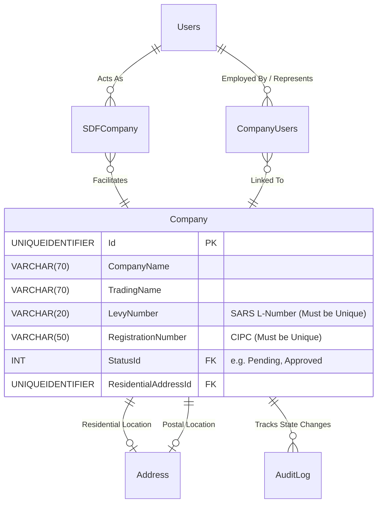

# Spec 02: Company Registration & Organisation Management

## 1. Domain Overview
The Organisation Management module is the central hub for employer and training provider demographic data. It manages the lifecycle of Companies registering with the NSDMS, their geographical mapping for spatial reporting, their dynamic link to Skills Development Facilitators (SDFs), and their SARS Levy routing identifiers. Establishing accurate company records is a prerequisite for downstream domains like Workplace Skills Plans (WSP), Learner Registrations, and ETQA workflows.

## 2. SQL Server Schema Strategy

**Core Tables Needed:**
- `Company` (Core Entity tracking Name, Trading Name, L-Number, Type, and Workflow Status).
- `CompanyUsers` (Bridge table binding a `User` to a `Company` with specific Roles/Designations).
- `SDFCompany` (Specialised bridge table explicitly for Primary/Secondary Skills Development Facilitators binding a User to an Entity for compliance sign-offs).
- `Address` (Geo-spatial link table maintaining Residential and Postal addresses).



## 3. MVC Controllers & Routing

The .NET MVC application will expose specific administrative endpoints protected by ASP.NET Core Policies.

**Target Controllers:**
* `[Route("Organisation/Companies")]` (Standard Grid overview for searching Companies by L-Number or Name)
* `[Route("Organisation/Companies/{id:guid}/Details")]` (The deep-dive Employer Profile page)
* `[Route("Organisation/SDFs")]` (Management Console for linking/unlinking Facilitators)

**Security / Policies (`[Authorize]`):**
* Requirements evaluating Claims representing `ORG_ADMIN` (Can manage their own assigned company) vs `MERSETA_ADMIN_CLO` (Can view/manage mapped regional companies natively).

## 4. View Requirements (UI/UX)

The overarching pattern will be a **Stacked Master-Detail Grid**.

*   **Master (The List):** A Razor/DataTables grid paginating through `Company`. Columns: Name, Levy Number, Registration Number, Verification Status.
*   **Detail (The Drill-down):** Selecting an employer opens the detail view, strictly ordered into tabs:
    1.  **General Details:** Basic CIPC details, Name, Contacts. (Read/Write if in Edit Mode).
    2.  **Addresses & Geo:** Maps the physical and postal locations, automatically binding to Town/Municipality lookups.
    3.  **Client Liaison (CLO):** Read-Only view of the internally assigned merSETA official matched via Geography.
    4.  **Linked Users & SDFs:** Datagrid displaying all `CompanyUsers` and `SDFCompany` roles. Allows the Primary SDF to invite/link auxiliary users natively.

## 5. State Machine & Workflows

**Primary Transitions:**
1.  **Draft / Pre-Registration:** New user asserts ownership of an L-Number/Registration Number.
2.  **Verification:** Cross-check against SARS import tables or CIPC API (if configured).
3.  **Pending Registration Approval:** Admin/CLO verifies documentation.
4.  **Active / Approved:** Full functionality unlocked (WSP submissions enabled).

## 6. Business Rules Engine (The "Gotchas")

### 6.1 Code On Time (COT) Native Form Validations
To satisfy the rapid Touch UI generation of COT, the following rules must be directly injected into the Data Controllers mapping to `FILE 200` to handle synchronous database constraints and immediate UI validation.

#### A) SQL Business Rule (Server-Side Validation)
This SQL snippet replaces the application-layer Unique Constraint checks, acting within COT's `[Controller].xml` lifecycle before insertion.

```sql
-- Pattern: Code On Time SQL Business Rule (Before Insert/Update)
-- Target Controller: FILE 200 (Employer)
-- Action: Insert, Update

IF EXISTS (
    SELECT 1 
    FROM [dbo].[FILE 200] 
    WHERE [Main_SDL_No] = @Main_SDL_No 
      AND [FILE200_ID] <> ISNULL(@FILE200_ID, 0)
)
BEGIN
    SET @BusinessRules_PreventDefault = 1;
    SET @Result_ShowMessage = 'Levy number already in use, please provide a different levy number.';
END
```

#### B) JavaScript validation (Client-Side Touch UI)
This JS snippet enforces length and pattern formatting immediately on the UI input before a network call is dispatched, ensuring rapid feedback.

```javascript
// Pattern: Code On Time JavaScript Business Rule (Before Insert/Update)
// Target Controller: FILE 200 (Employer)
function override_before_insert(args) {
    var sdlNo = $v('Main_SDL_No');
    
    if (sdlNo == null || sdlNo.length !== 10) {
        this.preventDefault();
        this.result.showMessage('Levy Number must be exactly 10 characters long.');
        this.result.focus('Main_SDL_No');
        return;
    }
    
    if (sdlNo.charAt(0).toUpperCase() !== 'L') {
        this.preventDefault();
        this.result.showMessage('Levy Number must start with the letter L.');
        this.result.focus('Main_SDL_No');
        return;
    }
}
```

Extracted directly from the legacy application's `CompanyService` constraints:

**Constraint A: Unique Identifiers (`L-Number` / `Reg Number`)**
*   **Levy Number Integrity:** The backend MUST reject creation if the `LevyNumber` already exists ("Levy number already in use, please provide a different levy number...").
    *   ✨ **Modernization Directive (How-To Mapping):** Use Code On Time Data Controller unique indexes (`[Index(nameof(LevyNumber), IsUnique = true)]`). Handle DB constraint violations in the COT BusinessRules class and transform them to UI Validation Reject to avoid transaction race conditions inherent in simple "exists" checks.
*   **CIPC Integrity:** The `RegistrationNumber` must be universally unique across the database ("Company's Registration Number Has Already Been Registered On The NSDMS").
    *   ✨ **Modernization Directive (How-To Mapping):** Apply the same DB-level unique indexing pattern. Use a COT Business Rules Validation (Result.ShowMessage) to gracefully capture the `DbUpdateException` and return the specific error literal to the frontend.

**Constraint B: Staff / Internal Restrictions**
*   **Staff Exclusion Rule (`HOSTING_MERSETA`):** "Employees cannot register companies or register as an SDF." Logic must block active native merSETA users from appending themselves to an external Employer record as Primary Contacts or SDFs.
    *   ✨ **Modernization Directive (How-To Mapping):** Implement Policy-based authorization. Create a specific `can('register', 'Company')` policy mapping in COT Access Control Rules/COT Touch UI and a `.NET AuthorizationHandler` that strictly fails if the user possesses the `Internal_Staff` role claim.

**Constraint C: Role Conflicts across the Entity Matrix**
*   **SDF Uniqueness:** "The selected user is already assigned to the company". The `SDFCompany` table requires a strictly unique constraint spanning `UserId` and `CompanyId`.
    *   ✨ **Modernization Directive (How-To Mapping):** Implement a Composite Unique Index mapped via Code On Time Data Controller Fluent API (`HasIndex(e => new { e.UserId, e.CompanyId }).IsUnique()`).
*   **Cross-Role Protection:** "This user already exist as an Assessor/Facilitator" or "This user already exist as a contact person". Users cannot stack functionally conflicting designations on the same Company context.
    *   ✨ **Modernization Directive (How-To Mapping):** Handle this conflict at the COT Business Rule class layer. The C# `Company` aggregate root should expose an `.AddRole(Person, Role)` method that throws a `Result.ShowMessage error throw` if a conflicting context overlapping is detected, intercepting the action before persistence.

**Constraint D: Geographic & Routing Dependencies**
*   **Spatial Routing (CLO Linking):** "We are unable to locate CLO for this company...". Every company must map to a physical location that cleanly resolves to a merSETA Region, which in turn maps to a Client Liaison Officer (CLO) or Quality Assuror. A failure to map geography prevents workflow routing.
    *   ✨ **Modernization Directive (How-To Mapping):** Abstract spatial mapping into an `IGeographyRoutingService` injected into the COT Business Rule class. Evaluate coordinates/regions statically prior to dispatching state transition commands via COT Status Model.

**Constraint E: Strict Formatting Rules (SETMIS Validations)**
*   `companyName` and `tradingName`: Not allowed to start with spaces, limited to 70 characters. 
*   RegEx Whitelist applied on save: `ABCDEFGHIJKLMNOPQRTSUVWXYZ1234567890@#&+() /\:._,'`-` ONLY.
    *   ✨ **Modernization Directive (How-To Mapping):** Centralize these SETMIS requirements into a single shared extension method `RuleFor(x => x.CompanyName).MustBeValidSetmisCompanyString()` inside the COT Business Rules Validation (Result.ShowMessage) configuration container to apply unconditionally to all DTO payloads.

## 7. Document Generation
*   Standard Registration Acknowledgement PDFs, linking the Primary SDF's Details, generated directly via QuestPDF upon status move into `Approved`.

## 8. Required Data Fields Definition

| Field Name | Data Type | Required | Notes (Constants/Validation) |
| :--- | :--- | :--- | :--- |
| `Id` | `UNIQUEIDENTIFIER` | Yes | Primary Key (replaces legacy `bigint`) |
| `CompanyName` | `VARCHAR(70)` | Yes | SETMIS Regex Scrubbed. No starting spaces. |
| `TradingName` | `VARCHAR(70)` | Yes | SETMIS Regex Scrubbed. |
| `RegistrationNumber` | `VARCHAR(50)` | Yes | Must be unique across NSDMS (CIPC link). |
| `LevyNumber` | `VARCHAR(20)` | Yes | SARS L-Number. Unique. Begins with "L". |
| `TelNumber` | `VARCHAR(20)` | Yes | Strictly numerical with valid dial-codes. |
| `Email` | `VARCHAR(100)` | Yes | Standard email format validation. |
| EntityStatusId | INT | Yes | The rigid business outcome (e.g., Registered, Rejected). |
| CurrentWorkflowStateId | INT | Conditional | Dual-Status push: Points to the active Workflow State for rapid COT routing. |
| `ResidentialAddressId` | `UNIQUEIDENTIFIER` | Yes | FK to the Spatial mapping table for Region locking. |


## 9. Standardized Error Messages

To eliminate ambiguity and ensure UI alignment across the application, the following hardcoded error string literals **MUST** be implemented within the presentation layer and `COT Business Rules Validation (Result.ShowMessage)` constraints for this domain:

| Error Code | Hardcoded String Literal | Trigger Condition |
| :--- | :--- | :--- |
| `ERR_COMP_001` | `'Levy Number already exists in the system. Duplication is not permitted.'` | Primary Validation Failure |
| `ERR_COMP_002` | `'Invalid SARS verification code. Please check the company registration details.'` | State Machine Blocked |
| `ERR_COMP_003` | `'A Primary SDF must be assigned before submitting company registration.'` | Domain Invariant Violated |
