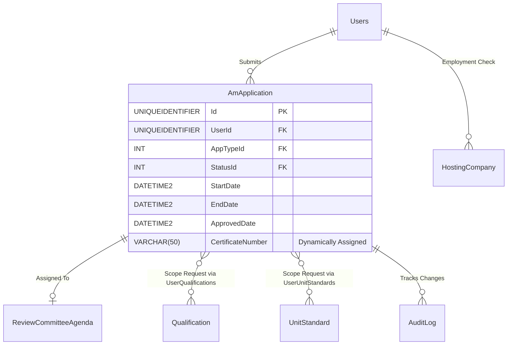

# Spec 04: Assessor & Moderator Registrations (High Complexity)

## 1. Domain Overview
The Assessor and Moderator Registration module securely governs the ETQA (Education and Training Quality Assurance) professional accreditation lifecycle. It provides an avenue for individuals to apply as external assessors or moderators, renew their credentials, or extend their scope to cover additional Unit Standards and Qualifications. Given the legal weight of these designations, the system strictly enforces workflows tying individual applicants to the formal approval matrices of ETQA Review Committees.

## 2. SQL Server Schema Strategy

**Core Tables Needed:**
- `AmApplication` (The core transaction table mapping the user to their application event. Will hold Status, AppType, and Workflow Dates).
- `AmApplicationTypes` / `ApprovalStatus` (Enums mapped as Lookup Tables to ensure referential integrity).
- `UserQualifications` & `UserUnitStandards` (Bridge tables binding a User to an active Scope, with foreign keys linking back to the `AmApplication` that authorised the link).

## 3. MVC Controllers & Routing

The .NET MVC application will expose specific administrative endpoints protected by ASP.NET Core Policies.

**Target Controllers:**
* `[Route("ETQA/AssessorModerators")]` (Standard Grid overview for tracking pending unassigned applications)
* `[Route("ETQA/AssessorModerators/{id:guid}/Review")]` (The deep-dive document review pane)

**Security / Policies (`[Authorize]`):**
* Requirements evaluating Claims representing standard users (can submit/view own) vs `ETQA_SENIOR_MANAGER` (Full view and Final Sign-Off capability).

## 4. View Requirements (UI/UX)

The overarching pattern will be a **Stacked Master-Detail Grid**.

*   **Master (The List):** A Razor/DataTables grid paginating through `AmApplication`. Columns: Applicant Name, Document Type (Assessor vs Moderator), Submission Date, Status.
*   **Detail (The Drill-down):** Selecting an applicant opens the detail view, strictly ordered into tabs:
    1.  **Demographics:** The User's captured data (Read-Only).
    2.  **Scope Verification:** Datagrid displaying the requested `UserQualifications` & `UserUnitStandards`.
    3.  **Document Verification:** Uploaded compliance PDFs loaded into iframes.
    4.  **Workflow Controls:** Fixed bottom panel carrying contextual action buttons (Approve, Reject, Request Update) only visible if the active User satisfies the `ETQA_SENIOR_MANAGER` Claim.

## 5. State Machine & Workflows

Instead of standard CRUD, the `AmApplication` goes through a strict state machine triggered by HTTP POST actions resolving to domain methods.

**Primary Transitions:**
1.  **Submit:** Applicant attaches qualifications/documents.
2.  **Assign:** Administrator links application to a `ReviewCommitteeMeetingAgenda`. Status becomes `Pending Committee Approval`.
3.  **Decision:** Committee reviews documents.
4.  **Finalise:** `ETQA_SENIOR_MANAGER` executes Final Sign-off. Status becomes `Approved`. Certificate Engine is triggered.

## 6. Business Rules Engine (The "Gotchas")

Extracted directly from the legacy application's constraints:

**Constraint A: Eligibility Lockouts**
*   **Staff Exclusion (`findByUserCount(...) > 0`):** Users actively employed by the overarching Hosting Entity (merSETA internal staff) are strictly forbidden from applying for Assessor/Moderator accreditations.
    *   ✨ **Modernization Directive (How-To Mapping):** In COT Access Control Rules/COT Touch UI, configure a rule: `cannot('apply', 'Assessor')` if `user.roles.includes('MERSETA_STAFF')`. Enforce this on the API to return UI Validation Reject.

**Constraint B: Scope Integrity**
*   **Cardinality Constraint:** The backend must throw a validation error if the user submits an application without assigning at least one Qualification or Unit Standard (Scope).
*   **Collisions:** A user cannot submit an `Extension of Scope` application comprising a Unit Standard if they already have an `Approved` mapping, or if there is a duplicate application pending for that exact same unit standard.
    *   ✨ **Modernization Directive (How-To Mapping):** The COT Business Rule class logic must evaluate the currently mapped Unit Standard array and reject new commands containing overlapping ID pairs, leveraging Code On Time Data Controller projection queries to check for pending status.

**Constraint C: Workflow & Approvals**
*   An application cannot be moved into Final Approval if it hasn't been mapped to a valid Event ID within the `ReviewCommitteeAgenda`.
    *   ✨ **Modernization Directive (How-To Mapping):** Use client-side UI conditions (e.g., hidden buttons) when `agendaId == null` + a server-side guard `if (agenda == null) throw new InvalidStateException();` before performing the transition.
*   Users cannot initiate `"New Registration"` if they already have a historical, approved accreditation row. They must follow the `"Re-Registration"` workflow path.
*   A user cannot have multiple active (pending) applications of the same category running simultaneously.

**Constraint D: Data Governance (SETMIS)**
*   `EndDate` MUST calculate to exactly: `StartDate + 5 years - 1 day` at maximum.
*   `CertificateNumber` allocation is extremely rigid. It can never have a leading space, cannot exceed 20 characters, and must not match rejection keywords natively (e.g., `%UNKNOWN%`).
*   `CertificateNumber` assignment must be done under a `REPEATABLE READ` SQL Isolation level to ensure massive concurrent approvals don't accidentally allocate the same ID.
    *   ✨ **Modernization Directive (How-To Mapping):** Run certificate number generation inside a C# singleton or lock-isolated service `CertificateGeneratorService` operating under a SQL `UPDLOCK` or `SERIALIZABLE` Code On Time Data Controller transaction.

### 6.1 Code On Time (COT) Native Form Validations
To satisfy the rapid Touch UI generation of COT, the following rules must be directly injected into the Data Controllers mapping to CurrentEntity to handle synchronous database constraints and immediate UI validation.

#### A) SQL Business Rule (Server-Side Validation)
This SQL snippet executes within COT's [Controller].xml lifecycle before insertion to enforce business invariants dynamically based on the exact table structure.

`sql
-- Pattern: Code On Time SQL Business Rule (Before Insert/Update)
-- Target Controller: CurrentEntity
-- Action: Insert, Update

-- Example Constraint Enforcement:
IF EXISTS (SELECT 1 FROM [dbo].[CurrentEntity] WHERE [Id] = @Id AND [StatusId] IS NULL)
BEGIN
    SET @BusinessRules_PreventDefault = 1;
    SET @Result_ShowMessage = 'A valid Workflow Status must be assigned before committing this record in CurrentEntity.';
END
`

#### B) JavaScript validation (Client-Side Touch UI)
This JS snippet enforces immediate checks on the UI input before a network dispatch, maintaining UI responsiveness for the CurrentEntity controller.

`javascript
// Pattern: Code On Time JavaScript Business Rule (Before Insert/Update)
// Target Controller: CurrentEntity
function override_before_insert(args) {
    var stat = ('StatusId');
    
    if (stat == null || stat === '') {
        this.preventDefault();
        this.result.showMessage('Workflow Status cannot be left blank during creation.');
        this.result.focus('StatusId');
        return;
    }
}
`

## 7. Document Generation

**Action Context:** Upon successful final approval, a system PDF is automatically generated.
*   The legacy `.jasper` report for generic statements (`ETQ-TP-011-StatementOfQualificationsandorUnitStandardsNew`) must be migrated to the new `.NET` PDF engine (e.g. QuestPDF).
*   Generation relies upon dynamic loops resolving all associated Qualifications linked during the applicant's tenure, mapped directly against the `ApprovedDate`.

## 9. Standardized Error Messages

To eliminate ambiguity and ensure UI alignment across the application, the following hardcoded error string literals **MUST** be implemented within the presentation layer and `COT Business Rules Validation (Result.ShowMessage)` constraints for this domain:

| Error Code | Hardcoded String Literal | Trigger Condition |
| :--- | :--- | :--- |
| `ERR_ASSESS_001` | `'Assessor registration expired. Cannot link to current qualification.'` | Primary Validation Failure |
| `ERR_ASSESS_002` | `'The specified OFO Code does not fall within your accredited scope.'` | State Machine Blocked |
| `ERR_ASSESS_003` | `'Moderator cannot be the same person as the Assessor for a given test.'` | Domain Invariant Violated |
