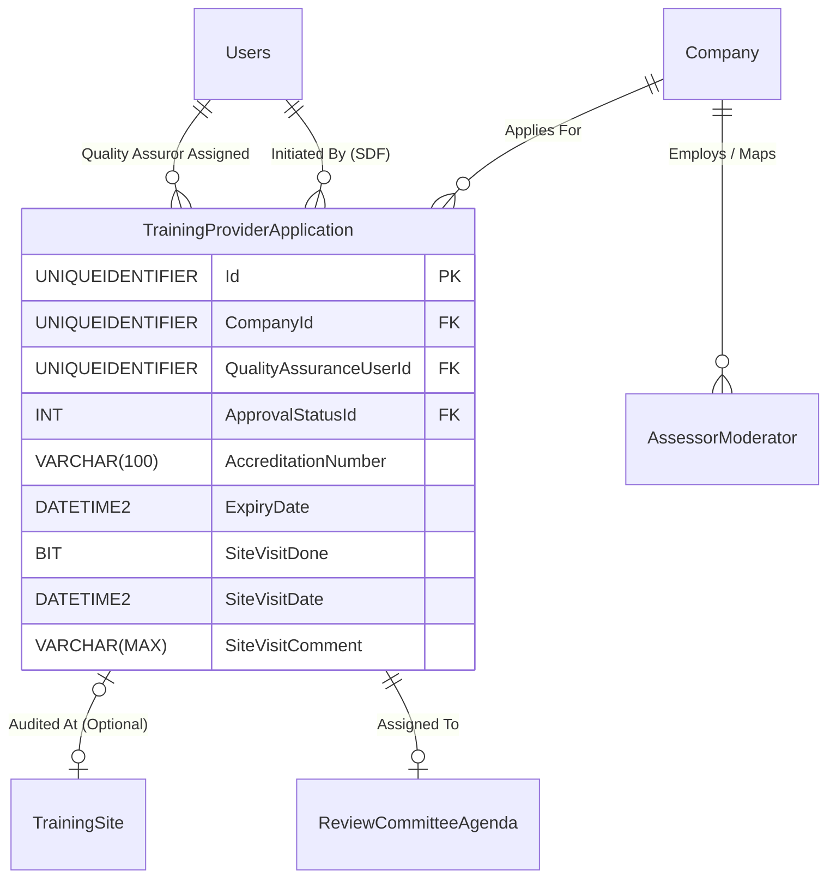

# Spec 05: Training Provider Accreditation & Audits

## 1. Domain Overview
The Training Provider module (often referred to as SDP - Skills Development Provider) governs the lifecycle of an organisation seeking to provide formal, accredited training within the NSDMS. It is a highly rigorous compliance module that builds upon the Organisation Management domain, adding strict Site Visit gates, Quality Assuror workflow routing, and ETQA Review Committee approvals before issuing Accreditation Certificates.

## 2. SQL Server Schema Strategy

**Core Tables Needed:**
- `TrainingProviderApplication` (The primary transaction table mapping an Employer/Provider entity to an Accreditation workflow state).
- `TrainingSite` (Granular location mapping for multi-branch providers).
- `CompanyUsers` (Used to verify Assessor/Moderator linkages).
- `Company` & `Users` (Standard Identity lookups).

## 3. MVC Controllers & Routing

**Target Controllers:**
* `[Route("ETQA/TrainingProviders")]` (Grid tracking all pending & active providers).
* `[Route("ETQA/TrainingProviders/{id:guid}/SiteVisit")]` (Dedicated QA workspace for capturing physical/virtual site audits).
* `[Route("ETQA/TrainingProviders/{id:guid}/Review")]` (Manager/Senior Manager sign-off pane).

**Security / Policies (`[Authorize]`):**
* `PROVIDER_SDF` (Can construct application and add Assessor links).
* `QUALITY_ASSUROR` (Conducts Site Visits, writes reports).
* `ETQA_REVIEW_COMMITTEE` (Grants final sign-off).

## 4. View Requirements (UI/UX)

Implementation requires a **Tabbed Master-Detail Interface** heavily gated by Workflow State.

*   **Master (The List):** DataTables grid showing Provider Name (from Company link), Accreditation Number, Status, and Next Action Owner.
*   **Detail Tabs:**
    1.  **Provider Demographics:** Read-only CIPC/SARS details pulled from the Company context.
    2.  **Site & Geography:** Identifies the formal Training Site being audited.
    3.  **Personnel (Assessors/Moderators):** Grid allowing the SDF to map Assessors to this provider. 
    4.  **Site Audit / QA:** Forms for the Quality Assuror to check `SiteVisitDone`, log dates, and upload the signed Visit Report.
    5.  **Workflow Controls:** Recommend, Reject, Final Approve (visible based on Policy).

## 5. State Machine & Workflows

Instead of standard CRUD, the `TrainingProviderApplication` transitions through rigorous states:

1.  **Initiation:** SDF fills out application.
2.  **QA Assignment:** System automatically (or Manager manually) assigns a `QualityAssuranceUserId` based on Regional mapping (CLO).
3.  **Site Visit:** QA performs audit -> Sets `SiteVisitDone = true` -> Submits report.
4.  **Pending Committee Approval:** Must be assigned to a `ReviewCommitteeMeetingAgenda`.
5.  **Approved:** Generates formal `AccreditationNumber` and `ExpiryDate`.

## 6. Business Rules Engine (The "Gotchas")

Extracted directly from the legacy application's constraints:

**Constraint A: Assessor & Moderator Enforcement**
*   **Strict Accreditation Rule:** "Only accredited Assessor or Moderator can be added" / "The selected user is not an accredited Assessor/Moderator". When building the MVC View for Tab 3 (Personnel), the backend `[HttpPost]` action MUST verify that the mapped user has an `AmApplication` where `Status == Approved`.
    *   ✨ **Modernization Directive (How-To Mapping):** Use client-side COT Touch UI async validation to verify status immediately during data entry, complemented by a strict COT BusinessRules class on the server to prevent bypass.

**Constraint B: Exclusivity and Duplication Detection**
*   **Duplicate Pipeline Block:** "Application cannot be processed. Application type already registered...". The system must block the creation of a new application if the `CompanyId` AND `TrainingSiteId` already have an active/pending workflow.
    *   ✨ **Modernization Directive (How-To Mapping):** Apply an Code On Time Data Controller filtered unique index (`HasIndex().HasFilter("[Status] NOT IN ('Rejected', 'Withdrawn')")`) on the Application entity to ensure the database physically prevents concurrent submissions.

**Constraint C: Physical Site Validation**
*   "Unable to locate company assigned..." The Provider MUST be cleanly mapped to the regional geography tree so that the Quality Assuror assignment logic does not fail.
    *   ✨ **Modernization Directive (How-To Mapping):** Check regional QA mappings via an injected spatial resolver service before the `DispatchApprovalTask` state machine transition can execute.

**Constraint D: ETQA Agenda Linking**
*   "Please add TrainingProviderApplication Approval to the agenda of the selected Review Committee meeting." Just like Assessors, the final status jump is completely hardware-locked until the application is bound to a valid Committee ID.
    *   ✨ **Modernization Directive (How-To Mapping):** The backend API should throw a domain exception if the final approval endpoint is invoked without a linked `AgendaId`.

**Constraint E: Document Guards**
*   "Pro-forma Letter for Full Accreditation is not available" / "Provider Certificate is not available". The PDF Generation API must throw UI Validation Reject or 404 unless `ApprovalStatus == Approved` and `AccreditationNumber` safely exists.
    *   ✨ **Modernization Directive (How-To Mapping):** Introduce a strict Document Access API endpoint that enforces a `HasApprovedStatus` and `DocumentOwnership` policy pipeline, rather than exposing direct Blob Storage URIs.

### 6.1 Code On Time (COT) Native Form Validations
To satisfy the rapid Touch UI generation of COT, the following rules must be directly injected into the Data Controllers mapping to CurrentEntity to handle synchronous database constraints and immediate UI validation.

#### A) SQL Business Rule (Server-Side Validation)
This SQL snippet executes within COT's [Controller].xml lifecycle before insertion to enforce business invariants dynamically based on the exact table structure.

`sql
-- Pattern: Code On Time SQL Business Rule (Before Insert/Update)
-- Target Controller: CurrentEntity
-- Action: Insert, Update

-- Example Constraint Enforcement:
IF EXISTS (SELECT 1 FROM [dbo].[CurrentEntity] WHERE [Id] = @Id AND [StatusId] IS NULL)
BEGIN
    SET @BusinessRules_PreventDefault = 1;
    SET @Result_ShowMessage = 'A valid Workflow Status must be assigned before committing this record in CurrentEntity.';
END
`

#### B) JavaScript validation (Client-Side Touch UI)
This JS snippet enforces immediate checks on the UI input before a network dispatch, maintaining UI responsiveness for the CurrentEntity controller.

`javascript
// Pattern: Code On Time JavaScript Business Rule (Before Insert/Update)
// Target Controller: CurrentEntity
function override_before_insert(args) {
    var stat = ('StatusId');
    
    if (stat == null || stat === '') {
        this.preventDefault();
        this.result.showMessage('Workflow Status cannot be left blank during creation.');
        this.result.focus('StatusId');
        return;
    }
}
`

## 7. Document Generation

**Action Context:**
*   **Letters of Intent / Pro-forma:** Pre-approval documentation.
*   **Accreditation Certificate:** A formally branded PDF (replacing the Jasper report) showing the `AccreditationNumber`, `StartDate`, `ExpiryDate`, and the dynamically retrieved list of approved Unit Standards/Qualifications the Provider is cleared to teach. Generated exclusively upon `Approved` state.

## 8. Required Data Fields Definition

| Field Name | Data Type | Required | Notes (Constants/Validation) |
| :--- | :--- | :--- | :--- |
| `Id` | `UNIQUEIDENTIFIER` | Yes | Primary Key |
| `CompanyId` | `UNIQUEIDENTIFIER` | Yes | FK referencing the core Organisation (Employer) |
| `QualityAssuranceUserId` | `UNIQUEIDENTIFIER` | Conditional | QA Assuror assigned for site visit. Mandatory for workflow progression. |
| EntityStatusId | INT | Yes | The rigid business outcome (e.g., Registered, Rejected). |
| CurrentWorkflowStateId | INT | Conditional | Dual-Status push: Points to the active Workflow State for rapid COT routing. |
| `AccreditationNumber` | `VARCHAR(100)` | Conditional | Generated automatically ONLY when Approved. |
| `ExpiryDate` | `DATETIME2` | Conditional | Tied to the validity window of the ETQA accreditation. |
| `SiteVisitDone` | `BIT` | Yes | Required to flip to `true` by QA user. |
| `SiteVisitDate` | `DATETIME2` | Conditional | Required if `SiteVisitDone == true`. |
| `SiteVisitComment` | `VARCHAR(MAX)` | Conditional | Required if rejected or upon visit submission. |

## 9. Standardized Error Messages

To eliminate ambiguity and ensure UI alignment across the application, the following hardcoded error string literals **MUST** be implemented within the presentation layer and `COT Business Rules Validation (Result.ShowMessage)` constraints for this domain:

| Error Code | Hardcoded String Literal | Trigger Condition |
| :--- | :--- | :--- |
| `ERR_PROV_001` | `'Training Provider accreditation code is invalid or suspended.'` | Primary Validation Failure |
| `ERR_PROV_002` | `'Mandatory site audit failed. Provider cannot be linked to learners.'` | State Machine Blocked |
| `ERR_PROV_003` | `'The primary contact person for this Provider is missing email credentials.'` | Domain Invariant Violated |
