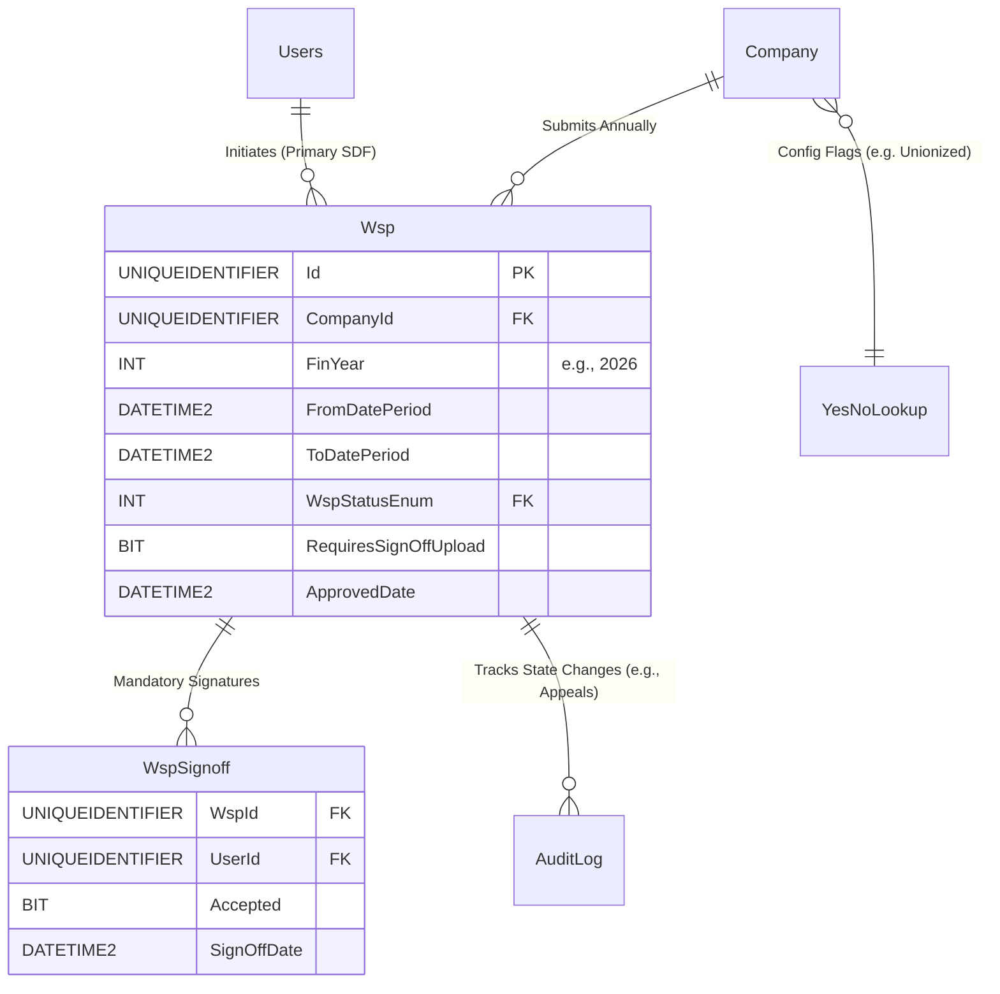

# Spec 06: Workplace Skills Plan (WSP) Submission Flow

## 1. Domain Overview
The Workplace Skills Plan (WSP) is arguably the highest-volume transactional core of the NSDMS. It oversees the statutory requirement for Employers (represented by their mapped SDFs) to submit annual training datasets outlining both past reported training (ATR) and future planned training (WSP). It dictates the approval pipeline that eventually unlocks Mandatory and Discretionary Grants. 

## 2. SQL Server Schema Strategy

**Core Tables Needed:**
- `Wsp` (The root envelope mapping a `.finYear` submission to a specific employer).
- `WspSignoff` (Tracks digital signatures of stakeholders—e.g., Union Reps, SDFs).
- `WspCompanyEmployeesHistory` (Bulk dataset tables for Excel imports detailing learner records).
- `WspLocations` / `Addresses` (Binding geolocation constraints native to the grant).

## 3. MVC Controllers & Routing

**Target Controllers:**
* `[Route("WSP/Submissions")]` (Dashboard showing historical and active submissions).
* `[Route("WSP/Form/{id:guid}")]` (The massive multi-step wizard form for capturing data natively or via Excel imports).
* `[Route("WSP/Appeals/{id:guid}")]` (Endpoint for grant rejections and SDF appeals).

**Security / Policies (`[Authorize]`):**
* `PRIMARY_SDF` (Only the registered architect of the company can initiate and submit).
* `INTERNAL_WSP_EVALUATOR` (Can view, reject, or approve submitted plans).

## 4. View Requirements (UI/UX)

The WSP submission is notorious for its length, requiring a heavily guided **Wizard/Stepper Interface**:

1.  **Initiation Gate:** Validates prerequisites (e.g., Bank details provided, SDF mapped).
2.  **Organisational Details:** Pre-filled from `Company` (Spec-02).
3.  **Workforce Profile:** Summary metrics (Total employees vs Total payroll).
4.  **Training Data Upload:** A bulk upload component handling mapped Excel structures natively.
5.  **Required Documents:** A checklist rendering required compliance PDFs based on organisational demographics (e.g., Recognition agreements for Unionized sites).
6.  **Digital Sign-off:** The routing form requiring approvals from the internal SDF, the standard employer contact, and the Union Representative.

## 5. State Machine & Workflows

**Primary Transitions:**
1.  **Draft:** Active year open. Data is being populated.
2.  **Pending Sign-off:** Locked for editing, routing through `WspSignoff` approvals.
3.  **Submitted:** Routed internally to merSETA Evaluators.
4.  **Approved / Rejected:** Final decision.
5.  **Appealed:** If rejected, SDF submits an appeal within a specific time window (`sdfAppealedGrantDate`), resetting status to `Pending MANCO Approval`.

## 6. Business Rules Engine (The "Gotchas")

Extracted directly from the legacy application's `WspService` constraints:

**Constraint A: Temporal (Time-Gate) Logic**
*   **Active Window Lockout:** "You can only initiate an application for financial year `X` on: `Date`." The backend Controller MUST block POST actions initiating a WSP unless `DateTime.Now` falls strictly within the pre-configured statutory submission window (e.g., Feb 1st - April 30th).
    *   ✨ **Modernization Directive (How-To Mapping):** Abstract this check into an `IStatutoryTimeGateService`. The UI calls a `/can-initiate-wsp` endpoint before loading the form, hiding controls natively. If the user circumvents the UI, the COT BusinessRules class Pipeline `Behavior` throws an UI Validation Reject.

**Constraint B: Primary SDF Prerequisite**
*   "Unable to locate primary SDF for company: [LevyNumber]". 
*   **Rule:** A WSP record **cannot** be initialized if the `Company` does not have an active `CompanyUsers` or `SdfCompany` map denoting a `PRIMARY_SDF`.
    *   ✨ **Modernization Directive (How-To Mapping):** Execute Code On Time Data Controller `AnyAsync(x => x.CompanyId == request.CompanyId && x.Role == SdfType.Primary)` inside the command validator and fail early.

**Constraint C: Compliance & GPS Prerequisites**
*   "Please provide GPS coordinates before attempting to initiate." The `Company` spatial data must be 100% complete.
*   "Configuration Error. Please configure the following SDF for [Company Name]." All required training committee/SDF roles must be populated before initiation.
    *   ✨ **Modernization Directive (How-To Mapping):** Funnel these discrete checks through an `ICompanyComplianceService.GetComplianceGaps(employerId)` method, which returns an array of broken rules to inform the user exactly what to fix.

**Constraint D: Dynamic Documentation Gate**
*   "Provide: [DocumentName] before submission." The backend must calculate dynamic document needs.
    *   *Example:* If `Company.recognitionAgreement == YES`, the WSP **cannot** move to `Submitted` unless the `RecognitionAgreement.pdf` is present.
*   "Provide Grant Application Appeal In Required Documents Section Before Proceeding With Appeal." If the WSP is rejected, the SDF cannot trigger the Appeal workflow unless an appeal motivation document is explicitly uploaded.
    *   ✨ **Modernization Directive (How-To Mapping):** Implement a `DocumentRequirementsEngine`. The machine reads a matrix of Rules (e.g., `If Union == True AND RecAgreement == null THEN Fail`), executing dynamically upon State Machine transitions rather than static hardcoded checks.

### 6.1 Code On Time (COT) Native Form Validations
To satisfy the rapid Touch UI generation of COT, the following rules must be directly injected into the Data Controllers mapping to Wsp to handle synchronous database constraints and immediate UI validation.

#### A) SQL Business Rule (Server-Side Validation)
This SQL snippet executes within COT's [Controller].xml lifecycle before insertion to enforce business invariants dynamically based on the exact table structure.

`sql
-- Pattern: Code On Time SQL Business Rule (Before Insert/Update)
-- Target Controller: Wsp
-- Action: Insert, Update

-- Example Constraint Enforcement:
IF EXISTS (SELECT 1 FROM [dbo].[Wsp] WHERE [Id] = @Id AND [StatusId] IS NULL)
BEGIN
    SET @BusinessRules_PreventDefault = 1;
    SET @Result_ShowMessage = 'A valid Workflow Status must be assigned before committing this record in Wsp.';
END
`

#### B) JavaScript validation (Client-Side Touch UI)
This JS snippet enforces immediate checks on the UI input before a network dispatch, maintaining UI responsiveness for the Wsp controller.

`javascript
// Pattern: Code On Time JavaScript Business Rule (Before Insert/Update)
// Target Controller: Wsp
function override_before_insert(args) {
    var stat = ('StatusId');
    
    if (stat == null || stat === '') {
        this.preventDefault();
        this.result.showMessage('Workflow Status cannot be left blank during creation.');
        this.result.focus('StatusId');
        return;
    }
}
`

## 7. Document Generation Component
- Replicating the legacy PDF exports that summarize the entire WSP submission, which are appended digitally to the formal `Approved/Rejected` outcome emails.

## 8. Required Data Fields Definition

| Field Name | Data Type | Required | Notes (Constants/Validation) |
| :--- | :--- | :--- | :--- |
| `Id` | `UNIQUEIDENTIFIER` | Yes | Primary Key |
| `CompanyId` | `UNIQUEIDENTIFIER` | Yes | FK. Link to standard company record. |
| `FinYear` | `INT` | Yes | E.g. `2026`. Forms unique constraint with `CompanyId`. |
| `FromDatePeriod` | `DATETIME2` | Yes | Financial year start boundary. |
| `ToDatePeriod` | `DATETIME2` | Yes | Financial year end boundary. |
| EntityStatusId | INT | Yes | The rigid business outcome (e.g., Registered, Rejected). |
| CurrentWorkflowStateId | INT | Conditional | Dual-Status push: Points to the active Workflow State for rapid COT routing. |
| `RequiresSignOffUpload` | `BIT` | Yes | Driven by Trade Union presence demographics. |
| `ApprovedDate` | `DATETIME2` | Conditional | Populated when final evaluators sign off. |
| `SdfAppealedGrantDate` | `DATETIME2` | Conditional | Populated if workflow bounces back to pending after rejection. |

## 9. Standardized Error Messages

To eliminate ambiguity and ensure UI alignment across the application, the following hardcoded error string literals **MUST** be implemented within the presentation layer and `COT Business Rules Validation (Result.ShowMessage)` constraints for this domain:

| Error Code | Hardcoded String Literal | Trigger Condition |
| :--- | :--- | :--- |
| `ERR_WSP_001` | `'WSP Deadline (30 April) has passed. Late submissions require regional manager override.'` | Primary Validation Failure |
| `ERR_WSP_002` | `'Total training budget cannot be smaller than the minimum statutory requirement.'` | State Machine Blocked |
| `ERR_WSP_003` | `'A Training Committee sign-off is mandatory for companies with >50 employees.'` | Domain Invariant Violated |
