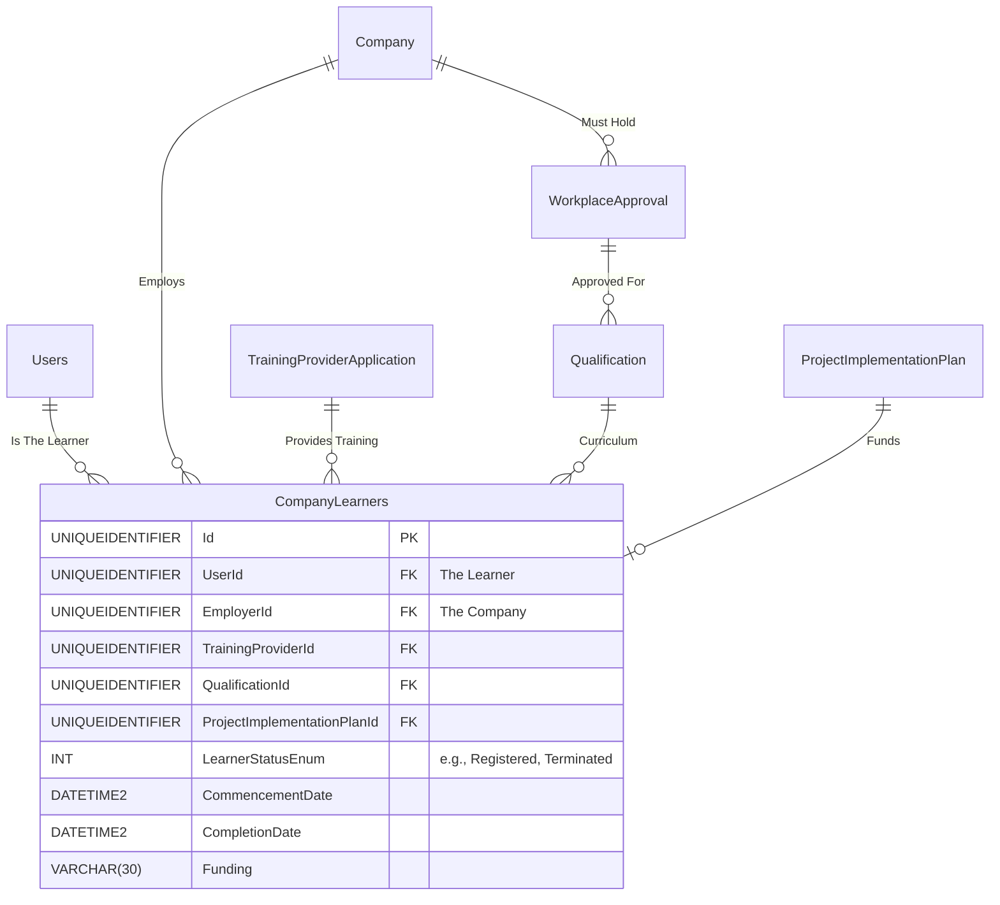

# Spec 08: Learner Registrations & Workplace Approvals

## 1. Domain Overview
The Learner Management module sits at the confluence of the entire NSDMS architecture. It binds together an individual Learner (`Users`), an Employer (`Company`), a Training Provider (`TrainingProviderApplication`), and a specific track of learning (`Qualification`/`Learnership`). This module is highly constrained by statutory regulations, funding limits (Discretionary Grants), and strict SETMIS validation criteria. 

## 2. SQL Server Schema Strategy

**Core Tables Needed:**
- `CompanyLearners` (The central hub tracking the active learner agreement).
- `WorkplaceApproval` (Tracks whether a company is physically/statutorily approved to host learners for specific qualifications).
- `CompanyLearnersTransfer` (Tracks the workflow if a learner moves from Employer A to Employer B).
- `ProjectImplementationPlan` (PIP - The funding allocation that limits learner headcounts).

## 3. MVC Controllers & Routing

**Target Controllers:**
* `[Route("Learners/WorkplaceApprovals")]` (Checking and applying for the right to host learners).
* `[Route("Learners/Agreements")]` (Grid displaying active company learners).
* `[Route("Learners/Agreements/{id:guid}/Register")]` (The multi-step registration wizard).
* `[Route("Learners/Agreements/{id:guid}/Transfer")]` (Workflow for moving learners mid-agreement).

**Security / Policies (`[Authorize]`):**
* `PROVIDER_SDF` / `EMPLOYER_SDF` (Can initiate contracts).
* `MERSETA_LEARNER_ADMIN` (Can override blocks or verify documentation).

## 4. View Requirements (UI/UX)

The Learner Registration process is complex and often initiated via a **Guided Multi-Step Wizard**.

*   **Step 1: ID Verification.** Pulls existing `User` demographic details or enforces a deep RSA ID validation to prevent ghost learners.
*   **Step 2: Tripartite Selection.** The SDF selects the Employer, the Provider, and the Qualification.
*   **Step 3: Funding & Projects.** Dropdowns filtering only active, approved `ProjectImplementationPlan` entries linked to the employer.
*   **Step 4: Ratios & Mentorship.** Mapping the learner to a specific internal mentor (verifying capacity constraints natively).
*   **Step 5: Document Uploads.** Dynamic required uploads (e.g., Learner ID Copy, Employment Contract, signed Learner Agreement).

## 5. State Machine & Workflows

**Primary Transitions:**
1.  **Application:** In-progress wizard.
2.  **Pending Registration Approval:** Waiting for internal merSETA admin verification (Client Service Administrator).
3.  **Registered:** Active learning phase (`dateLearnerRegistered` timestamped).
4.  **Completed / Terminated:** Terminal states.
5.  **Transfer Pending:** Complex sub-workflow requiring sign-off from relinquishing company, receiving company, and the learner.

## 6. Business Rules Engine (The "Gotchas")

Extracted directly from the legacy application's `CompanyLearnersService` constraints:

**Constraint A: Workplace Approval Locks**
*   **Strict Governance:** "The company is not workplace approved for this qualification..."
*   **Rule:** Before a learner can be bound to a qualification under an employer context, the backend MUST query the `WorkplaceApproval` table to ensure an active approval exists for that specific `(CompanyId, QualificationId)` pair.
    *   ✨ **Modernization Directive (How-To Mapping):** Use the shared `IsWorkplaceApprovedForTrade(employerId, tradeId)` service (from Spec-11) as a COT BusinessRules class behavior prior to allowing the registration command to proceed.

**Constraint B: Mentor & Ratio Enforcement**
*   "No learner mentor ratio assigned to a qualification..."
*   "Number of learners have exceeded mentor ratio"
*   "No available mentor for this learner"
*   **Rule:** Depending on the trade/qualification, there is a strict Learner-to-Mentor ratio (e.g., 1:4). The system enforces this capacity in the database and blocks registration if the mapped internal mentor is "full".
    *   ✨ **Modernization Directive (How-To Mapping):** Perform SQL Row-version locking/pessimistic concurrency while evaluating the `Mentor capacity CountAsync()` against required Trade Ratio before committing the assignment transaction.

**Constraint C: Discretionary Grant (PIP) Budget Caps**
*   "You have exceeded the number of learners allocated for this intervention as per the project implementation plan."
*   **Rule:** If a learner is funded via MerSETA DG, the system physically counts active `CompanyLearners` mapped to that `ProjectImplementationPlan`. If it exceeds the awarded allocation, the registration is blocked. 
    *   ✨ **Modernization Directive (How-To Mapping):** Transactional Code On Time Data Controller check `if (CurrentLearners >= PIP.Allocation) throw Result.ShowMessage error throw("Cap Exceeded")` preventing over-crediting from rapid asynchronous API calls.

**Constraint D: Transfer Integrity**
*   "No primary SDF found for [TransferToCompany]"
*   "Please Specify which entity is requesting this transfer"
*   **Rule:** A transfer requires the target (receiving) company to be completely compliant (Valid SDF, valid Workplace Approval) before the learner can be moved.
    *   ✨ **Modernization Directive (How-To Mapping):** Abstract Transfers into an atomic unit-of-work transaction, executing both source Learner extraction rules and target employer compliance pre-flight checks simultaneously before committing.

**Constraint E: Spatial QA / CLO Routing**
*   "No Region Client Service Administrator for the region"
*   **Rule:** The approval workflow relies on the Employer's regional address cleanly mapping to a valid internal MerSETA admin user to generate the approval task.
    *   ✨ **Modernization Directive (How-To Mapping):** The globally injected `IGeographyRoutingService` must output a valid Administrator User ID or fallback to a Region Manager, throwing a system exception if an orphaned geography scenario occurs.

### 6.1 Code On Time (COT) Native Form Validations
To satisfy the rapid Touch UI generation of COT, the following rules must be directly injected into the Data Controllers mapping to CurrentEntity to handle synchronous database constraints and immediate UI validation.

#### A) SQL Business Rule (Server-Side Validation)
This SQL snippet executes within COT's [Controller].xml lifecycle before insertion to enforce business invariants dynamically based on the exact table structure.

`sql
-- Pattern: Code On Time SQL Business Rule (Before Insert/Update)
-- Target Controller: CurrentEntity
-- Action: Insert, Update

-- Example Constraint Enforcement:
IF EXISTS (SELECT 1 FROM [dbo].[CurrentEntity] WHERE [Id] = @Id AND [StatusId] IS NULL)
BEGIN
    SET @BusinessRules_PreventDefault = 1;
    SET @Result_ShowMessage = 'A valid Workflow Status must be assigned before committing this record in CurrentEntity.';
END
`

#### B) JavaScript validation (Client-Side Touch UI)
This JS snippet enforces immediate checks on the UI input before a network dispatch, maintaining UI responsiveness for the CurrentEntity controller.

`javascript
// Pattern: Code On Time JavaScript Business Rule (Before Insert/Update)
// Target Controller: CurrentEntity
function override_before_insert(args) {
    var stat = ('StatusId');
    
    if (stat == null || stat === '') {
        this.preventDefault();
        this.result.showMessage('Workflow Status cannot be left blank during creation.');
        this.result.focus('StatusId');
        return;
    }
}
`

## 7. Document Generation Component
- The system must dynamically generate the **Formal Learner Agreement** (tripartite contract) into a PDF, pre-filling all demographic, employer, and provider data correctly, which is then printed, signed manually, and uploaded to satisfy the document gates.

## 8. Required Data Fields Definition

| Field Name | Data Type | Required | Notes (Constants/Validation) |
| :--- | :--- | :--- | :--- |
| `Id` | `UNIQUEIDENTIFIER` | Yes | Primary Key |
| `UserId` | `UNIQUEIDENTIFIER` | Yes | FK to Users (The specific Learner demographic). |
| `EmployerId` | `UNIQUEIDENTIFIER` | Yes | FK to Company (The host/workplace). |
| `TrainingProviderId` | `UNIQUEIDENTIFIER` | Yes | FK to TrainingProviderApplication/Company. |
| `QualificationId` | `UNIQUEIDENTIFIER` | Yes | FK to Curriculum/Trade lookup. |
| `ProjectImplementationPlanId` | `UNIQUEIDENTIFIER` | Conditional | Required for DG/Funded learners. Deducts from budget. |
| EntityStatusId | INT | Yes | The rigid business outcome (e.g., Registered, Rejected). |
| CurrentWorkflowStateId | INT | Conditional | Dual-Status push: Points to the active Workflow State for rapid COT routing. |
| `CommencementDate` | `DATETIME2` | Yes | When the apprenticeship/training officially begins. |
| `CompletionDate` | `DATETIME2` | Yes | Estimated/actual closeout date. |
| `Funding` | `VARCHAR(30)` | Yes | Usually derived Enum values (e.g. Discretionary Grant). |

## 9. Standardized Error Messages

To eliminate ambiguity and ensure UI alignment across the application, the following hardcoded error string literals **MUST** be implemented within the presentation layer and `COT Business Rules Validation (Result.ShowMessage)` constraints for this domain:

| Error Code | Hardcoded String Literal | Trigger Condition |
| :--- | :--- | :--- |
| `ERR_LRN_001` | `'Learner is currently registered active in another funded program.'` | Primary Validation Failure |
| `ERR_LRN_002` | `'The apprentice contract start date cannot precede the workplace approval date.'` | State Machine Blocked |
| `ERR_LRN_003` | `'Missing mandatory identification documents (Certified ID / Matric Certificate).'` | Domain Invariant Violated |
