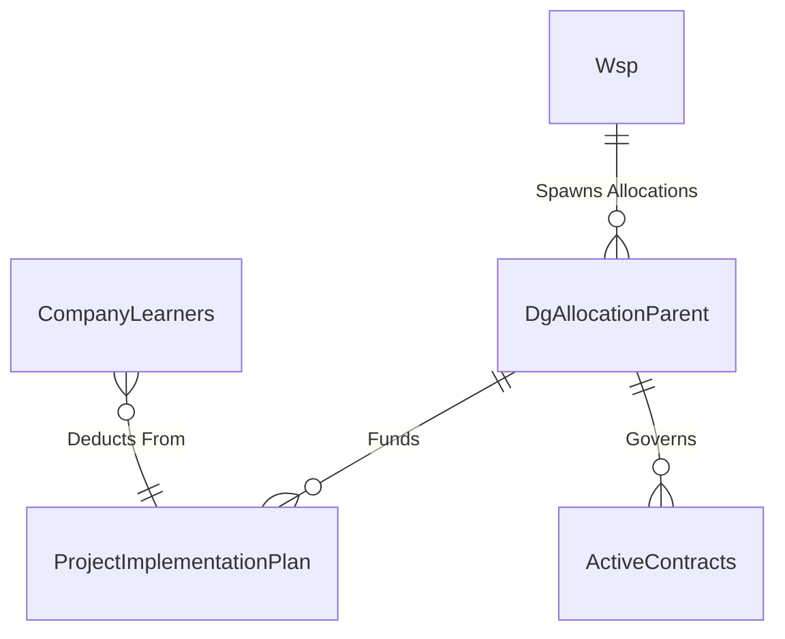

# Spec 03: Discretionary Grants (DG) & Contracts

## 1. Domain Overview
Discretionary Grants (DG) are specific allocations of funding granted to Companies or Training Providers to execute a Project Implementation Plan (PIP). They are strictly capped by mathematical calculations driven by SARS levies and require formal MoA (Memorandum of Agreement) contracting before activation.

## 2. SQL Server Schema Strategy

**Core Tables Needed:**
- `DgAllocationParent` (The bucket containing total DG Leviable amounts and overall status).
- `ProjectImplementationPlan` (PIP - The child execution plan stating exactly how many learners will be trained in which trade).
- `ActiveContracts` (The signed MoA binding the funding mathematically to the PIP).

## 3. MVC Controllers & Routing
- `[Route("Grants/Discretionary/Allocations")]`: Admin grid for evaluating and approving DG funding requests.
- `[Route("Grants/Discretionary/Contracts")]`: SDF view for accepting MoAs and uploading signed contracts.

## 4. View Requirements (UI/UX)
- **Financial Dashboard:** Top-level summary showing Total Available Funding vs Recommended Value vs Contracted Value.
- **PIP Drilldown:** "Project Implementation Plan" grid showing rows of Trades, Number of Learners approved, unit cost, and total Line-Item Value.

## 5. State Machine & Workflows
1. **Calculation:** Background job auto-calculates max available DG based on WSP approval and SARS levy data.
2. **Allocation Recommended:** Review committee reviews PIP requests and recommends budget.
3. **Pending Signature:** MoA generated and sent to SDF.
4. **Active:** Signed & Approved. The `ProjectImplementationPlan` is now unlocked and Learner Registrations (Spec-08) can map to it.

## 6. Business Rules (The "Gotchas")
- **WSP Dependency Lock:** A company CANNOT be considered for a Discretionary Grant unless their `Wsp` submission for the corresponding `FinYear` was `Approved`.
  - ✨ **Modernization Directive (How-To Mapping):** Abstract this check into a `WspComplianceService` that queries a cross-domain `IsEligibleForGrants(employerId)` boolean before initializing the DG pipeline on the UI, intercepting edge cases via UI Validation Reject.
- **Learner Headcount Caps:** The sum of active `CompanyLearners` mapped to a PIP can never exceed the allocated quantity. Attempting to register a new learner when capacity is reached must result in a Hard Stop error.
  - ✨ **Modernization Directive (How-To Mapping):** In C#, use Code On Time Data Controller `CountAsync()` locked under an optimistic concurrency `RowVersion` token on the `ActiveContractDetail` to verify counts before allowing the `AttachLearner` command to commit.

### 6.1 Code On Time (COT) Native Form Validations
To satisfy the rapid Touch UI generation of COT, the following rules must be directly injected into the Data Controllers mapping to CurrentEntity to handle synchronous database constraints and immediate UI validation.

#### A) SQL Business Rule (Server-Side Validation)
This SQL snippet executes within COT's [Controller].xml lifecycle before insertion to enforce business invariants dynamically based on the exact table structure.

`sql
-- Pattern: Code On Time SQL Business Rule (Before Insert/Update)
-- Target Controller: CurrentEntity
-- Action: Insert, Update

-- Example Constraint Enforcement:
IF EXISTS (SELECT 1 FROM [dbo].[CurrentEntity] WHERE [Id] = @Id AND [StatusId] IS NULL)
BEGIN
    SET @BusinessRules_PreventDefault = 1;
    SET @Result_ShowMessage = 'A valid Workflow Status must be assigned before committing this record in CurrentEntity.';
END
`

#### B) JavaScript validation (Client-Side Touch UI)
This JS snippet enforces immediate checks on the UI input before a network dispatch, maintaining UI responsiveness for the CurrentEntity controller.

`javascript
// Pattern: Code On Time JavaScript Business Rule (Before Insert/Update)
// Target Controller: CurrentEntity
function override_before_insert(args) {
    var stat = ('StatusId');
    
    if (stat == null || stat === '') {
        this.preventDefault();
        this.result.showMessage('Workflow Status cannot be left blank during creation.');
        this.result.focus('StatusId');
        return;
    }
}
`

## 7. Document Generation Component
- **Memorandum of Agreement (MoA):** Contains highly dynamic legal clauses, financial figures, company demographics, and signing matrices. Produced identically to the legacy Jasper MoA.

## 8. Required Data Fields Definition

| Field Name | Data Type | Required | Notes |
| :--- | :--- | :--- | :--- |
| `Id` | `UNIQUEIDENTIFIER` | Yes | Primary Key |
| `WspId` | `UNIQUEIDENTIFIER` | Yes | FK linking to the WSP submission. |
| `DgLevyAmount` | `DECIMAL(18,2)` | Yes | The financial ceiling allocated. |
| EntityStatusId | INT | Yes | The rigid business outcome (e.g., Registered, Rejected). |
| CurrentWorkflowStateId | INT | Conditional | Dual-Status push: Points to the active Workflow State for rapid COT routing. |
| `AcceptanceDate` | `DATETIME2` | Conditional | Signed Date. |

## 9. Standardized Error Messages

To eliminate ambiguity and ensure UI alignment across the application, the following hardcoded error string literals **MUST** be implemented within the presentation layer and `COT Business Rules Validation (Result.ShowMessage)` constraints for this domain:

| Error Code | Hardcoded String Literal | Trigger Condition |
| :--- | :--- | :--- |
| `ERR_DG_001` | `'Insufficient Discretionary Funds allocated for this Tranche.'` | Primary Validation Failure |
| `ERR_DG_002` | `'The selected PIP milestone has not been reached. Payment cannot be released.'` | State Machine Blocked |
| `ERR_DG_003` | `'Company is not legally eligible for a Discretionary Grant. Please verify compliance status.'` | Domain Invariant Violated |
