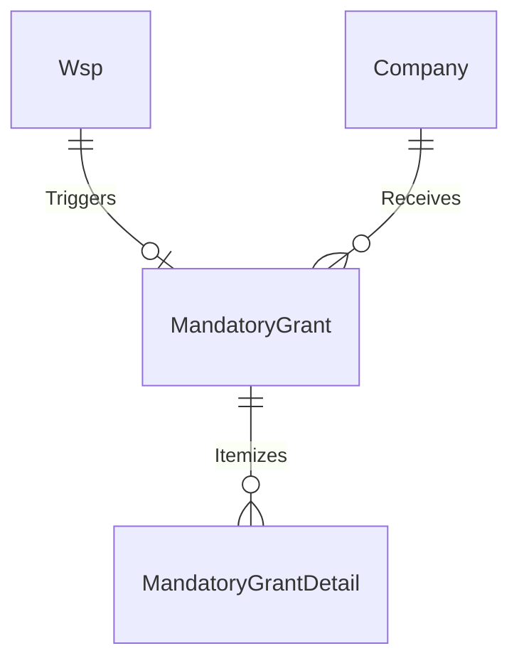

# Spec 07: Mandatory Grants (Levy Rebates)

## 1. Domain Overview
The Mandatory Grant module is an automated financial gateway. By law, if an Employer submits a valid Workplace Skills Plan (WSP) on time, they are entitled to a 20% Mandatory Grant rebate on the skills levies they paid to SARS. This module calculates those values and queues them for payment.

## 2. SQL Server Schema Strategy

**Core Tables Needed:**
- `MandatoryGrant` (The aggregate status table storing the approval for payment).
- `MandatoryGrantDetail` (Audit trace linking the specific WSP and the specific SARS payment chunks to the Mandatory Grant).

## 3. MVC Controllers & Routing
- `[Route("Grants/Mandatory")]`: Internal merSETA Finance view to evaluate the queue of Mandatory Grants ready for DHET/Treasury submission.
- `[Route("Employers/{id}/Grants/Mandatory")]`: Read-only historical ledger for SDFs to view payouts.

## 4. View Requirements (UI/UX)
- Ledger interface demonstrating simple "credits and debits" showing the WSP approval yielding the grant. Read-Only grids mapping back to the underlying `Wsp` submission.

## 5. State Machine & Workflows
1. **WSP Approval Event:** An event subscriber listens for `WspStatus == Approved`.
2. **Calculation Validation:** Cross-reference the Employer's SARS Levy payments.
3. **Queue For Payment:** Status moves to `Recommendation` queue.
4. **Paid:** Triggers the Treasury export and flags the entity as paid.

## 6. Business Rules (The "Gotchas")
- **The "No Levy, No Grant" Rule:** If `SarsLevyDetails` shows 0.00 payments for the financial year, the Mandatory Grant calculated is 0.00, regardless of the WSP being approved.
  - ✨ **Modernization Directive (How-To Mapping):** Build a strongly-typed `MandatoryGrantCalculator` strategy that short-circuits to `0m` internally if the summation of fiat chunks equals zero, bypassing the DB flush routines entirely to save performance.
- **Compliance Link:** If an employer is placed into a suspended/non-compliant state, Mandatory Grant sweep executions are blocked.
  - ✨ **Modernization Directive (How-To Mapping):** Intercept the Financial Dispatch logic with a `CompanyStatus` guard clause using `State Pattern`. If the state resolves to Suspended, drop the record into a `SuspendedGrantsQueue` (DB Table) instead of sending to Great Plains.

### 6.1 Code On Time (COT) Native Form Validations
To satisfy the rapid Touch UI generation of COT, the following rules must be directly injected into the Data Controllers mapping to CurrentEntity to handle synchronous database constraints and immediate UI validation.

#### A) SQL Business Rule (Server-Side Validation)
This SQL snippet executes within COT's [Controller].xml lifecycle before insertion to enforce business invariants dynamically based on the exact table structure.

`sql
-- Pattern: Code On Time SQL Business Rule (Before Insert/Update)
-- Target Controller: CurrentEntity
-- Action: Insert, Update

-- Example Constraint Enforcement:
IF EXISTS (SELECT 1 FROM [dbo].[CurrentEntity] WHERE [Id] = @Id AND [StatusId] IS NULL)
BEGIN
    SET @BusinessRules_PreventDefault = 1;
    SET @Result_ShowMessage = 'A valid Workflow Status must be assigned before committing this record in CurrentEntity.';
END
`

#### B) JavaScript validation (Client-Side Touch UI)
This JS snippet enforces immediate checks on the UI input before a network dispatch, maintaining UI responsiveness for the CurrentEntity controller.

`javascript
// Pattern: Code On Time JavaScript Business Rule (Before Insert/Update)
// Target Controller: CurrentEntity
function override_before_insert(args) {
    var stat = ('StatusId');
    
    if (stat == null || stat === '') {
        this.preventDefault();
        this.result.showMessage('Workflow Status cannot be left blank during creation.');
        this.result.focus('StatusId');
        return;
    }
}
`

## 7. Document Generation Component
- Non-Applicable natively (mostly purely data exports over APIs).

## 8. Required Data Fields Definition

| Field Name | Data Type | Required | Notes |
| :--- | :--- | :--- | :--- |
| `Id` | `UNIQUEIDENTIFIER` | Yes | Primary Key |
| `WspId` | `UNIQUEIDENTIFIER` | Yes | FK referencing the approved WSP. |
| `CompanyId` | `UNIQUEIDENTIFIER` | Yes | FK to the Company. |
| `Amount` | `DECIMAL(18,2)` | Yes | The calculated 20% rebate value. |
| EntityStatusId | INT | Yes | The rigid business outcome (e.g., Registered, Rejected). |
| CurrentWorkflowStateId | INT | Conditional | Dual-Status push: Points to the active Workflow State for rapid COT routing. |

## 9. Standardized Error Messages

To eliminate ambiguity and ensure UI alignment across the application, the following hardcoded error string literals **MUST** be implemented within the presentation layer and `COT Business Rules Validation (Result.ShowMessage)` constraints for this domain:

| Error Code | Hardcoded String Literal | Trigger Condition |
| :--- | :--- | :--- |
| `ERR_MG_001` | `'No approved WSP found for this fiscal cycle. Mandatory Grant rebate denied.'` | Primary Validation Failure |
| `ERR_MG_002` | `'Company Levy contributions are in arrears by more than 3 months.'` | State Machine Blocked |
| `ERR_MG_003` | `'Rebate target calculation mismatch. Please recalculate against SARS Levy dump.'` | Domain Invariant Violated |
