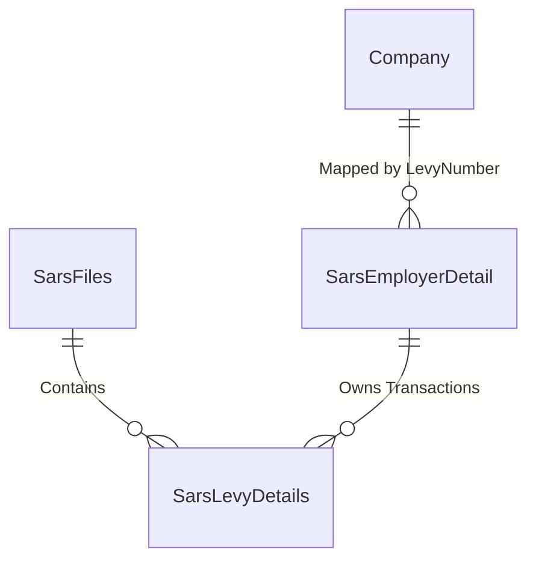

# Spec 09: SARS Levy Integration

## 1. Domain Overview
The SARS Integration module is the foundation of all NSDMS financial capability. It ingests massive raw flat files provided by SARS/DHET, translating unstructured text lines into cleanly typed SQL records determining exactly how much `Levy` a given company (`L-Number`) paid in a specific reporting period.

## 2. SQL Server Schema Strategy

**Core Tables Needed:**
- `SarsFiles` (Tracking the batches ingested).
- `SarsLevyDetails` (Granular transaction rows per L-Number).
- `SarsEmployerDetail` (Aggregated demographic metadata matching the tax files).

## 3. MVC Controllers & Routing
- `[Route("Integrations/Sars/Upload")]`: High-secure portal for DBAs/Finance admins to manually drop flat files.
- `[Route("Integrations/Sars/Reconciliation")]`: Dashboard showing mismatch variances between expected and actual file aggregates.

## 4. View Requirements (UI/UX)
- Bulk processing dashboard showing Upload Progress, Parse Errors, and Final Commit metrics.

## 5. State Machine & Workflows
1. **File Drop:** File ingested.
2. **Parsing & Staging:** Text strings converted to decimals/dates and placed in transient tables.
3. **Reconciliation:** Sanity check totals.
4. **Commit:** `SarsLevyDetails` populated and mathematical caches updated.

## 6. Business Rules (The "Gotchas")
- **File Format Rigidity:** The DHET/SARS file format uses absolute-positioned string indices. `Substring(10, 20)` logic must be strictly ported from the legacy `SarsFilesService.java`.
  - ✨ **Modernization Directive (How-To Mapping):** Do not manually substring. Use a robust .NET fixed-width file parser library (e.g., `CsvHelper` with positional mappings) to strictly serialize/deserialize the SARS string structures into strongly typed C# DTOs.
- **Idempotency:** Re-uploading a SARS batch sequence must correctly `DELETE` and rebuild or `UPSERT` without causing duplicate financial records (which would incorrectly trigger massive grant payouts).
  - ✨ **Modernization Directive (How-To Mapping):** Rely on a SQL Server `MERGE` statement within a Stored Procedure or Code On Time Data Controller `.ExecuteUpdateAsync()` to idempotently hash and apply delta SA/SARS records, ensuring the application handles re-uploads robustly without data duplication.

### 6.1 Code On Time (COT) Native Form Validations
To satisfy the rapid Touch UI generation of COT, the following rules must be directly injected into the Data Controllers mapping to SarsLevyDetails to handle synchronous database constraints and immediate UI validation.

#### A) SQL Business Rule (Server-Side Validation)
This SQL snippet executes within COT's [Controller].xml lifecycle before insertion to enforce business invariants dynamically based on the exact table structure.

`sql
-- Pattern: Code On Time SQL Business Rule (Before Insert/Update)
-- Target Controller: SarsLevyDetails
-- Action: Insert, Update

-- Example Constraint Enforcement:
IF EXISTS (SELECT 1 FROM [dbo].[SarsLevyDetails] WHERE [Id] = @Id AND [StatusId] IS NULL)
BEGIN
    SET @BusinessRules_PreventDefault = 1;
    SET @Result_ShowMessage = 'A valid Workflow Status must be assigned before committing this record in SarsLevyDetails.';
END
`

#### B) JavaScript validation (Client-Side Touch UI)
This JS snippet enforces immediate checks on the UI input before a network dispatch, maintaining UI responsiveness for the SarsLevyDetails controller.

`javascript
// Pattern: Code On Time JavaScript Business Rule (Before Insert/Update)
// Target Controller: SarsLevyDetails
function override_before_insert(args) {
    var stat = ('StatusId');
    
    if (stat == null || stat === '') {
        this.preventDefault();
        this.result.showMessage('Workflow Status cannot be left blank during creation.');
        this.result.focus('StatusId');
        return;
    }
}
`

## 7. Document Generation Component
- Internal Excel/CSV Reconciliation reports.

## 8. Required Data Fields Definition

| Field Name | Data Type | Required | Notes |
| :--- | :--- | :--- | :--- |
| `Id` | `UNIQUEIDENTIFIER` | Yes | Primary Key |
| `LevyNumber` | `VARCHAR(20)` | Yes | The critical structural join to `Company`. |
| `ArrivalDate` | `DATETIME2` | Yes | Date the file was dropped. |
| `Amount` | `DECIMAL(18,2)` | Yes | parsed payload. |
| `SchemeYear` | `INT` | Yes | E.g. `2026`. |

## 9. Standardized Error Messages

To eliminate ambiguity and ensure UI alignment across the application, the following hardcoded error string literals **MUST** be implemented within the presentation layer and `COT Business Rules Validation (Result.ShowMessage)` constraints for this domain:

| Error Code | Hardcoded String Literal | Trigger Condition |
| :--- | :--- | :--- |
| `ERR_SARS_001` | `'SARS Flat File Parse Error: Invalid fixed-width line at position [X].'` | Primary Validation Failure |
| `ERR_SARS_002` | `'Unmapped Scheme Year detected in the SARS payload. Cannot import.'` | State Machine Blocked |
| `ERR_SARS_003` | `'Total Levy amount exceeds absolute mathematical bounds for L-Number calculation.'` | Domain Invariant Violated |
